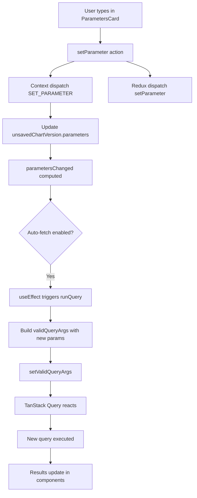
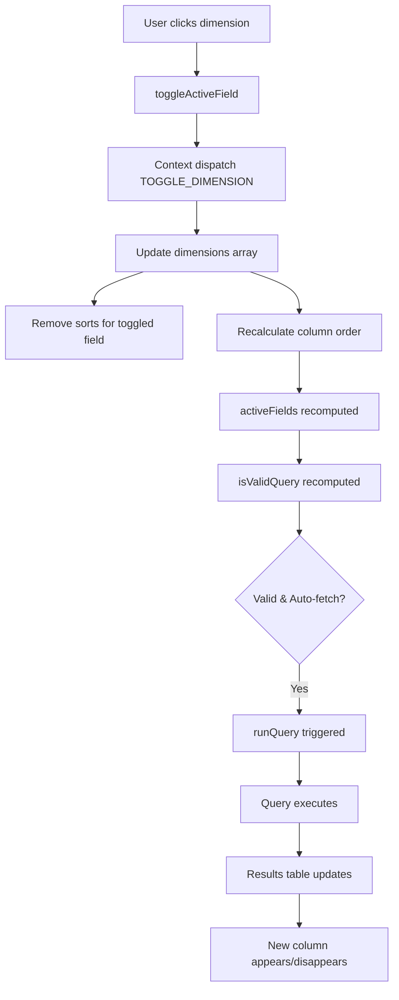
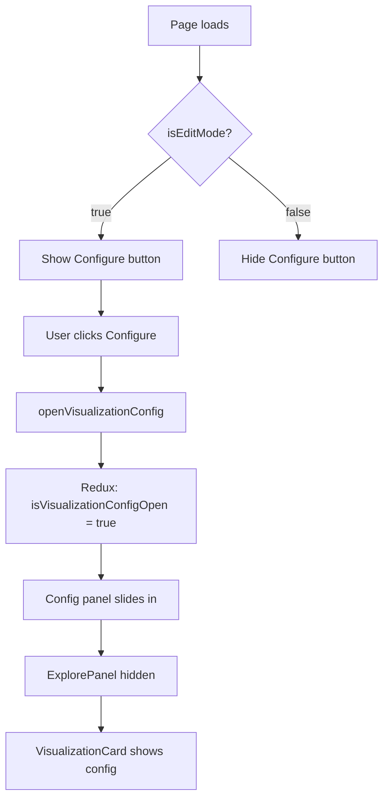
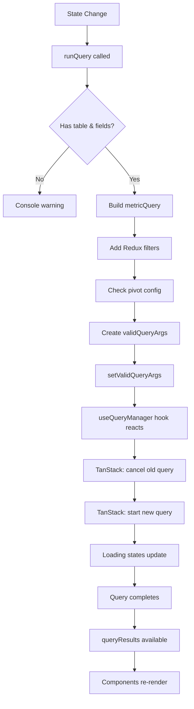
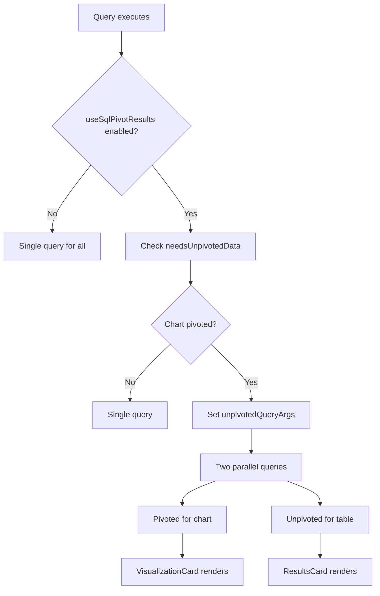
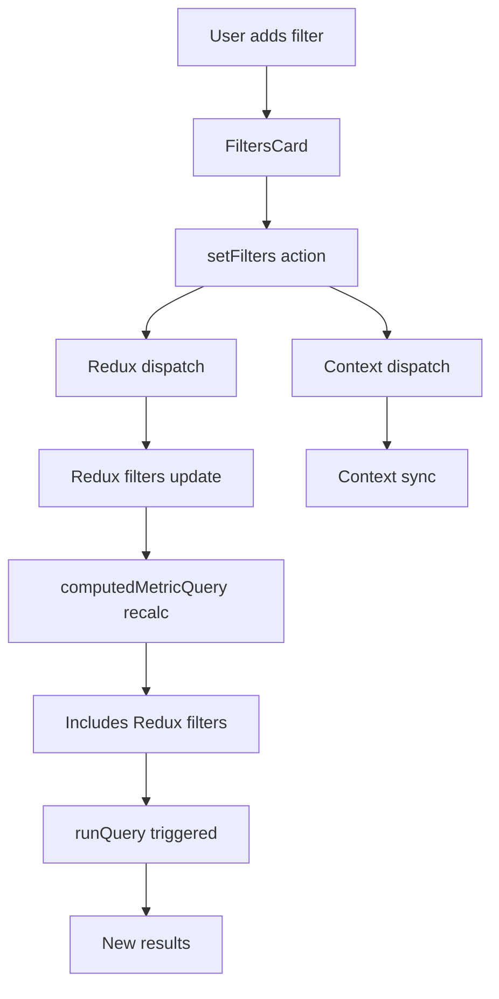
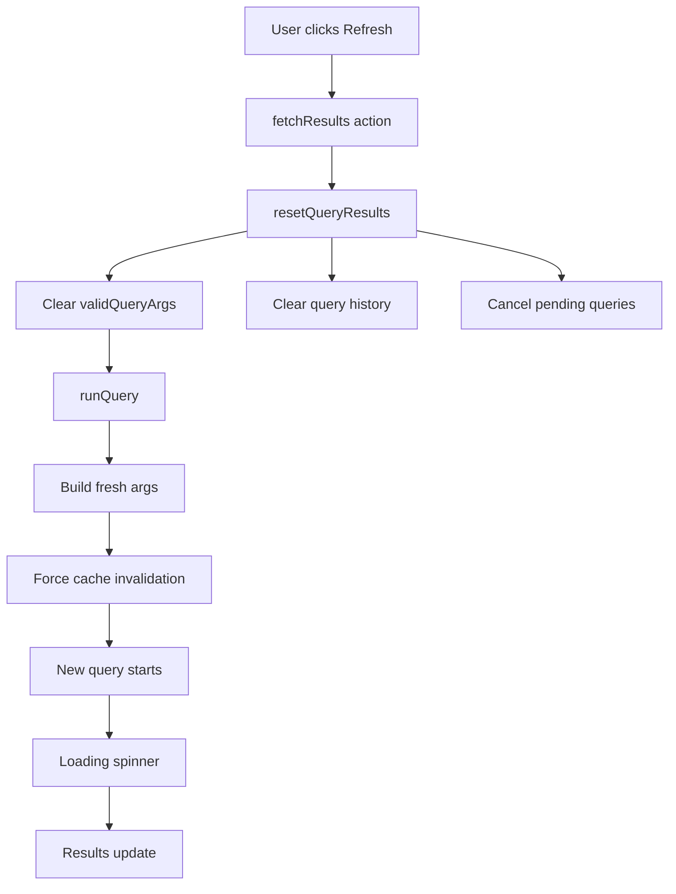
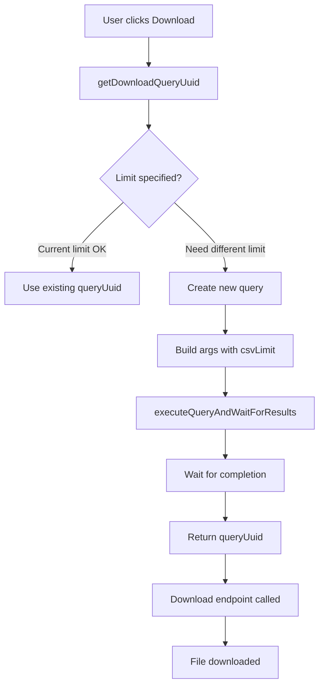
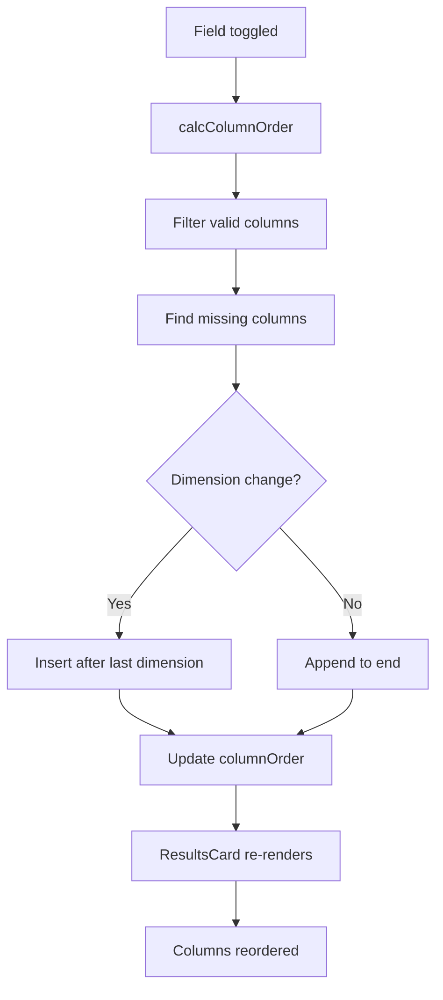
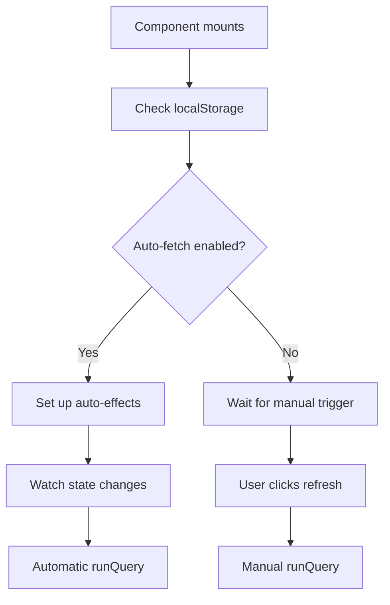

# Explorer User Flows Documentation

This document describes the critical user interactions and data flows in the Explorer, documenting how state changes propagate through the system.

## ✅ Flow Verification (Last verified: Query Execution Migration PR)

**Status**: All 7 critical flows verified and working after migrating query execution from Context to Redux + hooks.

**Verification Date**: Current PR
**Changes**: Query state migrated from Context to `useExplorerQuery` hook with split-hook pattern
**Result**: ✅ All flows preserved, no breaking changes

| Flow | Status | Implementation |
|------|--------|----------------|
| 1. Parameter Change with Auto-sync | ✅ Working | `useExplorerQueryManager.ts:272-290` |
| 2. Dimension Selection | ✅ Working | `useExplorerQueryManager.ts:108-114, 266-269` |
| 3. Core Query Execution | ✅ Working | `useExplorerQueryManager.ts:184-243` |
| 4. Pivot Detection & Dual Queries | ✅ Working | `useExplorerQueryManager.ts:130-144, 246-263` |
| 5. Filter Changes | ✅ Working | `useExplorerQueryManager.ts:99-105` |
| 6. Manual Refresh | ✅ Working | `useExplorerQuery.ts:239-251` |
| 7. Download/Export | ✅ Working | `useExplorerQuery.ts:254-284` |

## 1. Parameter Change with Auto-sync Enabled

### User Action: Changes a parameter value



### Key Code Locations:
- `ParametersCard.tsx:72-75` - Parameter change handler
- `ExplorerProvider.tsx:1094-1110` - setParameter action
- `ExplorerProvider.tsx:1720-1724` - Auto-fetch effect
- `ExplorerProvider.tsx:1606-1674` - runQuery implementation

## 2. Dimension Selection Flow

### User Action: Toggles a dimension in ExplorePanel



### Key Code Locations:
- `ExplorePanel/index.tsx:96-98` - toggleActiveField usage
- `ExplorerProvider.tsx:217-243` - TOGGLE_DIMENSION reducer
- `ExplorerProvider.tsx:953-964` - activeFields computation
- `ExplorerProvider.tsx:82-107` - calcColumnOrder function

## 3. Configure Button Display Logic

### Condition: Show/hide visualization configuration button



### State Dependencies:
- `isEditMode` (Redux) - Determines button visibility
- `isVisualizationConfigOpen` (Redux) - Controls panel state
- Components affected: VisualizationCard, ExplorePanel

### Key Code Locations:
- `VisualizationCard.tsx:96-100` - Selectors for edit mode and config state
- `explorerSlice.ts:103-108` - Config open/close actions

## 4. Query Execution Flow (Core)

### Trigger: Any state change that requires new results



### Detailed Flow:
1. **State aggregation** (1606-1614): Gather all query inputs
2. **Pivot calculation** (1621-1630): Determine if pivoting needed
3. **Args preparation** (1633-1643): Build QueryResultsProps
4. **State update** (1646): Set validQueryArgs
5. **TanStack reaction**: useQueryManager watches validQueryArgs
6. **Results propagation**: Components access via context

### Key Code Locations:
- `ExplorerProvider.tsx:1606-1674` - runQuery implementation
- `useExplorerQueryManager.ts:8-31` - Query manager hook
- `ExplorerProvider.tsx:1495-1500` - Main query manager setup

## 5. Results Display with Pivot Detection

### Scenario: Chart is pivoted, results table needs unpivoted data



### Key Code Locations:
- `ExplorerProvider.tsx:1783-1804` - needsUnpivotedData computation
- `ExplorerProvider.tsx:1876-1894` - Unpivoted args effect
- `ExplorerProvider.tsx:1702-1710` - Unpivoted query manager

## 6. Filter Changes Flow

### User Action: Adds/modifies a filter



### Synchronization Pattern:
- Double dispatch ensures compatibility during migration
- Redux filters merged into Context metricQuery
- Single source of truth (Redux) with Context bridge

### Key Code Locations:
- `FiltersCard.tsx:239-241` - setFilters call
- `ExplorerProvider.tsx:945-951` - computedMetricQuery
- `ExplorerProvider.tsx:1085-1091` - setFilters action

## 7. Manual Refresh Flow

### User Action: Clicks refresh button



### Key Code Locations:
- `RefreshButton.tsx` - Trigger point
- `ExplorerProvider.tsx:1778-1782` - fetchResults implementation
- `ExplorerProvider.tsx:1752-1761` - resetQueryResults

## 8. Download/Export Flow

### User Action: Exports results to CSV/Sheets



### Key Code Locations:
- `ResultsCard.tsx` - Download menu
- `ExplorerProvider.tsx:1715-1749` - getDownloadQueryUuid
- `VisualizationCard.tsx` - Chart download menu

## 9. Column Ordering Logic

### Trigger: Fields added/removed



### Key Code Locations:
- `ExplorerProvider.tsx:82-107` - calcColumnOrder function
- Used in: TOGGLE_DIMENSION, TOGGLE_METRIC, ADD_TABLE_CALCULATION

## 10. Auto-fetch Control Flow

### Setting: Auto-fetch enabled/disabled



### Key Code Locations:
- `ExplorerProvider.tsx:881-885` - Auto-fetch localStorage
- `ExplorerProvider.tsx:1896-1900` - Auto-fetch effect
- `RunQuerySettings/defaults.ts` - Default settings

## State Change Triggers

### Actions that trigger query re-execution:
1. **Dimension/Metric toggle** - Changes query fields
2. **Filter modification** - Changes query filters
3. **Parameter change** - Changes query parameters
4. **Sort change** - Changes result ordering
5. **Limit change** - Changes row count
6. **Table change** - Changes data source
7. **Manual refresh** - Forces re-execution

### Actions that DON'T trigger queries:
1. **Column reorder** - Visual only
2. **Chart type change** - Visualization only
3. **Expand/collapse sections** - UI only
4. **Open/close config** - UI only
5. **Format changes** - Display only

## Critical State Dependencies

### Query Execution Requirements:
```typescript
// Must have ALL of:
- validTableName
- hasFields (dimensions || metrics || tableCalculations)
- projectUuid
- No missing required parameters
```

### Computed State Chain:
```
Redux filters -> computedMetricQuery -> validQueryArgs -> TanStack Query -> Results
                     ^                        ^
                     |                        |
            Context metricQuery        Parameters/Config
```

## Migration Considerations

When migrating query state, these flows must continue working:
1. ✅ Auto-fetch on state changes
2. ✅ Parameter validation before execution
3. ✅ Proper loading/error states
4. ✅ Query cancellation
5. ✅ Dual query for pivot scenarios
6. ✅ Export with custom limits
7. ✅ Column order preservation
8. ✅ Filter/sort integration