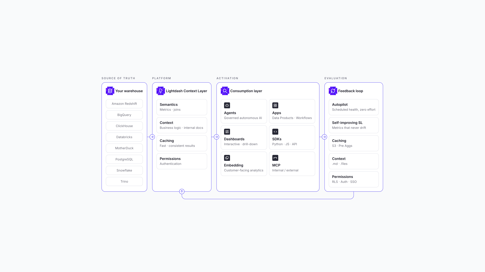

<p align="center">
  <a href="https://www.lightdash.com">
    
  </a>
</p>

<h2 align="center">Open-source Agentic BI for modern data teams</h2>

<p align="center">
  Build governed metrics, dashboards, AI agents, and data apps from your context layer.
  Ship analytics through Git, CI, MCP, and the Lightdash CLI.
</p>

<p align="center">
  <a href="https://www.lightdash.com/start"><b>Start on Cloud</b></a> ·
  <a href="https://docs.lightdash.com"><b>Documentation</b></a> ·
  <a href="https://demo.lightdash.com/login"><b>Live demo</b></a> ·
  <a href="https://www.lightdash.com/bi-as-code"><b>BI as code</b></a> ·
  <a href="https://go.lightdash.com/community"><b>Community</b></a>
</p>

<p align="center">
  <a href="https://github.com/lightdash/lightdash/blob/main/LICENSE"></a>
  <a href="https://github.com/lightdash/lightdash/stargazers"></a>
  <a href="https://hub.docker.com/r/lightdash/lightdash"></a>
</p>

<p align="center">
  <a href="https://context-layer-teal.vercel.app/">
    
  </a>
</p>

## Why Lightdash

Lightdash is the Agentic BI platform for teams that want analytics to move like software. Your context layer defines trusted metrics, joins, permissions, business logic, and caching once, then powers every way people consume data: dashboards, AI agents, data apps, embedded analytics, SDKs, and MCP.

Data teams can build and maintain BI from Cursor, Claude Code, the terminal, pull requests, and CI. Business users can ask questions in plain English, explore dashboards, or create custom data apps without bypassing governance.

## Start with Cloud

The fastest way to use Lightdash is [Lightdash Cloud](https://www.lightdash.com/start): no infrastructure to run, always up to date, and ready for AI agents, Data Apps, scheduled deliveries, embedding, and enterprise controls.

Want to explore first? Try the [live demo](https://demo.lightdash.com/login), read the [docs](https://docs.lightdash.com), or [book a walkthrough](https://www.lightdash.com/start).

## Everything you need

<table>
  <tr>
    <td width="50%" valign="top">
      <h3>BI as code</h3>
      <p>Your metrics, charts, and dashboards live as files. Build them with coding agents, preview changes from the CLI, validate in CI, and review analytics in pull requests.</p>
      <p><a href="https://www.lightdash.com/bi-as-code">Learn about BI as code</a></p>
    </td>
    <td width="50%" valign="top">
      <h3>AI agents</h3>
      <p>Lightdash agents answer from your context layer, not raw table guesses. They respect permissions, return inspectable queries, reuse verified answers, and improve through reviews and evaluations.</p>
      <p><a href="https://www.lightdash.com/conversational-analytics">Explore Conversational Analytics</a></p>
    </td>
  </tr>
  <tr>
    <td width="50%" valign="top">
      <h3>Data Apps</h3>
      <p>Build custom reports, workbooks, slide decks, forecasting tools, and customer-facing data products from a prompt, with your context layer, permissions, and auth already built in.</p>
      <p><a href="https://www.lightdash.com/data-apps">See Data Apps</a></p>
    </td>
    <td width="50%" valign="top">
      <h3>Context layer</h3>
      <p>Define metrics, dimensions, joins, descriptions, caching, and access rules in one governed layer. Use dbt projects or standalone Lightdash YAML pointed at your warehouse.</p>
      <p><a href="https://context-layer-teal.vercel.app/">View the context-layer model</a></p>
    </td>
  </tr>
  <tr>
    <td width="50%" valign="top">
      <h3>Embedded analytics</h3>
      <p>Embed dashboards, AI agents, and Data Apps in your product with the Lightdash SDK, row-level security, user attributes, and customer-facing permissions.</p>
      <p><a href="https://docs.lightdash.com/references/embedding">Read embedding docs</a></p>
    </td>
    <td width="50%" valign="top">
      <h3>Open-source core</h3>
      <p>Self-host the core BI platform, contribute improvements, and run Lightdash in your own infrastructure. Enterprise deployments can add commercial features and support.</p>
      <p><a href="https://docs.lightdash.com/self-host/self-host-lightdash">Self-host Lightdash</a></p>
    </td>
  </tr>
</table>

## Build with agents

Lightdash gives coding agents the context they need to make safe analytics changes.

```bash
lightdash install-skills
lightdash preview
lightdash validate
```

Use agent skills and the Lightdash MCP server to build charts, dashboards, metrics, and Data Apps from your editor or terminal. Every change can still go through the workflow your team trusts: preview, validate, review, merge.

## Installation

### Cloud

Sign up for [Lightdash Cloud](https://www.lightdash.com/start) to get a hosted workspace in minutes. This is the recommended path for teams that want AI agents, Data Apps, managed upgrades, and production-ready infrastructure without operating Lightdash themselves.

### Self-host

Run Lightdash on your own infrastructure with Docker or Kubernetes.

- [Self-hosting guide](https://docs.lightdash.com/self-host/self-host-lightdash)
- [Production deployment checklist](https://docs.lightdash.com/self-host/production-deployment-checklist)
- [Helm charts](https://github.com/lightdash/helm-charts)

### Local development

```bash
git clone https://github.com/lightdash/lightdash.git
cd lightdash
./scripts/install.sh
```

See the [contributing guide](https://github.com/lightdash/lightdash/blob/main/.github/CONTRIBUTING.md) for the full local setup, package scripts, and development workflow.

## Stack

Lightdash is a TypeScript monorepo built with:

- React, Mantine, Vite, and TanStack Query on the frontend
- Node.js, Express, TSOA, Knex, and PostgreSQL on the backend
- Warehouse adapters for BigQuery, Snowflake, Redshift, Databricks, Postgres, Trino, ClickHouse, and more
- A CLI, MCP server, SDKs, Git integrations, and content-as-code workflows for developer-native analytics

## Community

Lightdash is open source and built with the community.

- Join the [Lightdash Slack community](https://go.lightdash.com/community)
- Open a [bug report or feature request](https://github.com/lightdash/lightdash/issues/new/choose)
- Read the [contributing guide](https://github.com/lightdash/lightdash/blob/main/.github/CONTRIBUTING.md)
- Follow Lightdash on [LinkedIn](https://www.linkedin.com/company/lightdash) and [X](https://twitter.com/lightdash_devs)

Thanks to everyone who has contributed code, docs, issues, ideas, and feedback. See the [contributors graph](https://github.com/lightdash/lightdash/graphs/contributors) for the full community.
