# Lightdash First-Run Onboarding Journey

This document walks through the **complete onboarding flow** from a clean Lightdash install to running the first query against warehouse data, captured against version `0.2978.0` running locally.

## Summary

| | Count |
|---|---|
| **UI interactions** (typing + clicks) | **21** |
| **Pages / dialogs visited** | 9 (`/register`, `/verify-email`, `/createProject` + modal, `/createProject/cli`, `/projects/.../home`, `/projects/.../tables`, explore view) |
| **CLI commands required** | 3 (install CLI, login, deploy) |
| **Form fields filled** | 7 (sign-up: 4, OTP: 1 paste, org: 2) |
| **Wall-clock time** | ~2 min (UI) + ~3 min (CLI build/deploy) |

### Interaction breakdown

| Phase | UI interactions | Description |
|---|---|---|
| 1. Sign up | 5 | 4 text fields + Sign up button |
| 2. Verify email | 3 | Paste OTP, click Submit, click Continue |
| 3. Organization setup | 4 | Org name field, role dropdown click, role option pick, Next button |
| 4. Pick warehouse | 1 | Click PostgreSQL tile |
| 5. Pick dbt source | 1 | Click "Using your CLI with `lightdash deploy`" |
| 6. CLI deploy | 0 | (handled in terminal — see CLI commands below) |
| 7. Land in project | 1 | Click "Let's do some data!" |
| 8. Start first query | 1 | Click "Run your first query!" |
| 9. Pick table | 1 | Click `Orders` |
| 10. Build query | 3 | Click `Status` dim, click `Total order amount` metric, click `Run query` |
| **Total** | **21** | |

---

## Step 1 — Sign up

The app routes new visitors straight to `/register`. Four required fields, one button.

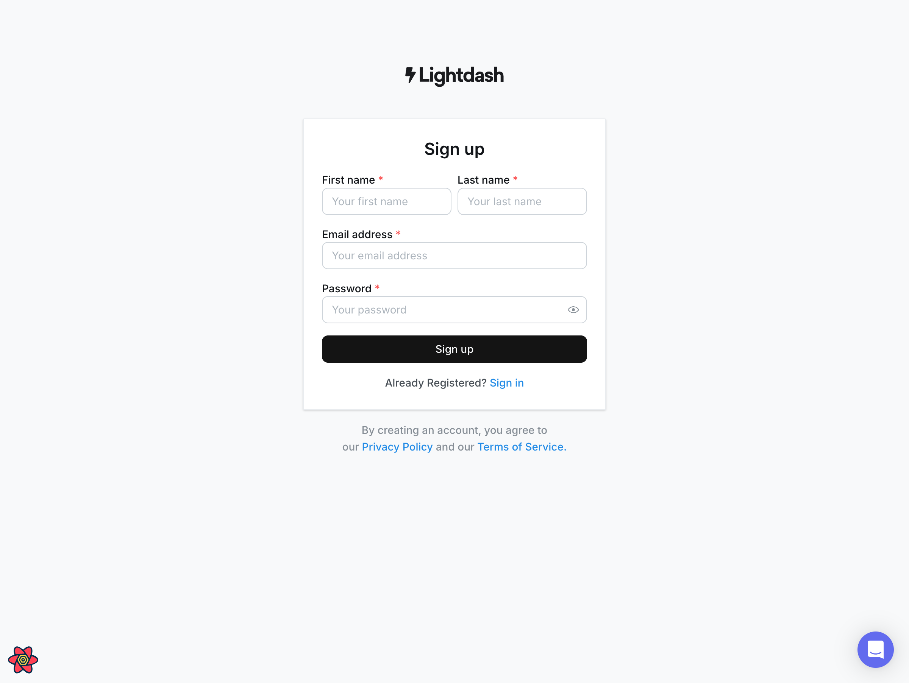

**Interactions (5):**

1. Type **First name**
2. Type **Last name**
3. Type **Email address**
4. Type **Password**
5. Click **Sign up**

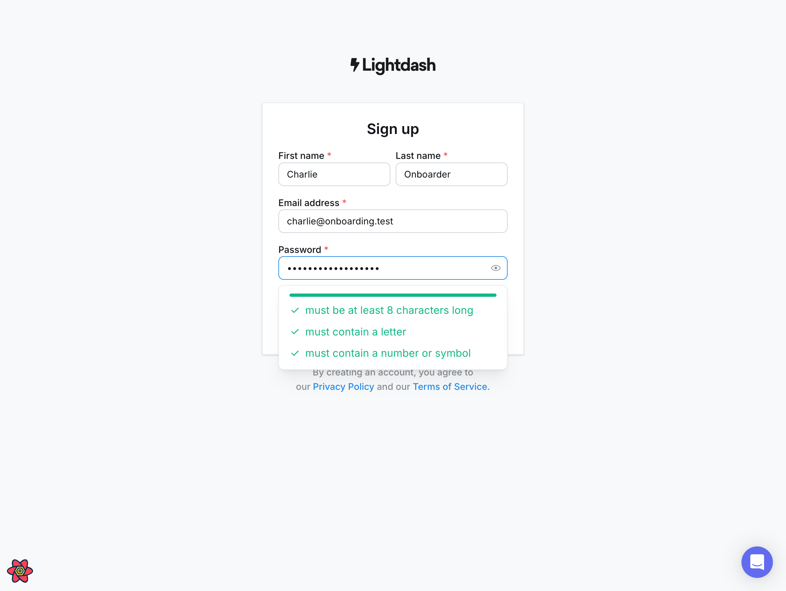

---

## Step 2 — Verify email

After sign-up, Lightdash sends a 6-digit one-time passcode (OTP) to the user's email. In dev/local instances the OTP is fixed at `000000`; in production it's random.

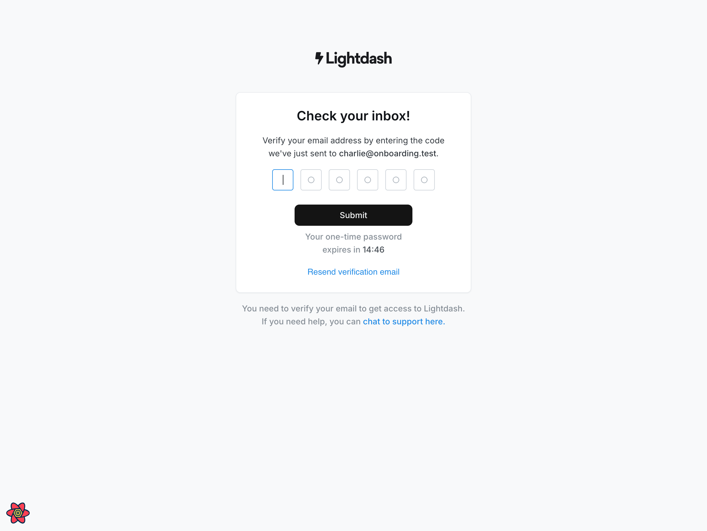

**Interactions (3):**

6. Type the **6-digit code** (single paste fills all 6 inputs)
7. Click **Submit**

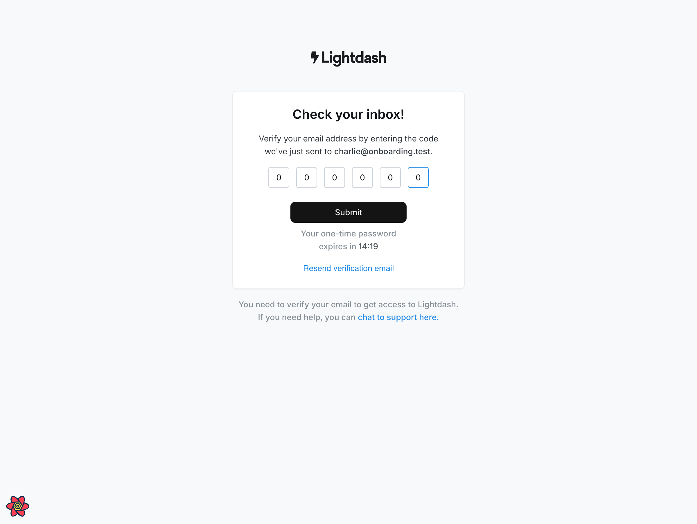

A confirmation dialog appears:

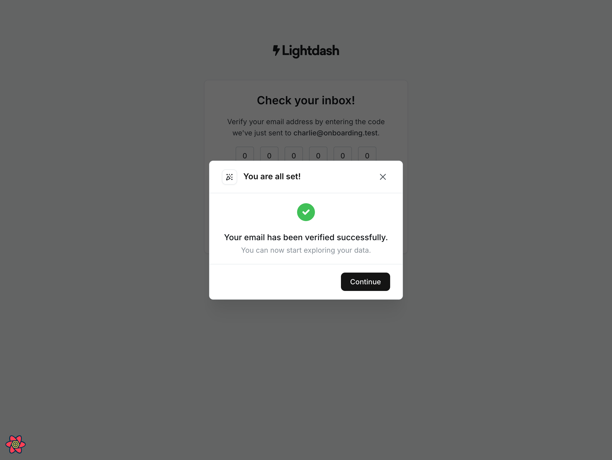

8. Click **Continue**

---

## Step 3 — Organization setup

The app routes to `/createProject` and immediately overlays a modal collecting org/role info. The modal is blocking — you must complete it before reaching the warehouse picker.

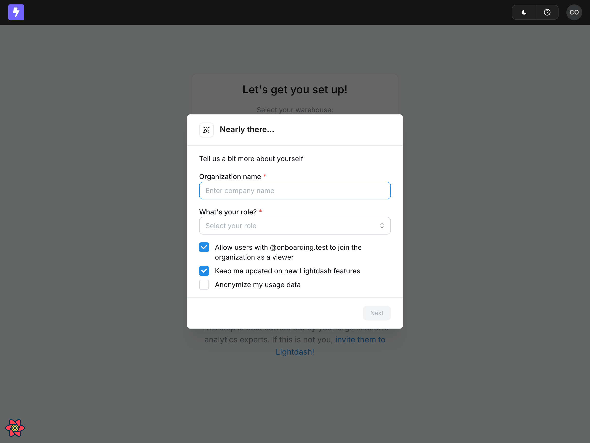

**Interactions (4):**

9. Type **Organization name** (e.g. `Onboarding Test Org`)
10. Click **What's your role?** dropdown
11. Pick a role from the listbox (e.g. `Software Engineer`)
12. Click **Next**

> The three checkboxes are pre-set to sensible defaults (allow same-domain users to join as viewers, receive product updates, share anonymous usage data). They're optional, not counted as required interactions.

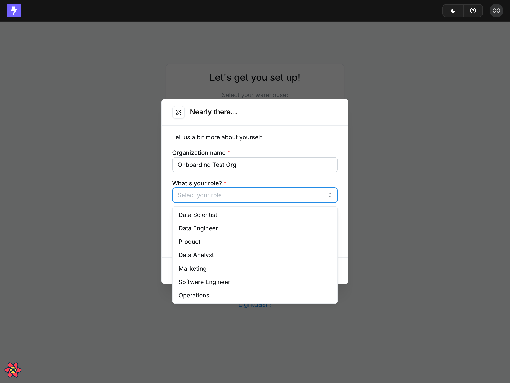

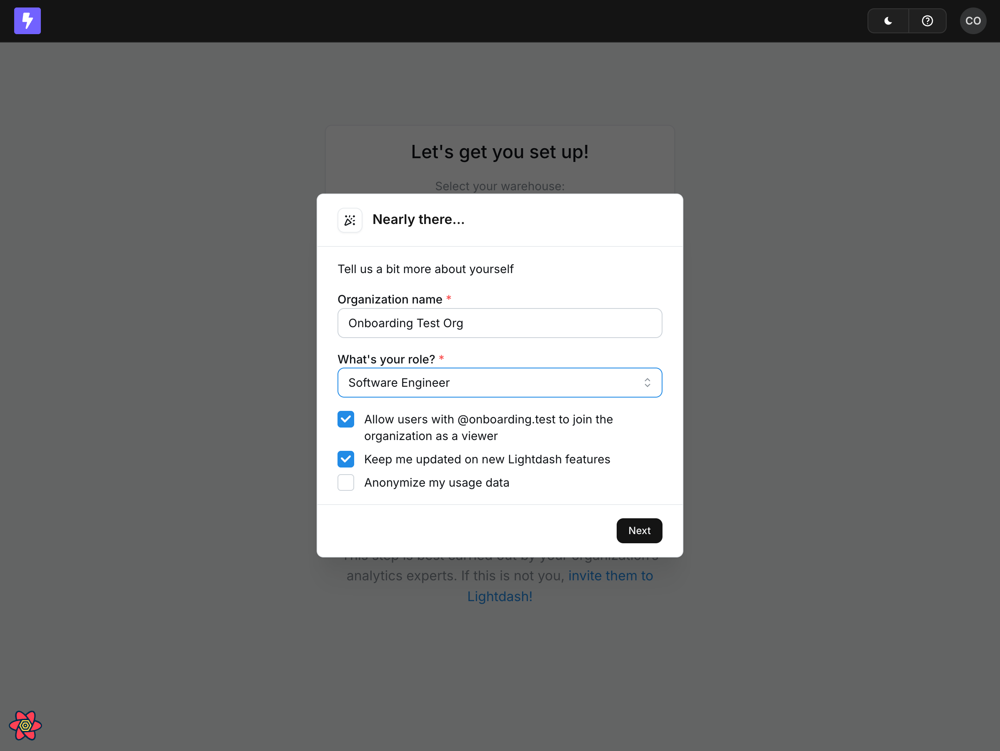

---

## Step 4 — Choose a warehouse

10 tiles. PostgreSQL for this walkthrough; any of the others would branch into a similar credentials flow.

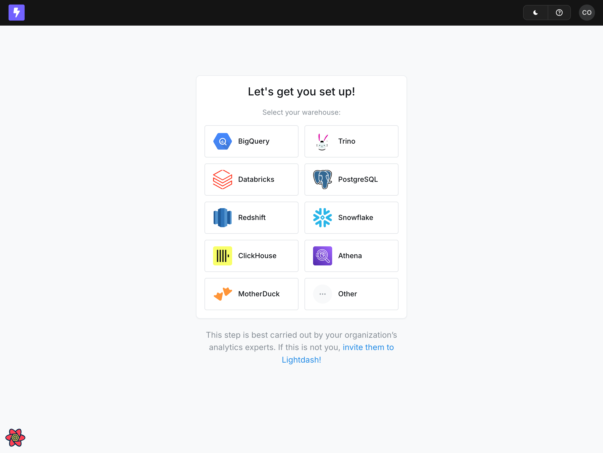

**Interactions (1):**

13. Click **PostgreSQL**

---

## Step 5 — Choose how to provide your dbt project

Lightdash needs a dbt project (it queries the warehouse via dbt-compiled SQL and reads dimensions/metrics from `.yml` files). Two paths:

- **CLI deploy** — Install the Lightdash CLI locally, point it at your dbt project, and run `lightdash deploy --create`. Lightdash receives the compiled manifest plus warehouse credentials extracted from `profiles.yml`.
- **Git pull** — Lightdash clones your repo (GitHub/GitLab/Bitbucket/Azure DevOps) on the server and runs dbt itself with credentials you provide via form.

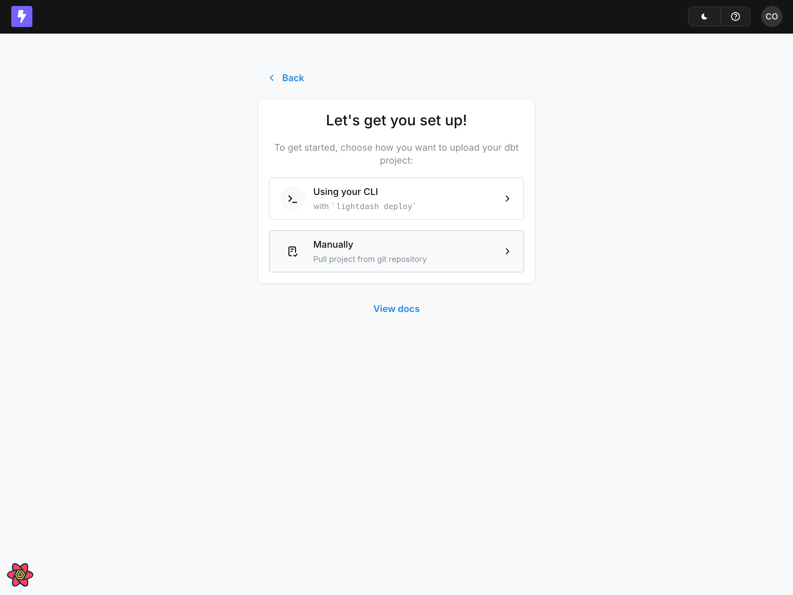

**Interactions (1):**

14. Click **Using your CLI with `lightdash deploy`**

---

## Step 6 — Deploy your dbt project via the CLI

This is the **only step that takes you out of the browser**. The page shows three commands tailored to this project, including a temporary Personal Access Token embedded in the login command (so no extra auth ceremony).

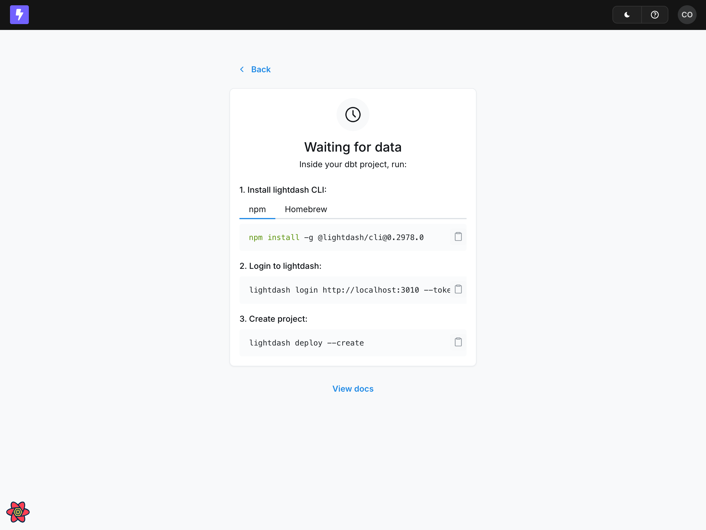

**Interactions (0)** — but **3 CLI commands** must be run from inside your local dbt project directory:

```bash
# 1. Install the CLI (npm shown; Homebrew is the other tab)
npm install -g @lightdash/cli@0.2978.0

# 2. Authenticate the CLI against your Lightdash instance
#    The token is auto-generated and shown on the page
lightdash login http://localhost:3010 --token ldpat_<auto-generated>

# 3. Compile and upload the project — `--create` makes a new project
lightdash deploy --create
```

The deploy step:
1. Runs `dbt list` (or `dbt compile`) against the project to produce a `manifest.json`
2. Reads `profiles.yml` to extract warehouse credentials
3. Uploads the manifest + credentials to the Lightdash API
4. Lightdash compiles each model into an **explore** (model + dimensions + metrics combined)

The frontend at `/createProject/cli` polls the API and **auto-advances** once the project lands. No browser refresh needed.

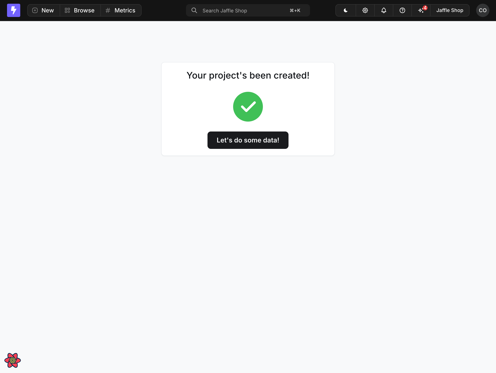

**Interactions (1):**

15. Click **Let's do some data!**

> **Tip — non-interactive deploy:** the CLI asks "Do you confirm Lightdash can store your warehouse credentials…" by default. Pass `-y` (or `--assume-yes`) to skip the prompt:
> ```bash
> lightdash deploy --create "Jaffle Shop" -y \
>   --project-dir path/to/dbt \
>   --profiles-dir path/to/profiles
> ```

---

## Step 7 — Project home

You now land on a per-project home with a 3-step "what you can do" card.

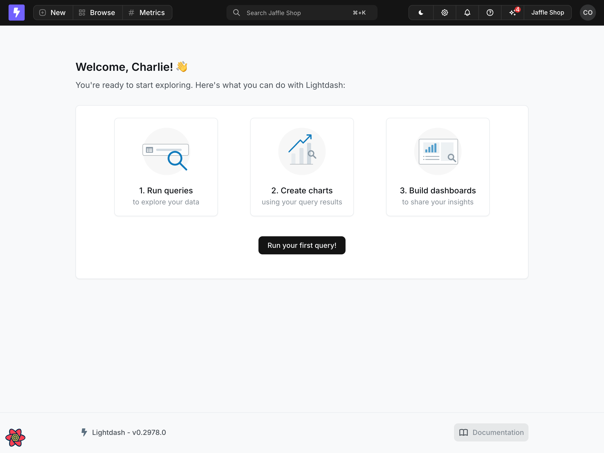

**Interactions (1):**

16. Click **Run your first query!**

---

## Step 8 — Pick a table to explore

Lightdash lists every dbt model that has Lightdash metadata as a "table". For Jaffle Shop, that includes Orders, Customers, Payments, plus a few demo schemas (`fanouts`, `healthcare`, etc.).

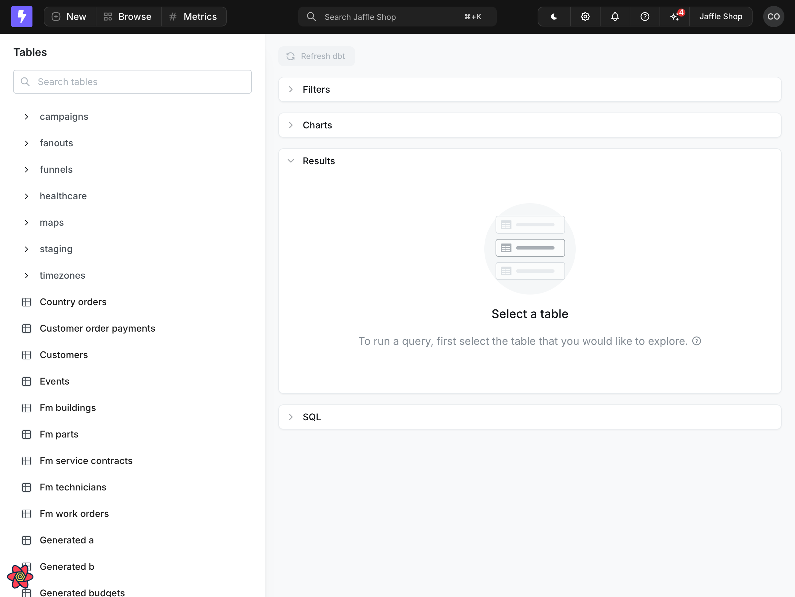

**Interactions (1):**

17. Click **Orders**

---

## Step 9 — Build & run the first query

The Explore view opens. The sidebar lists every dimension and metric defined on the `orders` model. The main panel is empty until you pick at least one metric — there's even helpful "eg. How many total signups per day?" copy in the empty state.

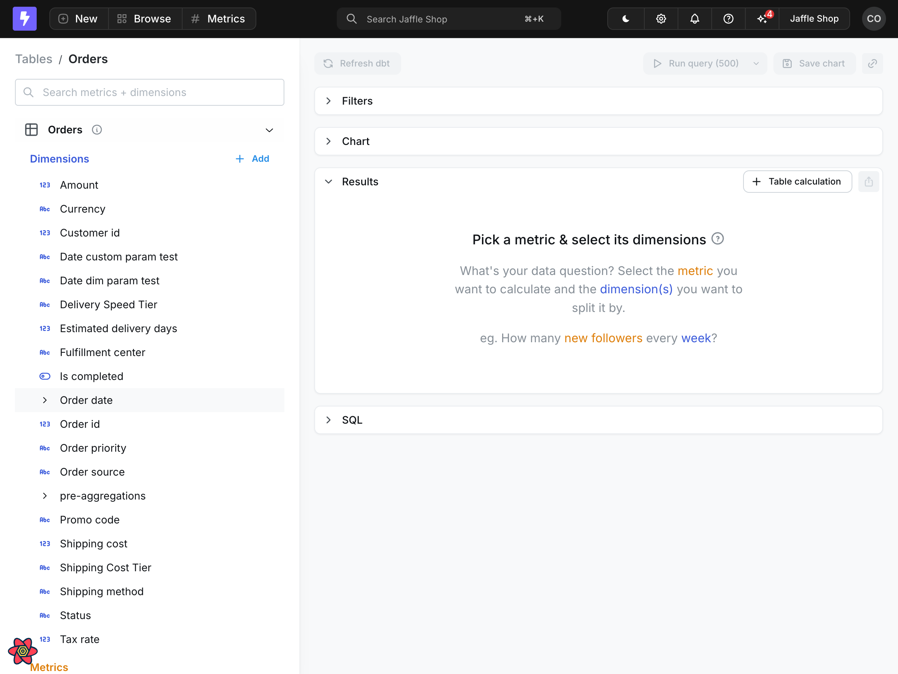

**Interactions (3):**

18. Click the **Status** dimension (adds it to the query and sorts by it)
19. Click the **Total order amount** metric (auto-found by scrolling or via the search field at the top of the sidebar)

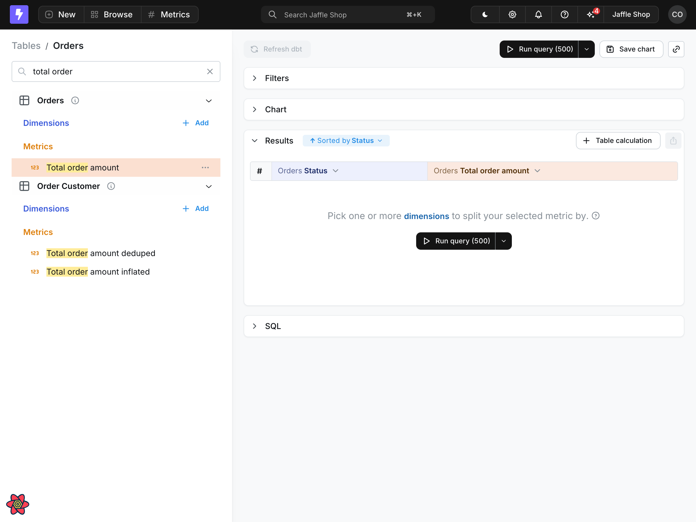

20. Click **Run query (500)** (the `(500)` is the row limit)

The query compiles to SQL, hits the warehouse, and returns:

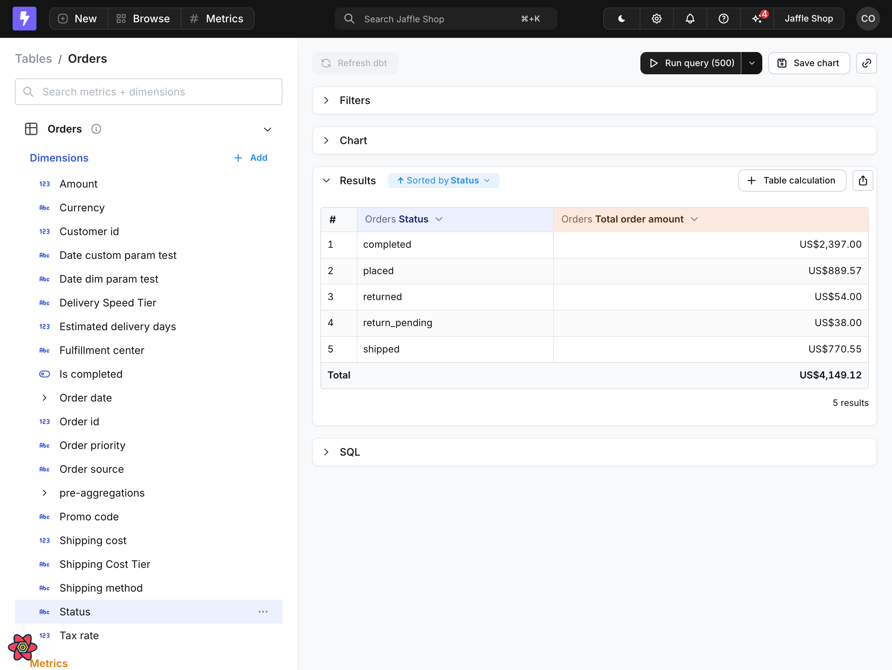

Result: **Total order amount = US$4,149.12** across 5 statuses (`completed`, `placed`, `returned`, `return_pending`, `shipped`).

> Lightdash also wires the result into a default chart automatically — the **Chart** panel above the Results table renders without an extra click.

---

## All CLI commands in one place

Run all three from inside your local dbt project directory (the one containing `dbt_project.yml`):

```bash
# 1. Install the Lightdash CLI globally
npm install -g @lightdash/cli@<version>

# 2. Log in — token from the /createProject/cli page in the browser
lightdash login http://<your-lightdash-host> --token <ldpat-token>

# 3. Deploy the project, creating it on first run
lightdash deploy --create
```

That's it. Three terminal commands and 21 UI interactions, end to end.

---

## Notes on this walkthrough

- **Environment**: Lightdash 0.2978.0 running locally via `/docker-dev` against an empty database (migrations only, no seed). The user/org/project/warehouse credentials in screenshots are throwaway.
- **Why CLI deploy and not Git?** No git remote was needed for this demo — the local jaffle-shop dbt example ships with the repo. In a real onboarding you'd typically use Git for automatic refresh on commits; the CLI path remains useful for first-time setup or CI-driven deploys.
- **OTP in screenshots is `000000`**: This is the dev-mode override. Production instances send a real random 6-digit code via SMTP.
- **AI agent errors in logs**: While running this walkthrough, the API logged errors about `aiAgentService` / `aiOrganizationSettingsService` being unconfigured. These are EE-only features and do not affect the onboarding flow.
