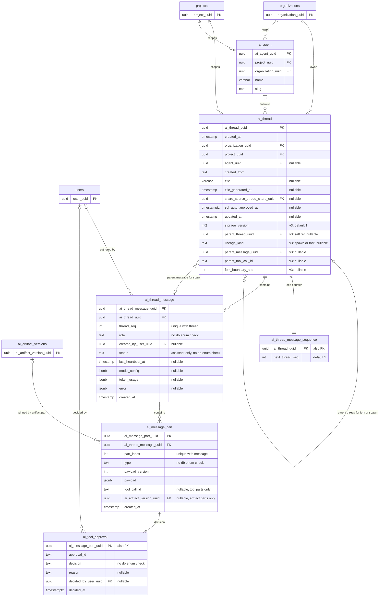
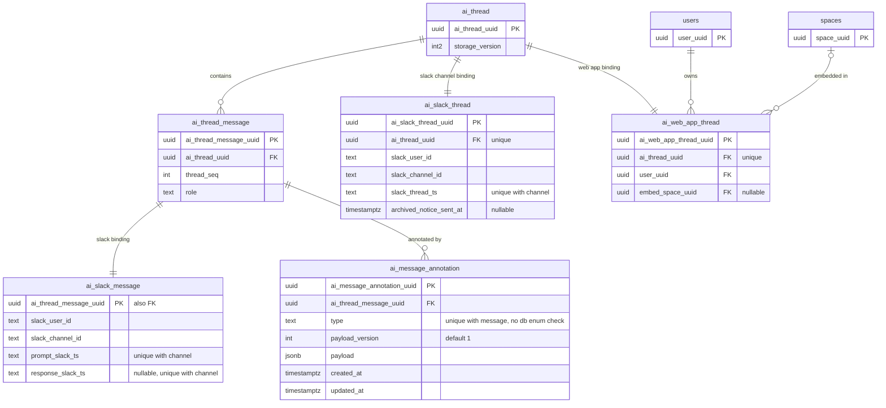
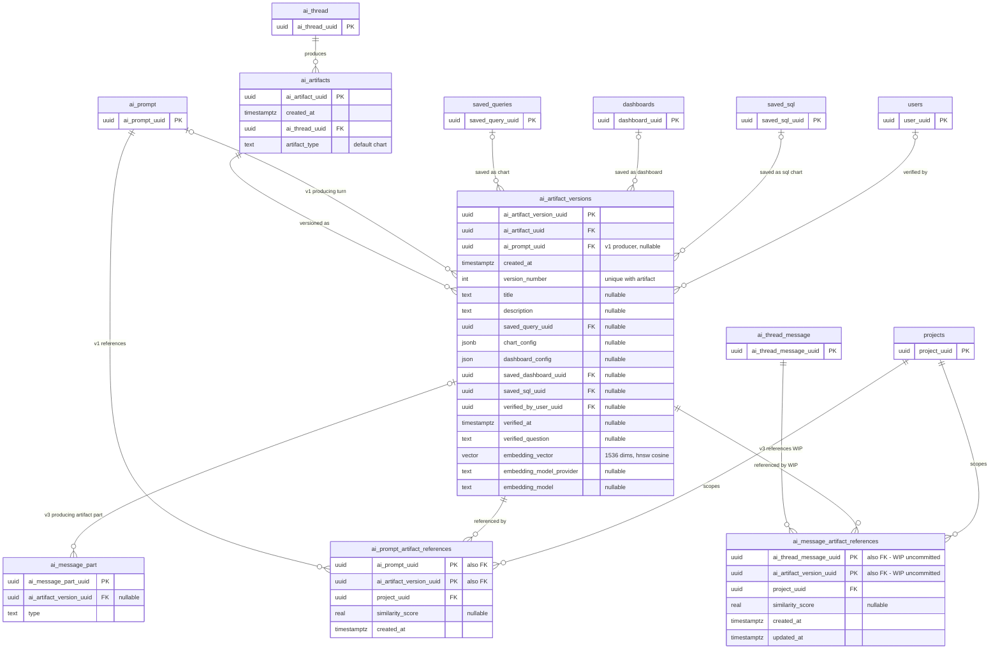
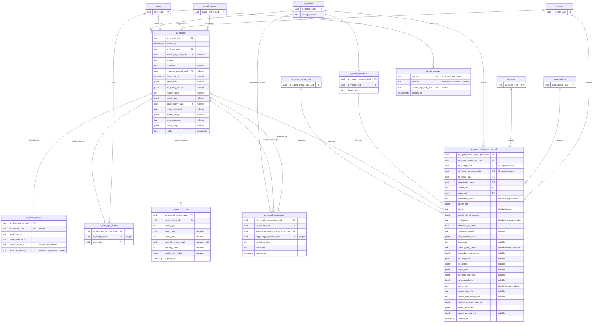

# AI agent database schema — `feature/zap-805`

Generated by reading the Postgres catalog of `zap805_rt`, a database built by
running the full migration chain (577 migrations) from the `feature/zap-805`
working tree. Everything below — columns, types, nullability, foreign keys,
uniques and CHECK constraints — is read out of `pg_catalog` /
`information_schema`, not reconstructed from migration files.

Scope is the AI-agent domain only. Non-AI tables (`users`, `projects`,
`organizations`, `spaces`, `saved_queries`, `dashboards`, `saved_sql`) appear as
minimal stub nodes wherever an AI table has a foreign key into them.

Two things to keep in mind while reading:

- **`ai_message_artifact_references` is uncommitted work-in-progress.** It exists
  in `zap805_rt` because the working tree contains an untracked migration
  (`20260806140000_add_ai_message_artifact_references.ts`) that is *not* part of
  the zap-805 commit. It is drawn with a `WIP` marker below.
- **There are no enum CHECK constraints anywhere in the v3 spine.** No
  `role IN (...)`, no `status IN (...)`, no `type IN (...)`. Enum validity is
  owned by application code by design. Allowed values are listed in prose at the
  bottom, sourced from `packages/backend/src/ee/database/entities/aiAgentV3.ts`
  and `packages/common/src/ee/AiAgent/v3ThreadTypes.ts`.

---

## 1. The v3 message spine

`ai_thread` is shared between v1 and v3; `storage_version` discriminates
(`1` = legacy `ai_prompt` rows, `3` = `ai_thread_message` rows). The v3 columns
`parent_thread_uuid` / `lineage_kind` / `parent_message_uuid` /
`parent_tool_call_id` / `fork_boundary_seq` carry sub-agent and fork lineage.

---

## 2. Slack binding and message annotations

`ai_slack_message` is the v3 replacement for `ai_slack_prompt` — same shape,
same two channel-scoped uniques, but keyed on `ai_thread_message_uuid` as a
shared primary key instead of carrying its own surrogate uuid.

`ai_slack_thread` and `ai_web_app_thread` are thread-level channel bindings and
are shared by v1 and v3 alike.

---

## 3. Artifacts

Artifacts are thread-scoped and versioned. v1 links a version to the turn via
`ai_artifact_versions.ai_prompt_uuid`; v3 links it via an `artifact`-typed
`ai_message_part`. The two `*_artifact_references` join tables carry retrieval
similarity scores for artifacts *referenced* by a turn rather than produced by
it.

---

## 4. v1 legacy tables and the review-signal bridge

The v1 turn table `ai_prompt` and its satellites are untouched by this stack and
still hold every `storage_version = 1` thread. `ai_agent_review_turn_signal` is
the one table that has been taught to point at *either* generation: exactly one
of `ai_prompt_uuid` / `ai_thread_message_uuid` must be non-null.

---

## Constraints the diagrams cannot express

### CHECK constraints

| Constraint | Table | Definition |
|---|---|---|
| `ai_thread_lineage_shape_check` | `ai_thread` | Exactly one of three shapes: **(a)** all of `lineage_kind`, `parent_thread_uuid`, `parent_message_uuid`, `parent_tool_call_id`, `fork_boundary_seq` NULL (a root thread); **(b)** `lineage_kind = 'spawn'` with `parent_thread_uuid`, `parent_message_uuid`, `parent_tool_call_id` all NOT NULL and `fork_boundary_seq` NULL; **(c)** `lineage_kind = 'fork'` with `parent_thread_uuid` and `fork_boundary_seq` NOT NULL and `parent_message_uuid` / `parent_tool_call_id` NULL. |
| `ai_thread_message_role_status_check` | `ai_thread_message` | `(role = 'assistant') = (status IS NOT NULL)` — only assistant messages carry a run status, and every assistant message must. |
| `ai_message_part_tool_call_shape_check` | `ai_message_part` | `tool_call_id IS NULL OR type = 'tool'` — only `tool` parts may carry a tool call id. |
| `ai_message_part_artifact_version_shape_check` | `ai_message_part` | `ai_artifact_version_uuid IS NULL OR type = 'artifact'` — only `artifact` parts may pin an artifact version. |
| `ai_agent_review_turn_signal_target_check` | `ai_agent_review_turn_signal` | `num_nonnulls(ai_prompt_uuid, ai_thread_message_uuid) = 1` — a signal targets exactly one generation, never both, never neither. |

Note that neither `ai_message_part` shape check is an *implication in both
directions*: a `tool` part may have a NULL `tool_call_id`, and an `artifact`
part may have a NULL `ai_artifact_version_uuid`. The checks only forbid the
columns being set on the wrong part type.

### Composite UNIQUEs that carry ordering or identity semantics

| Unique | Table | Meaning |
|---|---|---|
| `(ai_thread_uuid, thread_seq)` | `ai_thread_message` | Message ordering within a thread. Combined with `ai_thread_message_sequence.next_thread_seq` this is the allocator for gapless per-thread ordinals; renumbering is an allowed update path (`thread_seq` is writable). |
| `(ai_thread_message_uuid, part_index)` | `ai_message_part` | Part ordering within a message. |
| `(ai_thread_message_uuid, tool_call_id)` | `ai_message_part` | A tool call id is unique per message. `tool_call_id` is nullable and Postgres treats NULLs as distinct, so non-tool parts do not collide. |
| `(ai_thread_message_uuid, type)` | `ai_message_annotation` | At most one annotation of each type per message — so `feedback` is effectively 0..1 per message despite the one-to-many edge drawn above. |
| `(slack_channel_id, prompt_slack_ts)` | `ai_slack_message` | A Slack user message maps to at most one v3 thread message. |
| `(slack_channel_id, response_slack_ts)` | `ai_slack_message` | A Slack bot reply maps to at most one v3 thread message. Nullable, so unanswered messages do not collide. |
| `(slack_channel_id, prompt_slack_ts)` / `(slack_channel_id, response_slack_ts)` | `ai_slack_prompt` | The v1 originals of the two uniques above. Because both tables carry the same pair of uniques over the same Slack namespace but in *separate* tables, nothing at the database level prevents the same `(channel, ts)` existing once in v1 and once in v3. |
| `(slack_channel_id, slack_thread_ts)` | `ai_slack_thread` | A Slack thread maps to at most one `ai_thread`, regardless of storage version. |
| `(ai_artifact_uuid, version_number)` | `ai_artifact_versions` | Artifact version ordering. |
| `(triggering_ai_prompt_uuid)` | `ai_thread_compaction` | At most one compaction per triggering v1 turn. |

### Self-referencing lineage FKs on `ai_thread`

- `ai_thread.parent_thread_uuid → ai_thread.ai_thread_uuid` `ON DELETE CASCADE`.
  Deleting a thread cascades to every fork and spawn descending from it.
- `ai_thread.parent_message_uuid → ai_thread_message.ai_thread_message_uuid`
  `ON DELETE CASCADE`. This is a **back-edge from the parent table to the child
  table** — `ai_thread` is the parent of `ai_thread_message`, and also references
  it. Deleting the spawning message deletes the spawned sub-agent thread.
- `ai_thread.parent_tool_call_id` is a plain `text` column with **no** foreign
  key to `ai_message_part.tool_call_id`; the referential link to the spawning
  tool call is enforced only by application code (and only reachable through
  `parent_message_uuid`).
- Both lineage indexes exist: `ai_thread_parent_thread_uuid_index` and
  `ai_thread_parent_message_uuid_index`.

### Shared-primary-key satellites

`ai_thread_message_sequence`, `ai_slack_message` and `ai_tool_approval` use
their foreign key as their primary key. The database therefore enforces **at
most one** satellite row per parent, not exactly one; the `||--||` edges above
should be read as "one-to-at-most-one". In practice
`ai_thread_message_sequence` exists only for `storage_version = 3` threads,
`ai_slack_message` only for Slack-originated messages, and `ai_tool_approval`
only for tool parts that actually reached a human decision. The same is true of
`ai_slack_thread`, `ai_web_app_thread`, `ai_slack_prompt` and `ai_web_app_prompt`,
which achieve the same shape with a surrogate PK plus a UNIQUE on the FK.

### Enum-like columns — application-owned, not database-enforced

There are deliberately **no** database CHECK constraints on the following
columns. Values below come from
`packages/backend/src/ee/database/entities/aiAgentV3.ts` (re-exporting
`packages/common/src/ee/AiAgent/v3ThreadTypes.ts`).

| Column | Allowed values |
|---|---|
| `ai_thread.storage_version` | `1` (legacy `ai_prompt` storage), `3` (v3 message storage). Column default is `1`. |
| `ai_thread.lineage_kind` | `spawn`, `fork` — or NULL for a root thread. Shape is enforced by `ai_thread_lineage_shape_check`, but the *values* are not. |
| `ai_thread_message.role` | `user`, `assistant`, `compaction`. |
| `ai_thread_message.status` | `in_progress`, `completed`, `error`, `canceled`. Terminal statuses are `completed`, `error`, `canceled`. NULL for non-assistant roles (enforced by the role/status check). |
| `ai_message_part.type` | `text`, `reasoning`, `tool`, `file`, `artifact`, `step-start`, `source`, `compaction`. The read type is deliberately widened to `AiMessagePartType \| (string & {})` so that rows written by a newer deploy survive a rollback. |
| `ai_tool_approval.decision` | `approved`, `rejected`. |
| `ai_message_annotation.type` | `feedback` (currently the only member of `AI_AGENT_V3_MESSAGE_ANNOTATION_TYPES`). |

Related but *not* part of the v3 spine: the `state` machine stored inside a
`tool` part's `payload` JSON — `input-streaming`, `input-available`,
`approval-requested`, `approval-responded`, `output-available`, `output-error`,
`output-denied` — is likewise application-owned and entirely invisible to the
database.

By contrast, the v1 tables `ai_sql_approval` and `ai_agent_review_turn_signal`
*do* carry database enum checks (`decision`, `interaction_source`, `signal`,
`confidence`, `primary_root_cause`, `owner_type`), which is the older convention
this stack moves away from.
