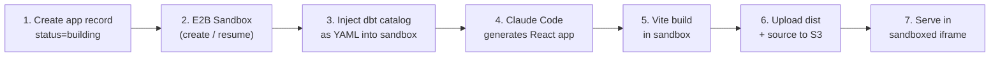
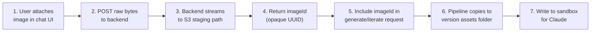

# Data Apps Architecture

This document describes how Data Apps work in Lightdash — AI-generated interactive React applications that can query
your project's metrics and dimensions, built from natural language prompts.

---

## Overview

Data Apps let users describe what they want in plain English and get a working, interactive React application back. Under
the hood, Claude Code runs inside an isolated sandbox, reads the project's dbt model catalog, generates a full React app,
builds it with Vite, and deploys the artifacts to S3. The resulting app is served in a sandboxed iframe and can query
Lightdash metrics through a secure postMessage bridge.

When creating a new app, users start from a **Starter Template** (Dashboard / Slide Show / PDF Report / Custom) and
answer a few clarifying questions to seed the first prompt. See [Starter Templates](#starter-templates) below.

The feature is enterprise-only, gated behind the `APP_RUNTIME_ENABLED` flag and the `view:DataApp` / `create:DataApp` / `manage:DataApp` permission scopes (see [Permissions](#permissions) below).

---

## How It Works (End-to-End)



### Step-by-step

1. **App creation** — The API creates a `DbApp` record and a v1 `DbAppVersion` with `status='building'`, then returns
   immediately with `{ appUuid, version }`. The pipeline runs asynchronously in the background.

2. **Sandbox setup** — An [E2B](https://e2b.dev/) sandbox is created from the `lightdash-data-app` template (override
   with `E2B_TEMPLATE_NAME` for development). The template contains a pre-configured React + Vite project with the
   Lightdash App SDK, plus a system prompt (`/app/skill.md`) that teaches Claude how to build data apps.

3. **Catalog injection** — The project's dbt catalog (tables, dimensions, metrics) is fetched via `CatalogModel` and
   written as YAML into the sandbox at `/tmp/dbt-repo/models/schema.yml`. This gives Claude full context on the
   available data model.

4. **Code generation** — Claude Code runs inside the sandbox with scoped file access
   (`Read`, `Write`, `Edit`, `Glob`, `Grep`) and generates the React app under `/app/src/`. Stream events are parsed in
   real time to provide status updates (e.g., "Creating Dashboard.tsx", "Editing App.tsx").

5. **Build** — `pnpm build` (Vite) compiles the generated code into production assets under `/app/dist`.

6. **Artifact storage** — Two tarballs are uploaded to S3:
   - `apps/{appUuid}/versions/{version}/dist.tar` — built assets (served to users)
   - `apps/{appUuid}/versions/{version}/source.tar` — source code (restored for future iterations)

7. **Preview serving** — The built app is served through an Express router at `/api/apps/{appUuid}/versions/{version}/`.
   Authentication uses short-lived JWT tokens. The iframe runs with `sandbox="allow-scripts allow-modals"` (no
   same-origin access) and strict CSP headers.

### Starter Templates

To avoid the blank-page problem, the **new-app** flow opens with a 3-stage wizard instead of an empty chat:

1. **Pick a template** - `Dashboard`, `Slide Show`, `PDF Report`, or `Custom`. Each describes a layout intent.
2. **Answer 2-3 clarifying questions** - template-specific (e.g., topic, audience, key metrics for Dashboard).
   "Custom" skips this stage.
3. **Review & generate** - the wizard composes a starting prompt from the answers, prefills the textarea, and
   the user can edit it before hitting send.

Templates are **only meaningful for v1**. Iteration prompts (v2+) never see the wizard.

How the template flows through the stack:

- The frontend sends a structured `template: 'dashboard' | 'slideshow' | 'pdf' | 'custom'` field on
  `POST /api/v1/ee/projects/{projectUuid}/apps/`, alongside the user's prompt.
- The backend `AppGenerateService` carries `template` into the `appGeneratePipeline` job payload.
- During the `catalog` stage in `writeCatalogAndPrompt`, the backend prepends a template-specific instruction block
  (from `AppGenerateService/templates.ts`) to the prompt before writing it to `/tmp/prompt.txt`. This is the same
  prepend slot used today for chart references and image references.
- For `template === 'custom'`, no instructions are prepended - Claude only sees the user's free-text prompt.
- Templates are **not persisted** in `app_versions` - they only influence the first generation. If the original
  intent matters later, it's captured by the resulting code, not the row.

Where the template metadata lives:

| Concern                                | Location                                                                                     |
| -------------------------------------- | -------------------------------------------------------------------------------------------- |
| Enum + request type                    | `packages/common/src/ee/apps/types.ts` (`DATA_APP_TEMPLATES`, `DataAppTemplate`)             |
| Backend instructions                   | `packages/backend/src/ee/services/AppGenerateService/templates.ts`                           |
| Frontend metadata + prompt composition | `packages/frontend/src/features/apps/templates.ts`                                           |
| Wizard UI                              | `AppTemplatePicker.tsx`, `AppTemplateQuestions.tsx`; orchestrated by `pages/AppGenerate.tsx` |

### Iteration

When users send follow-up prompts, the system creates a new `DbAppVersion` and either:

- **Resumes** the paused E2B sandbox (preserving Claude's conversation history via `--continue`)
- **Creates** a new sandbox and restores the source from the latest ready version's S3 tarball

This means Claude can see what it built previously and make targeted changes rather than starting from scratch.

### Cancellation

Users can cancel a building version. This atomically marks it as `status='error'` in the database and pauses the sandbox
(interrupting any running commands). The sandbox remains resumable for subsequent iterations.

### Deletion

Deleting an app goes through a single `DELETE /apps/{appUuid}` endpoint that routes to one of two modes based on the
instance-wide `lightdashConfig.softDelete.enabled` flag — the same pattern used by charts, dashboards, spaces, and SQL
charts.

- **Soft delete** (`softDelete.enabled=true`): the `apps` row is marked with `deleted_at` and `deleted_by_user_uuid`.
  Every read path (`getApp`, `getAppWithVersions`, `listMyApps`, `updateApp`, `moveToSpace`) already filters
  `deleted_at IS NULL`, so the app disappears from the UI but can be restored by clearing those columns. The E2B sandbox
  is paused so the in-flight pipeline (if any) stops against a hidden app.
- **Hard delete** (`softDelete.enabled=false`): the `apps` row is removed; `app_versions` cascade via
  `ON DELETE CASCADE`; the E2B sandbox is killed; and every S3 object under the `apps/{appUuid}/` prefix is
  enumerated and deleted (staged image uploads, version source tarballs, built dist tarballs, and per-version assets).

Implementation: `AppGenerateService.deleteApp` is the entry point. It delegates to `softDeleteApp` or
`permanentDeleteApp`, which each enforce the appropriate manage scope (see [Permissions](#permissions) below) and
handle sandbox/S3 cleanup.

---

## Data Model

### Database Tables

| Table          | Purpose                                                               |
| -------------- | --------------------------------------------------------------------- |
| `apps`         | App metadata: name, description, project, creator, sandbox ID         |
| `app_versions` | Version history: prompt, build status, error messages, status updates |

Key relationships:

- `apps.project_uuid` → `projects.project_uuid`
- `apps.space_uuid` → `spaces.space_uuid` (nullable, for future use)
- `app_versions.app_id` → `apps.app_id`

Version status transitions: `building` → `ready` | `error`

### Entity Types

Defined in `packages/backend/src/database/entities/apps.ts`:

```typescript
type DbApp = {
  app_id: string; // UUID primary key
  name: string;
  description: string;
  project_uuid: string;
  space_uuid: string | null;
  sandbox_id: string | null; // E2B sandbox ID for resume
  created_at: Date;
  created_by_user_uuid: string;
  deleted_at: Date | null; // soft delete
  deleted_by_user_uuid: string | null;
};

type DbAppVersion = {
  app_version_id: string; // UUID primary key
  app_id: string; // FK → apps
  version: number; // incrementing version number
  prompt: string; // user's request
  status: 'building' | 'ready' | 'error';
  error: string | null;
  status_message: string | null; // user-facing progress (e.g., "Creating Button.tsx")
  status_updated_at: Date | null;
  created_at: Date;
  created_by_user_uuid: string;
};
```

---

## API Endpoints

All endpoints are scoped under `/api/v1/ee/`. The required scope per endpoint follows the model in
[Permissions](#permissions) — `create:DataApp` for creation, `view:DataApp` (with space or self context) for reads,
and `manage:DataApp` (with space or self context) for mutations.

### App CRUD

| Method   | Path                                                                      | Description                            |
| -------- | ------------------------------------------------------------------------- | -------------------------------------- |
| `POST`   | `/projects/{projectUuid}/apps/`                                           | Create a new app from a prompt         |
| `GET`    | `/projects/{projectUuid}/apps/{appUuid}`                                  | Get app with paginated version history |
| `PATCH`  | `/projects/{projectUuid}/apps/{appUuid}`                                  | Update name/description                |
| `DELETE` | `/projects/{projectUuid}/apps/{appUuid}`                                  | Soft or hard delete (config-driven)    |
| `POST`   | `/projects/{projectUuid}/apps/{appUuid}/versions`                         | Iterate with a follow-up prompt        |
| `POST`   | `/projects/{projectUuid}/apps/{appUuid}/versions/{version}/cancel`        | Cancel a building version              |
| `GET`    | `/projects/{projectUuid}/apps/{appUuid}/versions/{version}/preview-token` | Mint JWT for iframe preview            |
| `GET`    | `/user/apps`                                                              | List current user's apps (paginated)   |

### Preview Serving (token-based, not session-based)

| Method | Path                                                       | Description                                        |
| ------ | ---------------------------------------------------------- | -------------------------------------------------- |
| `GET`  | `/api/apps/{appUuid}/versions/{version}/`                  | Serve `index.html` with token-rewritten asset URLs |
| `GET`  | `/api/apps/{appUuid}/versions/{version}/assets/{filename}` | Serve static assets (JS, CSS, fonts, images)       |

Controller: `packages/backend/src/ee/controllers/appGenerateController.ts`
Preview router: `packages/backend/src/routers/appPreviewRouter.ts`

---

## Security Model

### Iframe Sandboxing

The preview iframe uses `sandbox="allow-scripts allow-modals"` without `allow-same-origin`. This means:

- The iframe cannot access the parent page's cookies or storage
- The iframe cannot make credentialed requests to the Lightdash API directly
- All API communication goes through a `postMessage` bridge

`allow-modals` is enabled so that PDF Report templates (and any generated app that wants a Print button) can call
`window.print()`. It also enables `alert`/`confirm`/`prompt`, which are an accepted trade-off: the iframe is still
isolated from the parent origin, the browser attributes dialog origins to the iframe, and a malicious app could
already build an equivalent in-iframe HTML form.

### PostMessage Bridge (`useAppSdkBridge`)

Since the sandboxed iframe has no API access, the parent page acts as a proxy:

1. The iframe SDK sends `{ type: 'lightdash:sdk:fetch', method, path, body }` via `postMessage`
2. The parent validates the request against an allowlist of safe routes
3. If allowed, the parent executes the request with the user's session cookies
4. The parent posts the response back to the iframe

Allowed routes (defined in `packages/frontend/src/features/apps/hooks/useAppSdkBridge.ts`):

- `POST /api/v2/projects/{uuid}/query/metric-query` — run metric queries
- `GET /api/v2/projects/{uuid}/query/{queryId}` — poll for query results
- `GET /api/v1/user` — get current user info

All other routes are rejected.

### Preview Token Authentication

Preview requests use short-lived JWTs (signed with `LIGHTDASH_SECRET`), not session cookies:

- Tokens are minted per version and scoped to `{ appUuid, version }`
- The token is injected into asset URLs as `?token=` query parameters

### Content Security Policy

Each preview response includes a strict CSP header:

- `default-src 'none'` — deny everything by default
- `script-src 'self'` — only execute scripts from the app's own origin
- `connect-src 'self' {lightdashOrigin} https:` — allow API calls back to Lightdash
- `frame-ancestors {lightdashOrigin}` — only allow embedding from Lightdash

---

## Image Uploads

Users can attach images (screenshots, mockups, diagrams) to their prompts. These images are uploaded to S3 and passed
to Claude as context during code generation.

### Upload Flow



1. **User attaches image** — The chat UI lets users add an image file. A local preview is shown immediately.

2. **Upload to backend** — The frontend sends the raw file bytes directly to the backend via
   `POST /api/v1/ee/projects/{projectUuid}/apps/{appUuid}/upload-image` with the image's MIME type as the
   `Content-Type` header. This is a plain `fetch` call (not `lightdashApi`) because the body is raw binary, not JSON.

3. **Stream to S3 staging** — The backend streams the request body directly to S3 via `PutObjectCommand` without
   buffering the entire file in memory. The image is stored at a deterministic staging path:
   `apps/{appUuid}/uploads/{imageId}` (no file extension — MIME type is stored as the S3 object's `ContentType`).

4. **Return imageId** — The backend returns `{ imageId }` — an opaque UUID. The frontend never sees the S3 key.

5. **Attach to prompt** — When the user submits their prompt, the `imageId` is included in the generate or iterate
   request body. The backend reconstructs the S3 staging key from the deterministic convention.

6. **Copy to version assets** — During the pipeline, the image is copied from the staging path to the version assets
   folder: `apps/{appUuid}/versions/{version}/assets/images/{imageId}.{ext}`.

7. **Write to sandbox** — The image bytes are written to the E2B sandbox at `/tmp/images/reference.{ext}` for Claude
   to read as a design reference.

### Security

The frontend only ever sees an opaque `imageId` (UUID). It has no knowledge of S3 keys, bucket names, or storage
paths. The backend reconstructs all storage paths from a deterministic convention using values it controls
(`appUuid` + `imageId`). This eliminates Insecure Direct Object Reference (IDOR) risks where a modified client
could read arbitrary S3 objects.

### Constraints

- **Allowed MIME types**: `image/png`, `image/jpeg`, `image/gif`, `image/webp`
- **Max size**: 10 MB (validated via `Content-Length` header before streaming)
- **Permission**: For an existing app, the standard manage check applies (space role, self for personal apps, or
  project admin). For an upload tied to a not-yet-created app (initial creation flow), `create:DataApp` is required.

---

## Frontend Architecture

### Pages

| Route                                                            | Component            | Purpose                                   |
| ---------------------------------------------------------------- | -------------------- | ----------------------------------------- |
| `/projects/:projectUuid/apps/generate`                           | `AppGenerate.tsx`    | New app creation (split-panel chat UI)    |
| `/projects/:projectUuid/apps/:appUuid`                           | `AppGenerate.tsx`    | Edit existing app (loads version history) |
| `/projects/:projectUuid/apps/:appUuid/versions/:version/preview` | `AppPreviewTest.tsx` | Standalone preview                        |
| `/projects/:projectUuid/apps/:appUuid/preview`                   | `AppPreviewTest.tsx` | Preview latest ready version              |

### Key Hooks

| Hook                   | File                                          | Purpose                              |
| ---------------------- | --------------------------------------------- | ------------------------------------ |
| `useGenerateApp`       | `features/apps/hooks/useGenerateApp.ts`       | POST to create a new app             |
| `useIterateApp`        | `features/apps/hooks/useIterateApp.ts`        | POST to create a new version         |
| `useGetApp`            | `features/apps/hooks/useGetApp.ts`            | Infinite query for version history   |
| `useAppBuildPoller`    | `features/apps/hooks/useAppBuildPoller.ts`    | Web Worker polling build status      |
| `useBuildNotification` | `features/apps/hooks/useBuildNotification.ts` | OS notification when build completes |
| `useAppSdkBridge`      | `features/apps/hooks/useAppSdkBridge.ts`      | postMessage fetch proxy              |
| `useAppPreviewToken`   | `features/apps/hooks/useAppPreviewToken.ts`   | Mint JWT for iframe preview          |
| `useCancelAppVersion`  | `features/apps/hooks/useCancelAppVersion.ts`  | Cancel a building version            |
| `useUpdateApp`         | `features/apps/hooks/useUpdateApp.ts`         | Update app name/description          |

### Build Status Polling

The frontend uses a Web Worker (`useAppBuildPoller`) to poll the GET app endpoint for status changes. When a version
transitions from `building` to `ready` or `error`, the poller triggers a query invalidation and optionally fires an OS
notification via `useBuildNotification`.

---

## Infrastructure Dependencies

| Service           | Purpose                                           | Config                                        |
| ----------------- | ------------------------------------------------- | --------------------------------------------- |
| **E2B**           | Serverless sandbox for code generation and builds | `E2B_API_KEY`                                 |
| **S3 / MinIO**    | Stores built artifacts and source tarballs        | `S3_REGION`, `S3_ENDPOINT`, `S3_BUCKET`, etc. |
| **Anthropic API** | Powers Claude Code inside the sandbox             | `ANTHROPIC_API_KEY`                           |

### Configuration (`AppRuntimeConfig`)

```
APP_RUNTIME_ENABLED=true                           # Master feature flag
E2B_API_KEY=...                                    # E2B sandbox API key
E2B_TEMPLATE_NAME=lightdash-data-app               # Optional E2B template override (for dev)
APP_RUNTIME_LIGHTDASH_ORIGIN=https://app.example   # Origin for CORS/CSP (defaults to SITE_URL)
APP_RUNTIME_CDN_ORIGIN=https://cdn.example.com     # Optional CDN for CSP
APP_RUNTIME_PREVIEW_ORIGIN=https://preview.example # Optional Separate domain for preview serving
```

S3 credentials are configured through the existing `S3_*` environment variables used by the app runtime config.

---

## Key Files

| File                                                                        | Purpose                                        |
| --------------------------------------------------------------------------- | ---------------------------------------------- |
| `packages/backend/src/ee/services/AppGenerateService/AppGenerateService.ts` | Core pipeline: sandbox, Claude, build, S3, DB  |
| `packages/backend/src/ee/controllers/appGenerateController.ts`              | TSOA REST controllers                          |
| `packages/backend/src/models/AppModel.ts`                                   | Data access layer for apps and versions        |
| `packages/backend/src/routers/appPreviewRouter.ts`                          | Express router serving built artifacts from S3 |
| `packages/backend/src/routers/appPreviewToken.ts`                           | JWT minting and verification for preview auth  |
| `packages/backend/src/database/entities/apps.ts`                            | DB entity type definitions                     |
| `packages/common/src/ee/apps/types.ts`                                      | Shared API response types                      |
| `packages/frontend/src/pages/AppGenerate.tsx`                               | Split-panel chat UI for creation and iteration |
| `packages/frontend/src/features/apps/AppIframePreview.tsx`                  | Sandboxed iframe component                     |
| `packages/frontend/src/features/apps/hooks/useAppSdkBridge.ts`              | postMessage fetch proxy for iframe API access  |

---

## Permissions

Data apps follow the same space-based permission model as charts and dashboards, with one extra wrinkle: an app can
exist as **personal** (`space_uuid IS NULL`) before its creator decides to share it by moving it into a space. The
scopes, all defined in `packages/common/src/authorization/scopes.ts`:

| Scope                  | Granted to          | Effect                                                                                                       |
| ---------------------- | ------------------- | ------------------------------------------------------------------------------------------------------------ |
| `view:DataApp`         | viewer+             | View any app whose space the user can view (or where the project inherits org/project access).               |
| `create:DataApp`       | interactive_viewer+ | Start a new app from a prompt. Newly-created apps are personal until moved into a space.                     |
| `view:DataApp@self`    | interactive_viewer+ | View own personal apps (matched on `createdByUserUuid`).                                                     |
| `manage:DataApp@self`  | interactive_viewer+ | Iterate, edit, pin (n/a for personal), move, and delete own personal apps.                                   |
| `manage:DataApp@space` | interactive_viewer+ | Iterate, edit, cancel, pin, move, and delete apps in spaces where the user has the `EDITOR` or `ADMIN` role. |
| `manage:DataApp`       | admin               | Project-wide manage — covers any app, and gates restore + permanent-delete.                                  |

### Permission matrix

| Action                                    | Project admin | Space admin/editor | Space viewer | App creator (personal app)        |
| ----------------------------------------- | ------------- | ------------------ | ------------ | --------------------------------- |
| View an app in a space                    | ✓             | ✓                  | ✓            | (creator viewed via space)        |
| View own personal app                     | ✓             | —                  | —            | ✓                                 |
| View someone else's personal app          | ✓             | —                  | —            | —                                 |
| Create a new app                          | ✓             | ✓                  | ✗            | n/a                               |
| Iterate / cancel / update / move / delete | ✓             | ✓ (in their space) | ✗            | ✓ (own personal app)              |
| Pin to homepage                           | ✓             | ✓ (in their space) | ✗            | — (personal apps can't be pinned) |
| Restore / permanently delete              | ✓             | ✗                  | ✗            | ✗                                 |

The "App creator" column applies while an app is still personal (`space_uuid IS NULL`). Once moved into a space, the
app's permissions follow the space — the creator no longer has special rights unless they also have a space role.

### Implementation

Permission checks live in the service layer, not the controller — TSOA middleware only handles authentication. Two
helpers in `AppGenerateService.ts` carry the context-aware logic:

- `assertCanViewApp(user, app)` — used by `getAppVersions`, `getPreviewToken`. Builds a CASL subject that includes the
  app's space access context (empty for personal apps) plus `createdByUserUuid`, then checks the `view` action.
- `assertCanManageApp(user, app, msg)` — used by `iterateApp`, `cancelVersion`, `updateApp`, `togglePinning`,
  `deleteApp`, `moveToSpace`, and `uploadImage` (when the app exists). Same subject shape, checks the `manage` action.

`generateApp` (creation) checks the `create` action against a project-scoped subject — no app exists yet to provide
space or creator context.

`restoreApp` and `permanentDeleteApp` deliberately bypass the context-aware helper and use the bare project-wide
`manage:DataApp` check, since restoring deleted content is an admin-only recovery flow.

`moveToSpace` runs the manage check twice — once on the source app (its current space) and once on the target space —
so a user can't move an app into a space they don't own.

The scopes are enterprise-only and must be granted to users through their role or custom role configuration.
