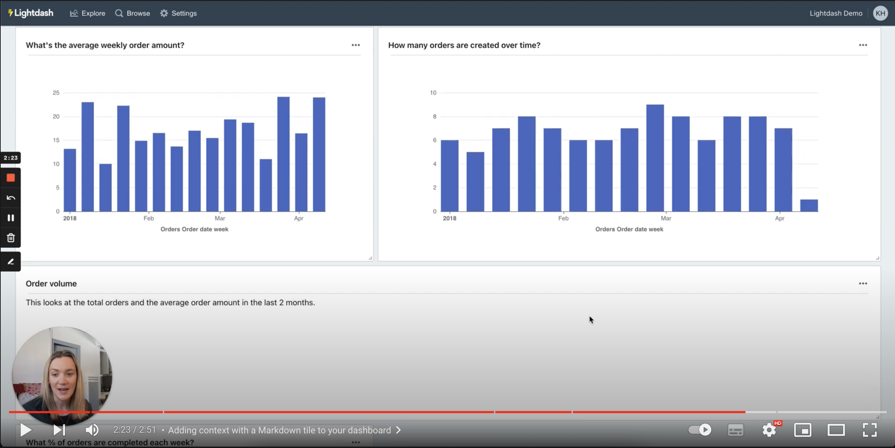
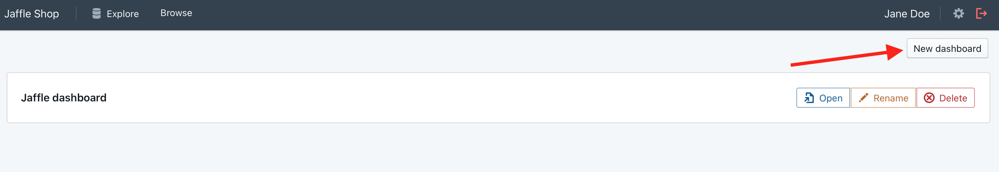
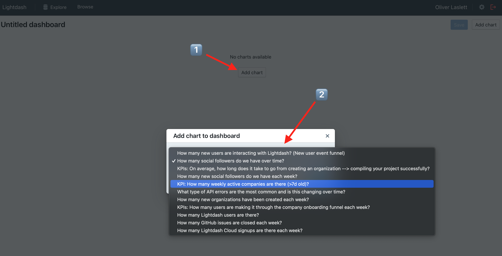
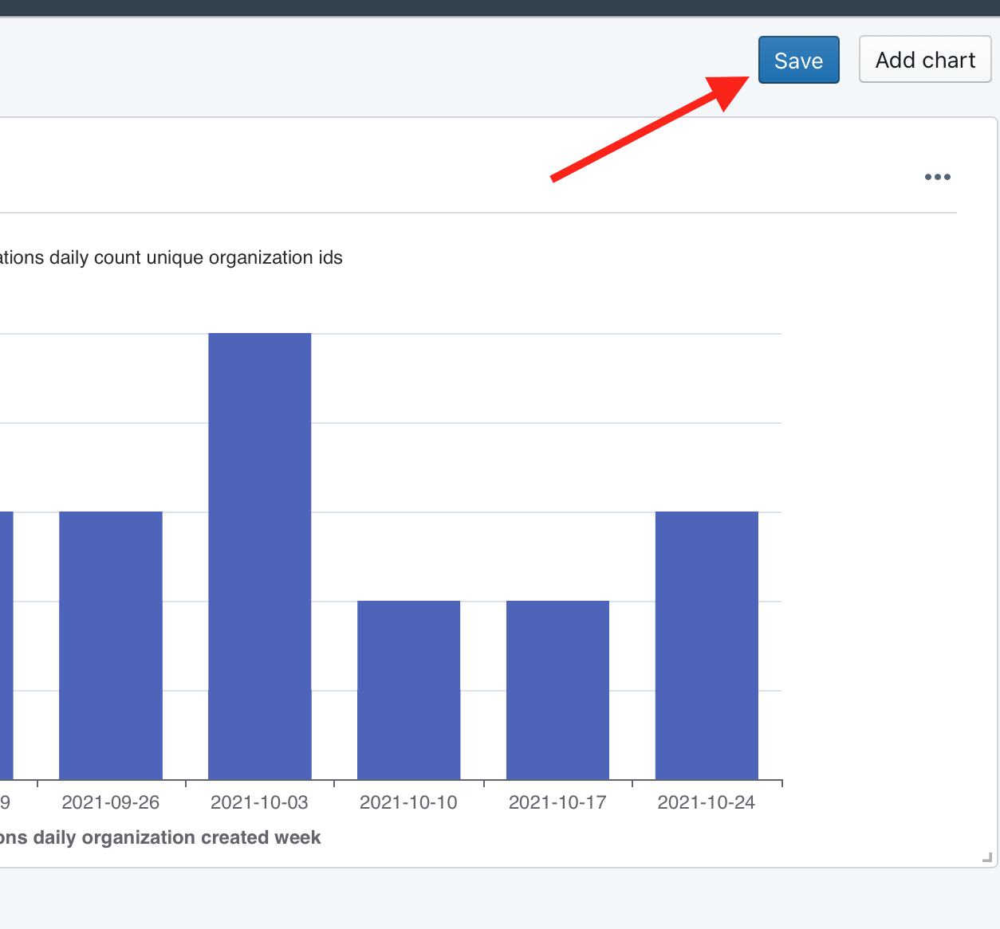
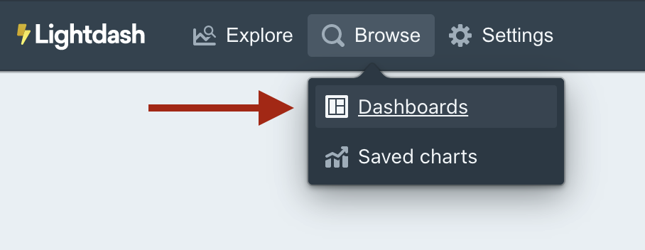

# Creating Dashboards

Dashboards allow you to arrange multiple charts that are related to each other into a single view.

Checkout this tutorial on how to create your first dashboard:

## 1. Open the dashboard page

Navigate to the top bar and choose Browse > Dashboards

## 2. Create a new empty dashboard

Click to create a new dashboard. By default, dashboards are empty and have a name "Untitled dashboard",
you can change this later.

## 3. Choose a chart to add to your dashboard

Charts can only be added to a dashboard if they've been saved. See [instructions for saving charts](./using-explores.mdx) for more
information.

Click "add chart" to see a list of charts that have been saved. Clicking any chart will add it at the top of your
dashboard.

You can resize charts by dragging the lower-right corner.

You can position your chart by dragging the center of the chart.

## 4. Save and share your dashboard

When you're happy with the layout, hit save.

You can share your dashboard with anybody in your Lightdash organisation by copying the URL. You can also see all of the saved dashboards in your project by clicking on `Browse` --> `Dashboards`.

