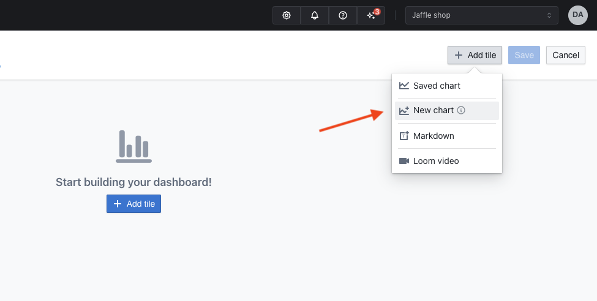

# Creating Dashboards

Dashboards allow you to arrange multiple charts that are related to each other into a single view.

Checkout this tutorial on how to create your first dashboard:

## 1. Open the dashboard page

Navigate to the top bar and choose Browse > Dashboards

## 2. Create a new empty dashboard

Click to create a new dashboard. By default, dashboards are empty and have a name "Untitled dashboard",
you can change this later.

## 3. Add a chart to your dashboard

You can create new charts or add existing ones.

#### How to create a new chart

Click "Add tile" and then "New chart" to create a new chart. You will be taken to the chart builder.

These charts can't be used in other dashboards and won't be shown in the global search or in the space.

#### How to add existing chart 

Click "Add tile" and then "Saved chart" to see a list of charts that have been saved. Clicking any chart will add it at the bottom of your
dashboard.

You can resize charts by dragging the lower-right corner.

You can position your chart by dragging the center of the chart.

## 4. Save and share your dashboard

When you're happy with the layout, hit save.

You can share your dashboard with anybody in your Lightdash organisation by copying the URL. You can also see all of the saved dashboards in your project by clicking on `Browse` --> `Dashboards`.

