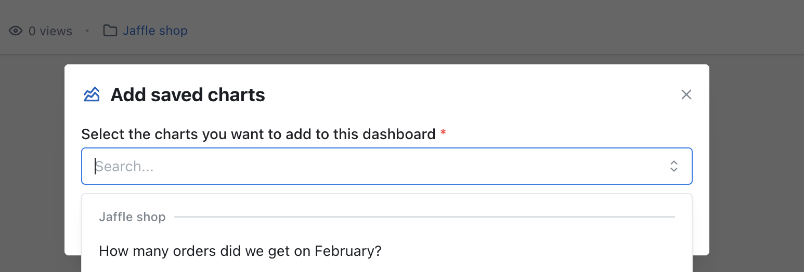
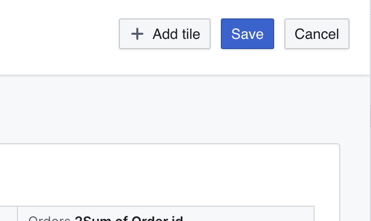
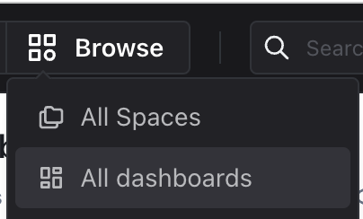

import DashboardAddNew from './assets/dashboard-add-new-navbar.png';
import DashboardAddTileCenter from './assets/dashboard-add-tile-center.png';

# Creating Dashboards

Dashboards allow you to arrange multiple charts that are related to each other into a single view.

Checkout this tutorial on how to create your first dashboard:

## 1. Create a new empty dashboard

On the nav bar, click "New" to create a new dashboard.

Fill out the details of your new dashboard and hit 'Create'. Once done, you will be redirected to your new Dashboard page:

Here, you can add the following types of tiles:

-   Saved Chart
-   New Chart
-   Markdown
-   Loom video

## 2. Choose a chart to add to your dashboard

You can create new charts or add existing ones.

### How to create a new chart

Click "Add tile" and then "New chart" to create a new chart. You will be taken to the chart builder. Once you save the chart it will appear at the bottom of your dashboard.

Note: These charts can't be used in other dashboards and won't be shown in the global search or in the space.

### How to add an existing chart

Click "Add tile" and then "Saved chart" to see a list of charts that have been saved and are ready to be added to your dashboard. Clicking any chart will add it at the bottom of your dashboard.

You can resize charts by dragging the lower-right corner.

You can position your chart by dragging the center of the chart.

## 3. Save and share your dashboard

When you're happy with the layout, hit "Save".

You can share your dashboard with anybody in your Lightdash organisation by copying the URL (or by pressing on the 🔗 button). You can also see all of the saved dashboards in your project by clicking on `Browse` --> `All Dashboards`.

## 4. Add filters to your dashboards

Learn about adding filters to your dashboards [here](/guides/limiting-data-using-filters#adding-filters-to-your-dashboard)
