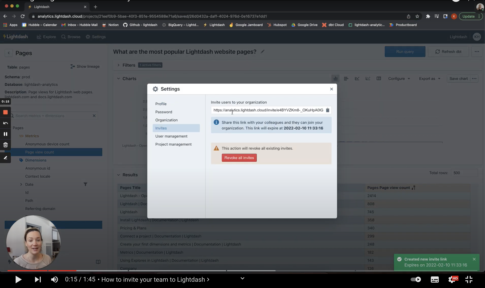
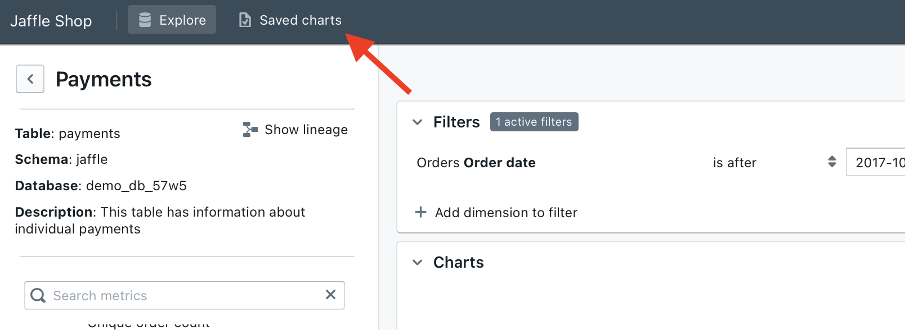
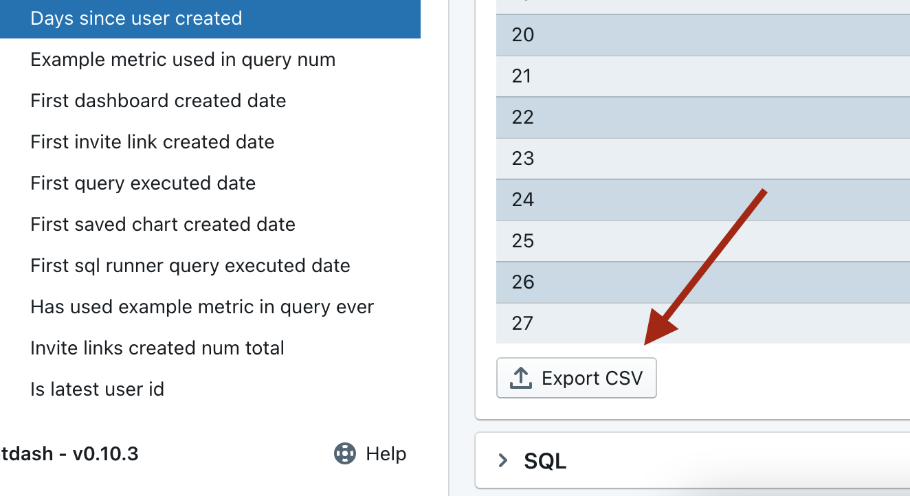
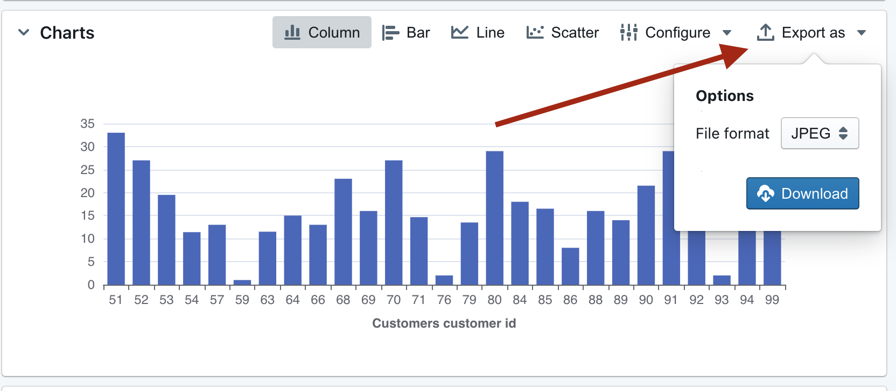

import InviteUserAction from './assets/invite_user_action.png';
import AddUserEmail from './assets/add-user-email.png';
import PendingInvites from './assets/pending-invites.png';
import SaveChart from './assets/save-chart.jpg';

# Share insights with your team

It's time to share your hard work with the world!

In Lightdash there are three primary ways to share insights with your team:

* Share a URL to a 'work-in-progress' data exploration
* Share a link to a saved chart
* Download results as a .csv or a .png of the chart

Watch this quick 2 minute tutorial where we walk you through the three key ways to share insights with your team:

## Inviting your teammates to your Lightdash project

You can only share things with people you've invited to your Lightdash project.

To invite your teammates, just click on `Settings` --> `User Management` --> `Add user`.

You then need to input the email address of the user you want to invite and select the role you want to assign them. You can read more about [user roles and permissions in Lightdash here](../../references/roles.md).

Once you hit `send invite`, we'll send an email to the new user with their invite link.

Once you're done inviting users, you can head back to the list of users in the `User Management` tab, scroll to the bottom and see all of the pending invitations for your project. You can also re-generate an invite link if you need to!

## Now that you've added some teammates, you can start sharing your work!

Here are the three ways to do this:

### 1. Share a URL to work in progress

As you explore your data in Lightdash, the URL contains a unique link to your work in progress.

Copy and paste the url while you're exploring data and anybody with access to your Lightdash project can jump into the Explore view at exactly the same point you're at.

### 2. Share a link to a saved chart

#### Save your chart

You can create a new saved chart or update an existing saved chart by clicking the 'Save chart' button on the chart panel.

#### Share your chart

Everyone in your project has access to the saved charts. All they need to do is click on `saved charts` and they can see your finished work of chart art 😚👌

### 3. Download results as a table or chart

You can download your results table as a .CSV with just the click of a button.

So, you can import data from Lightdash into other tools, or just save them on your computer for later 😉

It's also easy to download your favourite chart images. You can pick between JPEG, PNG, and more!

If you're stuck for a last minute gift idea, we've heard that framed chart art can bring a smile to most people's faces 🖼

