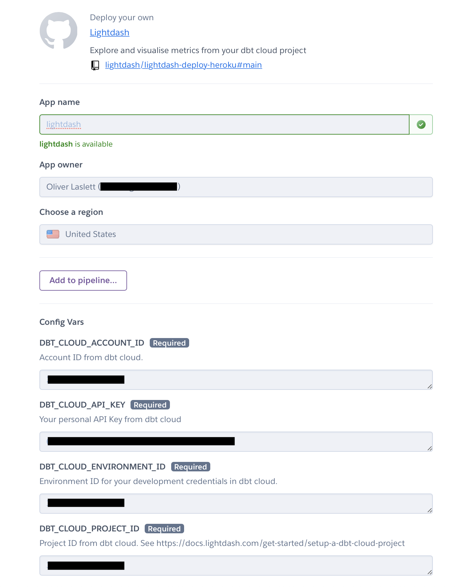
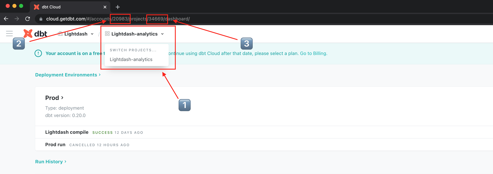
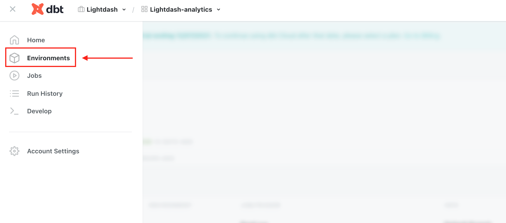
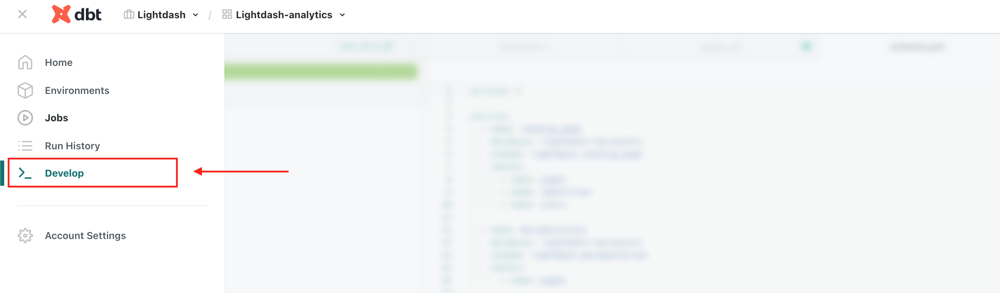

# Setup Lightdash to connect to your dbt cloud project

In this tutorial, you'll setup Lightdash and connect it to your dbt project on [dbt cloud](https://cloud.getdbt.com).
dbt cloud provides a development environment that makes it really easy to your develop your dbt project code, with
Lightdash you can also visualise your dbt models while developing you code.

**Prerequisites**
 - A dbt cloud account. If you don't have one, [sign up for a free here](https://cloud.getdbt.com/signup/)
 - A heroku account. We'll use heroku to deploy your own self-hosted lightdash instance. [Signup for free here](https://heroku.com)
 - Your dbt cloud account should have at least one environment (data warehouse) configured
 - Your dbt cloud account environment should be using dbt version `0.20.0` or higher

<iframe
    width="640"
    height="480"
    src="https://www.youtube.com/embed/joQD47r6-A4" title="Develop metrics in dbt Cloud with Lightdash" frameborder="0"
    allow="accelerometer; autoplay; clipboard-write; encrypted-media; gyroscope; picture-in-picture"
    allowfullscreen
  >
  </iframe>

## 1. One-click deploy to Heroku

Click to deploy the latest version of Lightdash to heroku. This provides a secure, production-ready deployment connected
to your dbt cloud account:

Note if you don't have an account, you'll be prompted to signup. It's free to deploy Lightdash!

## 2. Fill in your dbt cloud credentials

After you hit deploy, you'll be asked to provide some credentials to connect to your dbt cloud project:

### 2a. Get your `account_id` and `project_id` from your dbt cloud project

Login to [dbt cloud](https://cloud.getdbt.com) and follow these instructions to get your account and project id:

1. Make sure you have the correct project selected in the drop down settings
2. Get your `account_id` from the URL after `/accounts/`
3. Get your `project_id` from the URL after `/projects/`

Add the `account_id` and `project_id` in the heroku setup form.

### 2b. Get your `environment_id`

Use the sidebar to see all your environments. To connect to your dbt IDE you must select your development credentials with
type `type: development`. This should be the environment you usually use when developing in the dbt cloud IDE.

Once you've located your environment follow these steps to get your environment id:

1. Get your `environment_id` from the URL after `/environments/`
2. Check that your environment is using dbt `0.20.0` or above (you can change this in environment settings)

Add the `environment_id` to your heroku setup form.

### 2c. Get your `api_key`

You can get your personal api key by visiting your [API Access - Your profile](https://cloud.getdbt.com/#/profile/api/).

:::info

**It's a secret!** Remember to keep your api key safe as it enables access to your dbt cloud account.

:::

Add the `api_key` to your `lightdash.yml` heroku setup form.

## 3. Launch your dbt cloud development environment

Open your development environment in [dbt cloud](https://cloud.getdbt.com).

## 4. Launch Lightdash

Heroku will show that it's setting up and deploying Lightdash. When it's complete you should see an option to view
your Lightdash app.

## 5. Setup your admin account

As the first user for Lightdash, you'll be prompted to create an admin account to secure your instance:
