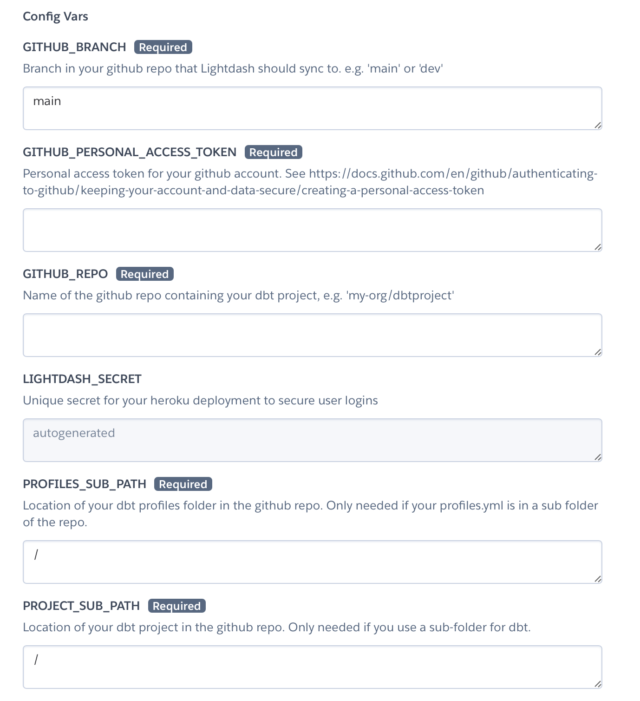
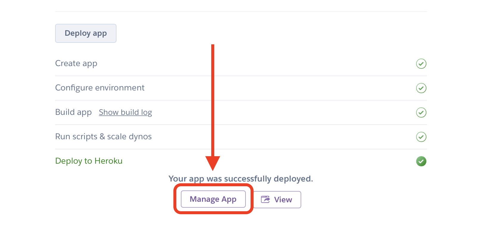
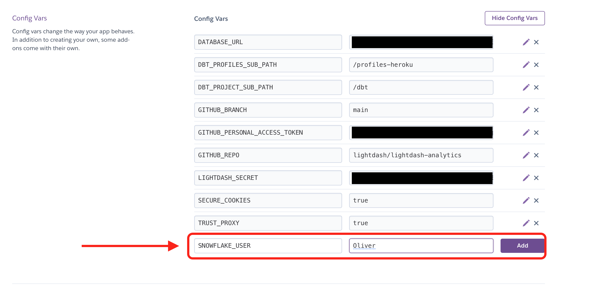
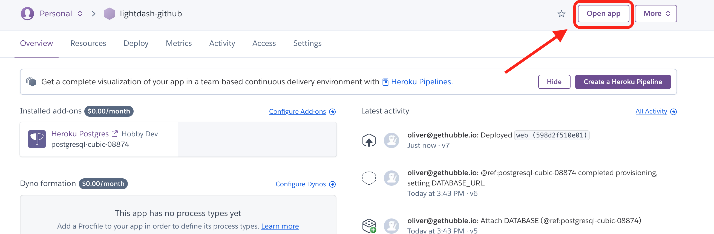

# Setup Lightdash to connect to your dbt project on GitHub

In this tutorial, you'll setup Lightdash and connect it to your dbt project on [GitHub](https://github.com).
Using GitHub as the backend is the recommended way to connect Lightdash to your production dbt project. This way, 
Lightdash will only update when you merge code changes into your production branch (e.g. `main`).

**Prerequisites**
 - A dbt project on github. You'll need the repository name
 - Your dbt project shoud have a template `profiles.yml` file in it. See below
 - A heroku account. We'll use heroku to deploy your own self-hosted lightdash instance. [Signup for free here](https://heroku.com)

## 1. Check `profiles.yml` in github

Lightdash needs a [`profiles.yml`](https://docs.getdbt.com/dbt-cli/configure-your-profile) to run you dbt project.

You can add a template `profiles.yml` file to your repo **without any secrets** by using environment variables. This
allows us to add these secret values later. For example, a snowflake profile would look like this:

```yaml
# profiles.yml
my-snowflake-db:
  target: prod
  outputs:
    prod:
      type: snowflake
      account: "{{ env_var('SNOWFLAKE_ACCOUNT') }}"
      user: "{{ env_var('SNOWFLAKE_USER') }}"
      password: "{{ env_var('SNOWFLAKE_PASSWORD') }}"
...
```

## 2. One-click deploy to Heroku

Click to deploy the latest version of Lightdash to heroku. This provides a secure, production-ready deployment connected
to your dbt project in GitHub:

[](https://heroku.com/deploy?template=https://github.com/lightdash/lightdash-deploy-heroku-github)

Note if you don't have a Heroku account, you'll be prompted to signup. It's free to deploy Lightdash!

## 3. Fill in your GitHub credentials

After you hit deploy, you'll be asked to provide some credentials to connect to your dbt project in GitHub:

The following are required:
 * **GITHUB_REPO** should be in the format `my-org/myrepo`
 * **GITHUB_PERSONAL_ACCESS_TOKEN** used to access your repo. [See instructions here](https://docs.github.com/en/github/authenticating-to-github/keeping-your-account-and-data-secure/creating-a-personal-access-token)

Optionally you can change the git branch and the location of your dbt project in the repo (in case you use a sub-folder).




## 4. Deploy your Lightdash app instance

Heroku will show that it's setting up and deploying Lightdash. When it's complete you should see an option to manage
your Lightdash app. Click here to see the Heroku dashboard for you Lightdash instance:



## 5. Add the secrets for your `profiles.yml`

If you open your Lightdash app now, it will show an error because we haven't added the `profiles.yml` environment
variables. 

In your heroku app settings, open the config vars tab:


For each `"{{ env_var('name') }}"` in your `profiles.yml` you need to add it to your heroku deployment config vars. In this example
we're adding a value for `SNOWFLAKE_USER`:




## 6. Launch Lightdash and setup your Lightdash account

Heroku will automatically update and restart your Lightdash app after you've changed your config vars. Once the
app has finished redeploying, hit "open app" in the dashboard:



As the first user for Lightdash, you'll be prompted to create an admin account to secure your instance:
