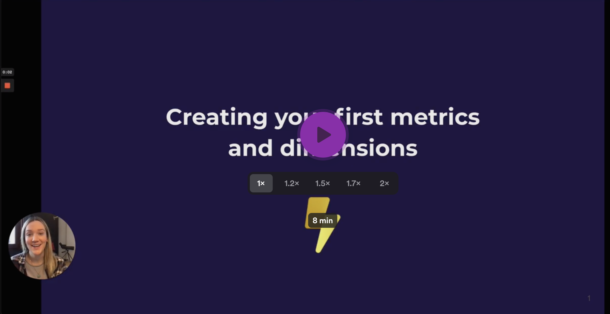

# Create your first dimensions and metrics

[](https://youtu.be/5BSPtgGnETo)

import DataQuestion from './assets/data-question.svg';

You must define **metrics** and **dimensions** before you can start exploring and visualizing data with Lightdash.
Metrics are defined in your dbt project alongside your dbt model properties.

* **Dimensions** are used to **segment data** in your Tables.
* **Metrics** are used to **perform calculations** on your Tables.

## Example

Say we're running an ecommerce business, we probably have a table containing all order data. We might want to
ask:

<div style={{textAlign: 'center', paddingBottom: 30, paddingTop: 10}}>
  <DataQuestion width="70%"/>
</div>

This question can be answered using a single metric "the total number of unique orders" and a single dimension for
splitting the metric by "status of order". In Lightdash you'd get the following chart:


To learn more about why we use dimensions and metrics in Lightdash, [read the Lightdash approach to BI](../..
/best-practice/lightdash-way.md)

## 1. Add a dimension to your project

Dimensions are created automatically when you define columns in your dbt model properties. To define columns add a
new `.yml` file to your `models/` directory in your dbt project.

For example, the following dbt project file contains properties that create a single dimension, `status`, for the `orders` model in Lightdash:
```
version: 2
models:
  - name: orders
    description: "A table of all orders."
    columns:
      - name: status
        description: "Status of an order: ordered/processed/complete"
```

The name of the dimension is `status` and the type will be inferred from the column in your database.

:::

:::info

There are some pretty great tools for automatically generating and updating your model .yml files in dbt. Our favourites are [dbt-invoke](https://pypi.org/project/dbt-invoke/) and [dbt-coves](https://pypi.org/project/dbt-coves/).

:::

## 2. Add a metric to your project

Metrics are defined in your dbt project files along with your dimensions and dbt model properties.

If dimensions segment your data into groups, metrics calculate interesting statistics for those groups.

For example, once we've used the `status` dimension to split orders by their `status`, we may want to know the
"Total number of orders" or the "Total sales" of the orders. These calculations are metrics:

```yaml
# schema.yml
version: 2
models:
  - name: "orders"
    description: "A table of all orders."
    columns:
      - name: "status"
        description: "Status of an order: ordered/processed/complete"
      - name: "order_id"
        meta:
          metrics:
            total_order_count:
              type: count_distinct
      - name: "order_value"
        meta:
          metrics:
            total_sales:
              type: sum
```
You can [see the full list of metric types](https://docs.lightdash.com/references/metrics) that you can use in your Lightdash project.

## 3. Load your metrics + dimensions in Lightdash

Commit the new dbt project files containing your dimensions and metrics to your dbt project:

* Github/Gitlab: commit the files and push them to the branch connected with Lightdash.
* local dbt project: save the new files

Finally hit "Refresh dbt" in the Lightdash UI to load them into Lightdash and start exploring.

## Next steps

Now that you've made some shiny new metrics, it's time to start [exploring your data](https://docs.lightdash.com/get-started/exploring-data/using-explores)!
