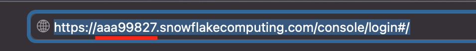
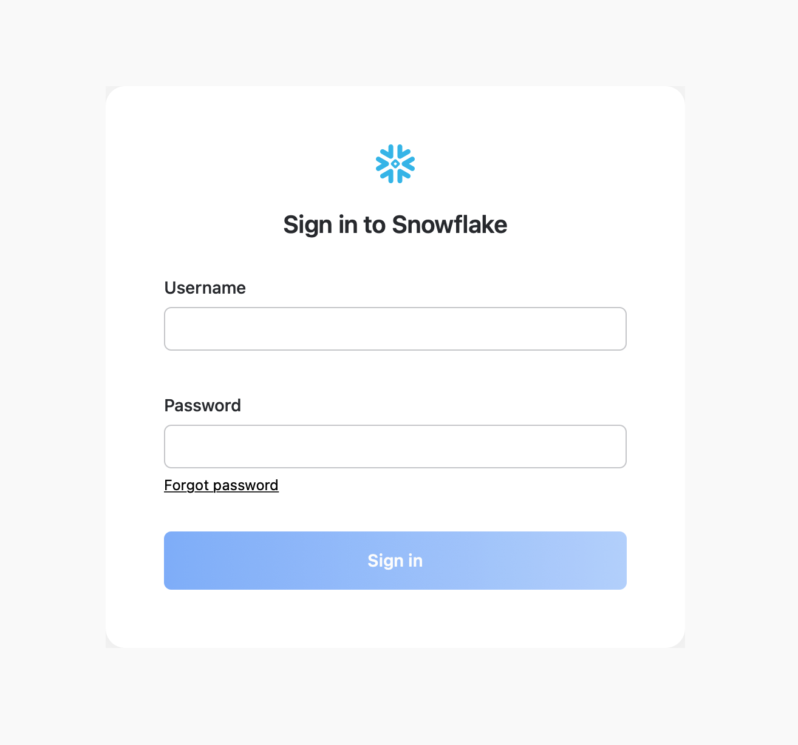
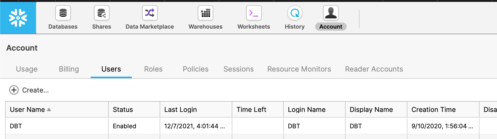
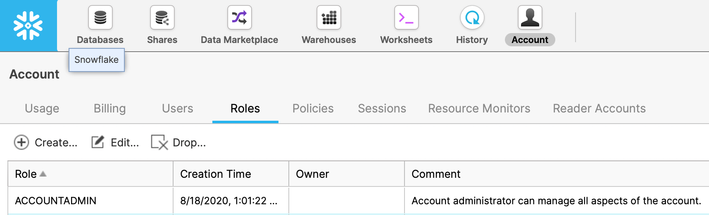
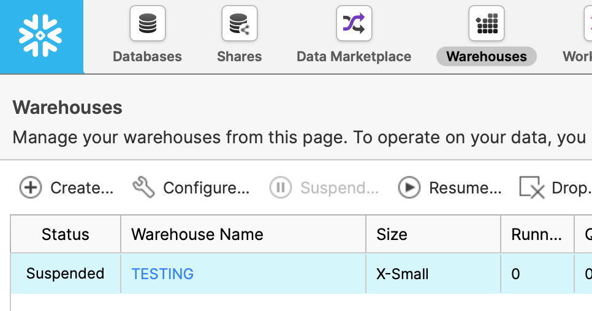
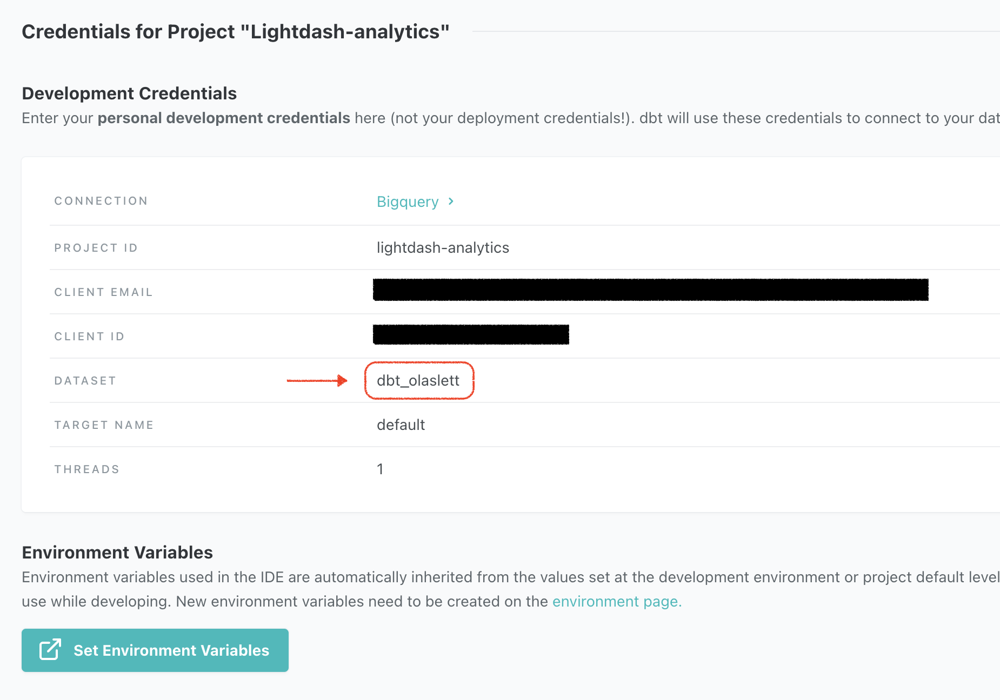

# Connect a project

Once you've [installed Lightdash](./install-lightdash), you can connect to your existing dbt project:

* [connect to a project on GitHub](#github)
* [connect to a project on Gitlab](#gitlab)
* [connect to a project on your local machine](#local-dbt-project) _(only available for local Lightdash installations)_


Once you've set up the connection to your dbt project, you'll need to continue on to [set up the connection to your warehouse](#warehouse-connection) (it's a short step, we promise 🤞).

We currently support:

1. [Bigquery](#bigquery)
2. [Postgres](#postgres)
3. [Redshift](#redshift)
4. [Snowflake](#snowflake)
5. [Databricks](#databricks)

If we don't support the warehouse you're using, don't be afraid to reach out to us in [GitHub](https://github.com/lightdash/lightdash)! :)

## dbt connection options

----

### GitHub

#### Personal access token
This is used to access your repo.
See the [instructions for creating a personal access token here](https://docs.github.com/en/github/authenticating-to-github/keeping-your-account-and-data-secure/creating-a-personal-access-token).

Select `repo` scope when you're creating the token.


#### Repository
This should be in the format `my-org/my-repo`. e.g. `lightdash/lightdash-analytics`

#### Branch
This is the branch in your GitHub repo that Lightdash should sync to. e.g. `main`, `master` or `dev`

By default, we've set this to `main` but you can change it to whatever you'd like.

#### Project directory path
This is the folder where your `dbt_project.yml` file is found in the GitHub repository you entered above.

- Put `/` if your `dbt_project.yml` file is in the main folder of your repo (e.g. lightdash/lightdash-analytics/dbt_project.yml)
- Include the path to the sub-folder where your dbt project is if your dbt project is in a sub-folder in your repo. For example, if my project was in lightdash/lightdash-analytics/dbt/dbt_project.yml, I'd write `/dbt` in this field.

----

### GitLab

#### Personal access token
This is used to access your repo.
See the [instructions for creating a personal access token here](https://docs.gitlab.com/ee/user/profile/personal_access_tokens.html).

Select `read_repository` scope when you're creating the token.

#### Repository
This should be in the format `my-org/my-repo`. e.g. `lightdash/lightdash-analytics`

#### Branch
This is the branch in your GitLab repo that Lightdash should sync to. e.g. `main`, `master` or `dev`

By default, we've set this to `main` but you can change it to whatever you'd like.

#### Project directory path
This is the folder where your `dbt_project.yml` file is found in the GitLab repository you entered above.

If your `dbt_project.yml` file is in the main folder of your repo (e.g. `lightdash/lightdash-analytics/dbt_project.yml`),
then you don't need to change anything in here. You can just leave the default value we've put in.

If your dbt project is in a sub-folder in your repo (e.g. `lightdash/lightdash-analytics/dbt/dbt_project.yml`), then
you'll need to include the path to the sub-folder where your dbt project is (e.g. `/dbt`).

----

### Azure DevOps

#### Personal access token

This is your secret token used to access Azure Devops. See the [instructions to create a personal access token](https://docs.microsoft.com/en-us/azure/devops/organizations/accounts/use-personal-access-tokens-to-authenticate?view=azure-devops&tabs=Windows)
You must specify at least the Repo:Read scope.

#### Organization

This is the name of the organization that owns your repository

#### Project

This is the name of the project that owns your repository

#### Repository

This is the name of the repository. For many projects, this is the same as your project name above.

#### Branch
This is the branch in your repository that Lightdash should sync to. e.g. `main`, `master` or `dev`

By default, we've set this to `main` but you can change it to whatever you'd like.

#### Project directory path
This is the folder where your `dbt_project.yml` file is found in the repository you entered above.

If your `dbt_project.yml` file is in the main folder of your repo (e.g. `lightdash/lightdash-analytics/dbt_project.yml`),
then you don't need to change anything in here. You can just leave the default value we've put in.

If your dbt project is in a sub-folder in your repo (e.g. `lightdash/lightdash-analytics/dbt/dbt_project.yml`), then
you'll need to include the path to the sub-folder where your dbt project is (e.g. `/dbt`).

### Local dbt project

:::caution Prerequisite

Unsuitable for production and only available for Lightdash instances installed on your local machine

:::

To start Lightdash with the option to connect to a local dbt project, you must specify the directory of the dbt project when 
you start docker compose:

```shell
# Specify the absolute path to your dbt project
# e.g. export DBT_PROJECT_DIR=/Users/elonmusk/mydbtproject
export DBT_PROJECT_DIR= # Enter your path here!
docker compose start
```

----

## Warehouse connection

We always recommend giving read-only permissions to Lightdash, that way you ensure than no data can be manipulated. See each section below for warehouse specific details.

### Bigquery

To connect to Bigquery, your service account will need to have the following roles in your GCP project:
- `roles/bigquery.dataViewer` (to see data in your project)
- `roles/bigquery.jobUser` (to run queries in your project)

If you need to provide access to data across multiple projects, the service account will need to granted `roles/bigquery.dataViewer` on each additional project.

You can see more details in [dbt documentation](https://docs.getdbt.com/reference/warehouse-profiles/bigquery-profile).

#### Project

This is the GCP project ID.

#### Data set

This is the name of your dbt dataset: the dataset in your warehouse where the output of your dbt models is written to.
If you're not sure what this is, check out the `dataset` value [you've set in your dbt `profiles.yml` file](https://docs.getdbt.com/reference/warehouse-profiles/bigquery-profile#:~:text=This%20connection%20method%20requires%20local%20OAuth%20via%20gcloud.).

#### Location

The location of BigQuery datasets.
You can see more details in [dbt documentation](https://docs.getdbt.com/reference/warehouse-profiles/bigquery-profile#dataset-locations).

#### Key File

This is the JSON key file.
You can see [how to create a key here](https://cloud.google.com/docs/authentication/getting-started#cloud-console)

#### Threads
This is the amount of threads dbt can have with the warehouse.

#### Timeout in seconds
If a dbt model takes longer than this timeout to complete, then BigQuery may cancel the query.
You can see more details in [dbt documentation](https://docs.getdbt.com/reference/warehouse-profiles/bigquery-profile#timeouts).

#### Priority
The priority for the BigQuery jobs that dbt executes.
You can see more details in [dbt documentation](https://docs.getdbt.com/reference/warehouse-profiles/bigquery-profile#priority).

#### Retries

The number of times dbt should retry queries that result in unhandled server errors
You can see more details in [dbt documentation](https://docs.getdbt.com/reference/warehouse-profiles/bigquery-profile#retries).

#### Maximum bytes billed

When a value is configured, queries executed by dbt will fail if they exceed the configured maximum bytes threshold.
You can see more details in [dbt documentation](https://docs.getdbt.com/reference/warehouse-profiles/bigquery-profile#maximum-bytes-billed).

----

### Postgres

You can see more details in [dbt documentation](https://docs.getdbt.com/reference/warehouse-profiles/postgres-profile).

#### Host

This is the host where the database is running.

#### User

This is the database user name.

#### Password

This is the database user password.

#### DB name

This is the database name.

#### Schema

This is the schema name.

#### Port

This is the port where the database is running.

#### Threads

This is the amount of threads dbt can have with the warehouse.

#### Keep alive idle (seconds)

This specifies the amount of seconds with no network activity after which the operating system should send a TCP keepalive message to the client.
You can see more details in [postgresqlco documentation](https://postgresqlco.nf/doc/en/param/tcp_keepalives_idle/).

#### Search path
This controls the Postgres "search path".
You can see more details in [dbt documentation](https://docs.getdbt.com/reference/warehouse-profiles/postgres-profile#search_path).

#### SSL mode
This controls how dbt connects to Postgres databases using SSL.
You can see more details in [dbt documentation](https://docs.getdbt.com/reference/warehouse-profiles/postgres-profile#sslmode).

----

### Redshift

You can see more details in [dbt documentation](https://docs.getdbt.com/reference/warehouse-profiles/redshift-profile).

#### Host

This is the host where the database is running.

#### User

This is the database user name.

#### Password

This is the database user password.

#### DB name

This is the database name.

#### Schema

This is the schema name.

#### Port

This is the port where the database is running.

#### Threads

This is the amount of threads dbt can have with the warehouse.
#### Keep alive idle (seconds)

This specifies the amount of seconds with no network activity after which the operating system should send a TCP keepalive message to the client.

#### SSL mode

This controls how dbt connects to Postgres databases using SSL.

#### RA3 Node

Allow dbt to use cross-database-resources

----

### Snowflake

You can see more details in [dbt documentation](https://docs.getdbt.com/reference/warehouse-profiles/snowflake-profile).

#### Account

This is your Snowflake [account identifer](https://docs.snowflake.com/en/user-guide/admin-account-identifier.html#format-1-preferred-account-name-in-your-organization).

The easiest way to find this is to login to snowflake in your browser and your account identifier is whatever comes 
before `snowflakecomputing.com`.



For example in the image above, the user logs in via `https://aaa99827.snowflakecomputing.com/console/login#/` so 
the account identifier is `aaa99827`.

If you don't have access via the browser, you can use the following format `<organization_name>-<account_name>` where
`organization_name` and `account_name` can be found by following any of the methods listed in 
[Managing accounts in your organization](https://docs.snowflake.com/en/user-guide/organizations-manage-accounts.html#label-viewing-organization-name).

#### User

This is the login name for your Snowflake user. This is usually the same username you use to login to 
Snowflake:

 

Alternatively, you can [create a new user through the snowflake console](https://docs.snowflake.com/en/user-guide/admin-user-management.html) 
with a username and password specifically for Lightdash to use.

If you're a snowflake admin you can list all users available in the snowflake console:




#### Password

This is the password your Snowflake user. This is usually the same password you use to login to Snowflake:


Alternatively, you can [create a new user through the snowflake console](https://docs.snowflake.com/en/user-guide/admin-user-management.html) 
with a username and password specifically for Lightdash to use.

If you're a Snowflake admin you can list all users available in the snowflake console:


#### Role

This is the security role that you would like to use when running queries as the specified user. The role must have 
access to any warehouses, databases, schemas, and tables you want to use.

If you're a Snowflake admin you can list all roles available in the snowflake console:



You can configure your role to allow read access to all warehouses, databases, schemas, and tables by following the 
guide for 
[Creating custom read-only roles](https://docs.snowflake.com/en/user-guide/security-access-control-configure.html#creating-custom-read-only-roles).

#### Database

This is the name of your database. The specified user must be granted access to this database. You can see a list of 
databases available in the snowflake console:

![snowflake-database-list](./assets/snowflake-database-list.png

#### Warehouse

This is the name of the warehouse you would like to use for running queries. The specified user must be grantend 
access to use this warehouse. You can see al list of warehouses available in the snowflake console:



#### Schema

This is the default schema used by dbt to compile and run your dbt project. You can find this in the dbt cloud IDE 
or  your local `profiles.yml` file.

If you're a dbt cloud user you can find this under your profile in the dbt cloud IDE:



If you work with dbt locally, then check your `profiles.yml` file at `~/.dbt/profiles.yml` and look for a field 
named `database`:

```yaml
my-snowflake-db:
  target: dev
  outputs:
    dev:
      type: snowflake
      account: [account id]
      user: [username]
      password: [password]
      role: [user role]
      database: [database name]
      warehouse: [warehouse name]
      schema: [dbt schema]    # Look for this one!
```

#### Threads

This is the number of multiple concurrent queries Lightdash will run against your Snowflake warehouse. Use a higher 
number if you have a larger warehouse. A larger number of threads will increase performance for many users Lightdash 
at the same time.

#### Keep client session alive

This is intended to keep Snowflake sessions alive beyond the typical 4 hour timeout limit.
You can see more details in [dbt documentation](https://docs.getdbt.com/reference/warehouse-profiles/snowflake-profile#client_session_keep_alive).

#### Query tag

A value with which to tag all queries, for later searching in [QUERY_HISTORY view](https://docs.snowflake.com/en/sql-reference/account-usage/query_history.html))

---

### Databricks

The credentials needed to connect to your cluster can be found in the ODBC options in your databricks account:

1. Go to the `Compute` tab in the sidebar.
2. Click the configuration tab for the cluster that you're connecting to Lightdash.
3. Expand the `Advanced options` tab
4. Open the `JDBC/ODBC` tab


#### Server hostname

Follow the instructions above to find your ODBC connection instructions.

#### HTTP Path

Follow the instructions above to find your ODBC connection instructions.

#### Port

Follow the instructions above to find your ODBC connection instructions.

#### Personal Access Token

Your personal access token can be found in your user settings in databricks:

1. Open `Settings` by clicking the cog ⚙️ in the sidebar and select `User settings`
2. Click `Generate token`. You'll be asked to enter a name and expiry.
3. Copy the token


#### Database

The default database name used by dbt for this connection. In databricks/spark the database is also the schema.


