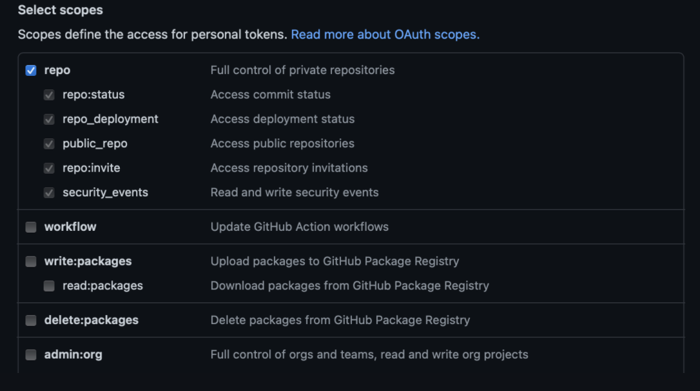

# Connect a project

How you connect your dbt project depends on where it is hosted.

1. If you use dbt cloud, then check out the [how to connect dbt cloud](#dbt-cloud) instructions
2. If you want to connect a dbt project that's version controlled, take a look at:
   - [how to connect with GitHub](#github)
   - [how to connect with GitLab](#gitlab)
3. If you want to connect to your local dbt project, then you can check [how to connect to local dbt](#local-dbt-project)

If you're connecting a dbt cloud project, once you've connected your project, you can go ahead and launch Lightdash.
If you're connecting a dbt project that _**isn't**_ on dbt cloud, once you've set up the connection to your dbt project,
you'll need to continue on to [set up the connection to your warehouse](#warehouse-connection) (it's a short step, we promise 🤞).

We currently support:

1. [Bigquery](#bigquery)
2. [Postgres](#postgres)
3. [Redshift](#redshift)
4. [Snowflake](#snowflake)

If we don't support the warehouse you're using, don't be afraid to reach out to us in [GitHub](https://github.com/lightdash/lightdash)! :)

## dbt connection options

----

### dbt cloud

#### How to get your **Account ID** and **Project ID** from your dbt cloud project

Login to [dbt cloud](https://cloud.getdbt.com) and follow these instructions to get your account and project id:

1. Make sure you have the correct project selected in the drop down settings
2. Get your **Account ID**  from the URL after `/accounts/`
3. Get your **Project ID** from the URL after `/projects/`

#### How to get your **Environment ID**

Use the sidebar to see all your environments. 

Once you've located your environments, follow these steps to get your environment id:

1. Click on the Environment that is `type: development`. This is the environment you use when developing in the dbt cloud IDE. 

2. Get your **Environment ID** from the URL after `/environments/`
3. Check that your environment is using dbt `0.20.0` or above (you can change this in environment settings)

#### How to get your **API key**

You can get your personal api key by visiting your [API Access - Your profile](https://cloud.getdbt.com/#/profile/api/).

:::caution It's a secret!

Remember to keep your api key safe as it enables access to your dbt cloud account.

:::

### Spin up the IDE

After getting your project information and credentials, click on the hamburger menu on the top left and click on `Develop`. This will spin up the IDE for your project. You will need this to be active to connect to Lightdash. 

----

### GitHub

#### Personal access token
This is used to access your repo.
See the [instructions for creating a personal access token here](https://docs.github.com/en/github/authenticating-to-github/keeping-your-account-and-data-secure/creating-a-personal-access-token).

Select `repo` scope when you're creating the token.

#### Repository
This should be in the format `my-org/my-repo`. e.g. `lightdash/lightdash-analytics`

#### Branch
This is the branch in your GitHub repo that Lightdash should sync to. e.g. `main`, `master` or `dev`

By default, we've set this to `main` but you can change it to whatever you'd like.

#### Project directory path
This is the folder where your `dbt_project.yml` file is found in the GitHub repository you entered above.

- Put `/` if your `dbt_project.yml` file is in the main folder of your repo (e.g. lightdash/lightdash-analytics/dbt_project.yml)
- Include the path to the sub-folder where your dbt project is if your dbt project is in a sub-folder in your repo. For example, if my project was in lightdash/lightdash-analytics/dbt/dbt_project.yml, I'd write `/dbt` in this field.

----

### GitLab

#### Personal access token
This is used to access your repo.
See the [instructions for creating a personal access token here](https://docs.gitlab.com/ee/user/profile/personal_access_tokens.html).

Select `read_repository` scope when you're creating the token.

#### Repository
This should be in the format `my-org/my-repo`. e.g. `lightdash/lightdash-analytics`

#### Branch
This is the branch in your GitLab repo that Lightdash should sync to. e.g. `main`, `master` or `dev`

By default, we've set this to `main` but you can change it to whatever you'd like.

#### Project directory path
This is the folder where your `dbt_project.yml` file is found in the GitLab repository you entered above.

If your `dbt_project.yml` file is in the main folder of your repo (e.g. `lightdash/lightdash-analytics/dbt_project.yml`),
then you don't need to change anything in here. You can just leave the default value we've put in.

If your dbt project is in a sub-folder in your repo (e.g. `lightdash/lightdash-analytics/dbt/dbt_project.yml`), then
you'll need to include the path to the sub-folder where your dbt project is (e.g. `/dbt`).

----

### Local dbt project

:::caution Prerequisite

If you're using a local dbt project, during the [install process](./install-lightdash.mdx) you should have set the path
to your local dbt project.

:::

####

**Project directory**

This is path to the dbt project inside the docker container.

If you followed the [install instructions](./install-lightdash.mdx), then keep the value as **"/usr/app/dbt"**.

----

## Warehouse connection

### Bigquery

You can see more details in [dbt documentation](https://docs.getdbt.com/reference/warehouse-profiles/bigquery-profile).

#### Project

This is the GCP project ID.

#### Data set

This is the name of your dbt dataset: the dataset in your warehouse where the output of your dbt models is written to.
If you're not sure what this is, check out the `dataset` value [you've set in your dbt `profiles.yml` file](https://docs.getdbt.com/reference/warehouse-profiles/bigquery-profile#:~:text=This%20connection%20method%20requires%20local%20OAuth%20via%20gcloud.).

#### Location

The location of BigQuery datasets.
You can see more details in [dbt documentation](https://docs.getdbt.com/reference/warehouse-profiles/bigquery-profile#dataset-locations).

#### Key File

This is the JSON key file.
You can see [how to create a key here](https://cloud.google.com/docs/authentication/getting-started#cloud-console)

#### Threads
This is the amount of threads dbt can have with the warehouse.

#### Timeout in seconds
If a dbt model takes longer than this timeout to complete, then BigQuery may cancel the query.
You can see more details in [dbt documentation](https://docs.getdbt.com/reference/warehouse-profiles/bigquery-profile#timeouts).

#### Priority
The priority for the BigQuery jobs that dbt executes.
You can see more details in [dbt documentation](https://docs.getdbt.com/reference/warehouse-profiles/bigquery-profile#priority).

#### Retries

The number of times dbt should retry queries that result in unhandled server errors
You can see more details in [dbt documentation](https://docs.getdbt.com/reference/warehouse-profiles/bigquery-profile#retries).

#### Maximum bytes billed

When a value is configured, queries executed by dbt will fail if they exceed the configured maximum bytes threshold.
You can see more details in [dbt documentation](https://docs.getdbt.com/reference/warehouse-profiles/bigquery-profile#maximum-bytes-billed).

----

### Postgres

You can see more details in [dbt documentation](https://docs.getdbt.com/reference/warehouse-profiles/postgres-profile).

#### Host

This is the host where the database is running.

#### User

This is the database user name.

#### Password

This is the database user password.

#### DB name

This is the database name.

#### Schema

This is the schema name.

#### Port

This is the port where the database is running.

#### Threads

This is the amount of threads dbt can have with the warehouse.

#### Keep alive idle (seconds)

This specifies the amount of seconds with no network activity after which the operating system should send a TCP keepalive message to the client.
You can see more details in [postgresqlco documentation](https://postgresqlco.nf/doc/en/param/tcp_keepalives_idle/).

#### Search path
This controls the Postgres "search path".
You can see more details in [dbt documentation](https://docs.getdbt.com/reference/warehouse-profiles/postgres-profile#search_path).

#### SSL mode
This controls how dbt connects to Postgres databases using SSL.
You can see more details in [dbt documentation](https://docs.getdbt.com/reference/warehouse-profiles/postgres-profile#sslmode).

----

### Redshift

You can see more details in [dbt documentation](https://docs.getdbt.com/reference/warehouse-profiles/redshift-profile).

#### Host

This is the host where the database is running.

#### User

This is the database user name.

#### Password

This is the database user password.

#### DB name

This is the database name.

#### Schema

This is the schema name.

#### Port

This is the port where the database is running.

#### Threads

This is the amount of threads dbt can have with the warehouse.
#### Keep alive idle (seconds)

This specifies the amount of seconds with no network activity after which the operating system should send a TCP keepalive message to the client.

#### SSL mode

This controls how dbt connects to Postgres databases using SSL.

----

### Snowflake

You can see more details in [dbt documentation](https://docs.getdbt.com/reference/warehouse-profiles/snowflake-profile).

#### Account

This is the account to connect to.

#### User

This is the database user name.

#### Password

This is the database user password.

#### Role

This is the role to assume when running queries as the specified user.

#### Database

This is the database name.

#### Warehouse

This is the warehouse name.

#### Schema

This is the schema name.

#### Threads

This is the amount of threads dbt can have with the warehouse.

#### Keep client session alive

This is intended to keep Snowflake sessions alive beyond the typical 4 hour timeout limit
You can see more details in [dbt documentation](https://docs.getdbt.com/reference/warehouse-profiles/snowflake-profile#client_session_keep_alive).

#### Query tag

This is Snowflake query tags parameter.
You can see more details in [dbt documentation](https://docs.getdbt.com/reference/warehouse-profiles/snowflake-profile#query_tag).
