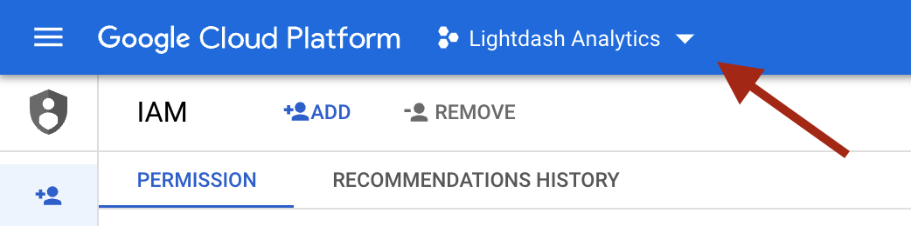
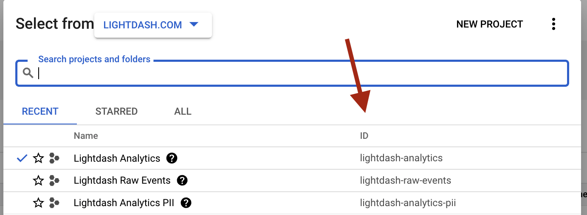
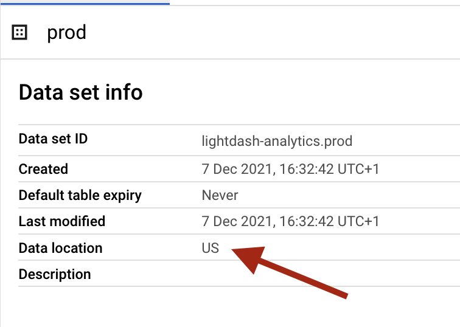
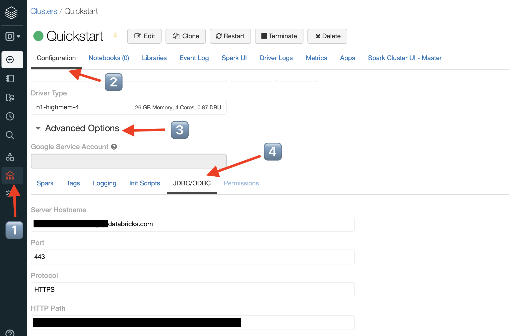
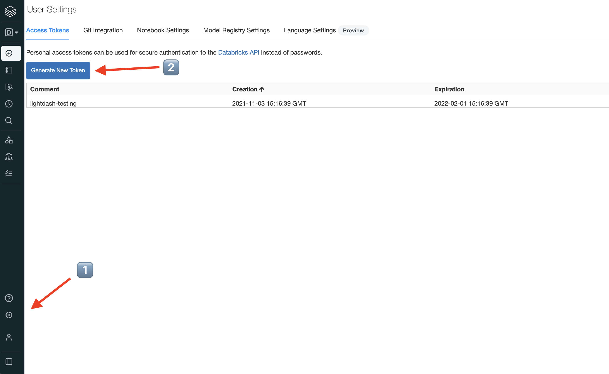

# Connect a project

Once you've [installed Lightdash](./install-lightdash), you can connect to your existing dbt project:

* [connect to a project on GitHub](#github)
* [connect to a project on Gitlab](#gitlab)
* [connect to a project on your local machine](#local-dbt-project) _(only available for local Lightdash installations)_


Once you've set up the connection to your dbt project, you'll need to continue on to [set up the connection to your warehouse](#warehouse-connection) (it's a short step, we promise 🤞).

We currently support:

1. [Bigquery](#bigquery)
2. [Postgres](#postgres)
3. [Redshift](#redshift)
4. [Snowflake](#snowflake)
5. [Databricks](#databricks)

If we don't support the warehouse you're using, don't be afraid to reach out to us in [GitHub](https://github.com/lightdash/lightdash)! :)

## dbt connection options

----

### GitHub

#### Personal access token
This is used to access your repo.
See the [instructions for creating a personal access token here](https://docs.github.com/en/github/authenticating-to-github/keeping-your-account-and-data-secure/creating-a-personal-access-token).

Select `repo` scope when you're creating the token.


#### Repository
This should be in the format `my-org/my-repo`. e.g. `lightdash/lightdash-analytics`

#### Branch
This is the branch in your GitHub repo that Lightdash should sync to. e.g. `main`, `master` or `dev`

By default, we've set this to `main` but you can change it to whatever you'd like.

#### Project directory path
This is the folder where your `dbt_project.yml` file is found in the GitHub repository you entered above.

- Put `/` if your `dbt_project.yml` file is in the main folder of your repo (e.g. lightdash/lightdash-analytics/dbt_project.yml)
- Include the path to the sub-folder where your dbt project is if your dbt project is in a sub-folder in your repo. For example, if my project was in lightdash/lightdash-analytics/dbt/dbt_project.yml, I'd write `/dbt` in this field.

----

### GitLab

#### Personal access token
This is used to access your repo.
See the [instructions for creating a personal access token here](https://docs.gitlab.com/ee/user/profile/personal_access_tokens.html).

Select `read_repository` scope when you're creating the token.

#### Repository
This should be in the format `my-org/my-repo`. e.g. `lightdash/lightdash-analytics`

#### Branch
This is the branch in your GitLab repo that Lightdash should sync to. e.g. `main`, `master` or `dev`

By default, we've set this to `main` but you can change it to whatever you'd like.

#### Project directory path
This is the folder where your `dbt_project.yml` file is found in the GitLab repository you entered above.

If your `dbt_project.yml` file is in the main folder of your repo (e.g. `lightdash/lightdash-analytics/dbt_project.yml`),
then you don't need to change anything in here. You can just leave the default value we've put in.

If your dbt project is in a sub-folder in your repo (e.g. `lightdash/lightdash-analytics/dbt/dbt_project.yml`), then
you'll need to include the path to the sub-folder where your dbt project is (e.g. `/dbt`).

----

### Azure DevOps

#### Personal access token

This is your secret token used to access Azure Devops. See the [instructions to create a personal access token](https://docs.microsoft.com/en-us/azure/devops/organizations/accounts/use-personal-access-tokens-to-authenticate?view=azure-devops&tabs=Windows)
You must specify at least the Repo:Read scope.

#### Organization

This is the name of the organization that owns your repository

#### Project

This is the name of the project that owns your repository

#### Repository

This is the name of the repository. For many projects, this is the same as your project name above.

#### Branch
This is the branch in your repository that Lightdash should sync to. e.g. `main`, `master` or `dev`

By default, we've set this to `main` but you can change it to whatever you'd like.

#### Project directory path
This is the folder where your `dbt_project.yml` file is found in the repository you entered above.

If your `dbt_project.yml` file is in the main folder of your repo (e.g. `lightdash/lightdash-analytics/dbt_project.yml`),
then you don't need to change anything in here. You can just leave the default value we've put in.

If your dbt project is in a sub-folder in your repo (e.g. `lightdash/lightdash-analytics/dbt/dbt_project.yml`), then
you'll need to include the path to the sub-folder where your dbt project is (e.g. `/dbt`).

### Local dbt project

:::caution Prerequisite

Unsuitable for production and only available for Lightdash instances installed on your local machine

:::

To start Lightdash with the option to connect to a local dbt project, you must specify the directory of the dbt project when 
you start docker compose:

```shell
# Specify the absolute path to your dbt project
# e.g. export DBT_PROJECT_DIR=/Users/elonmusk/mydbtproject
export DBT_PROJECT_DIR= # Enter your path here!
docker compose start
```

----

## Warehouse connection

We always recommend giving read-only permissions to Lightdash, that way you ensure than no data can be manipulated. See each section below for warehouse specific details.

### Bigquery

#### Project

This is project ID from Google Cloud Platform for the data that you want to connect Lightdash to.

To find your project ID, head to the [BigQuery Cloud console](https://console.cloud.google.com/).

Once you're in there, click on the project name in the top bar.



Then, you should see all of the projects and their project IDs in your organization (that you have access to).



For the project you want to connect Lightdash to, just copy its `id` and pop it into the `project` field in the Warehouse Connection form in Lightdash.

#### Data set

This is the name of your the dataset in BigQuery where the output of your dbt models is written to.

If you're not sure what this is, check out the `dataset` value [you've set in your dbt `profiles.yml` file](https://docs.getdbt.com/reference/warehouse-profiles/bigquery-profile#:~:text=This%20connection%20method%20requires%20local%20OAuth%20via%20gcloud.).

#### Location

The data location of the dataset in BigQuery where the output of your dbt models is written to.

The value you enter should be all lower-case (e.g. `us` or `europe-east`).

You can find the location of your dataset [in your dbt `profiles.yml` file](https://docs.getdbt.com/reference/warehouse-profiles/bigquery-profile#dataset-locations), or in your BigQuery console.



#### Key File

To connect to BigQuery, you'll need to have a service account that you can use with Lightdash. You can read more about [creating and managing service accounts with Google BigQuery in their docs](https://cloud.google.com/iam/docs/creating-managing-service-accounts). 

:::info

If you're creating a new service account, make sure that you save your JSON key file somewhere safe! You'll need it for connecting to Lightdash.

:::

The service account you use with Lightdash will need to have the following roles in your GCP project:
- `roles/bigquery.dataViewer` (to see data in your project)
- `roles/bigquery.jobUser` (to run queries in your project)

If you need to provide access to data across multiple BigQuery projects, the service account will need to be granted `roles/bigquery.dataViewer` on each additional BigQuery project.

Once you have a service account all ready to go, you'll need to add its JSON key file to Lightdash in the `key file` section of the Warehouse Connection page.

#### Threads

When dbt runs, it creates a directed acyclic graph (DAG) of links between models. The number of threads represents the maximum number of paths through the graph dbt may work on at once – increasing the number of threads can minimize the run time of your project.

By default, we set this to 1 thread.

You can read more about [configuring threads with dbt here](https://docs.getdbt.com/dbt-cli/configure-your-profile#understanding-threads).

#### Timeout in seconds
BigQuery supports query timeouts. By default, the timeout is set to 300 seconds. If a dbt model takes longer than this timeout to complete, then BigQuery may cancel the query and issue the following error:

```
Operation did not complete within the designated timeout.
```

To change this timeout, use the `Timeout in seconds` configuration.

If a dbt model takes longer than this timeout to complete, then BigQuery may cancel the query.

#### Priority
The priority for the BigQuery jobs that Lightdash executes can be configured with the `priority` configuration in your Warehouse Connection settings. The `priority` field can be set to one of `batch` or `interactive`. 

For more information on query priority, [check out the BigQuery documentation.](https://cloud.google.com/bigquery/docs/running-queries)

#### Retries

The `retries` configuration specifies the number of times Lightdash should retry queries that result in unhandled server errors. 

For example, setting `retries` to 5 means that Lightdash will retry BigQuery queries 5 times with a delay. If the query does not succeed after the fifth attempt, then Lightdash will raise an error.

By default, the number of retries is set to 3.

#### Maximum bytes billed

If a value for the `Maximum bytes billed` is set, then queries executed by Lightdash will fail if they exceed the configured maximum bytes threshhold. This configuration should be supplied as an integer number of bytes.

For example, setting this to `1000000000` means if a query would bill more than a gigabyte of data (e.g. 2Gb), then BigQuery will reject the query and you'd get an error like this:

```
  Query exceeded limit for bytes billed: 1000000000. 2000000000 or higher required.
```

----

### Postgres

You can see more details in [dbt documentation](https://docs.getdbt.com/reference/warehouse-profiles/postgres-profile).

#### Host

This is the host where the database is running.

#### User

This is the database user name.

#### Password

This is the database user password.

#### DB name

This is the database name.

#### Schema

This is the schema name.

#### Port

This is the port where the database is running.

#### Threads

This is the amount of threads dbt can have with the warehouse.

#### Keep alive idle (seconds)

This specifies the amount of seconds with no network activity after which the operating system should send a TCP keepalive message to the client.
You can see more details in [postgresqlco documentation](https://postgresqlco.nf/doc/en/param/tcp_keepalives_idle/).

#### Search path
This controls the Postgres "search path".
You can see more details in [dbt documentation](https://docs.getdbt.com/reference/warehouse-profiles/postgres-profile#search_path).

#### SSL mode
This controls how dbt connects to Postgres databases using SSL.
You can see more details in [dbt documentation](https://docs.getdbt.com/reference/warehouse-profiles/postgres-profile#sslmode).

----

### Redshift

You can see more details in [dbt documentation](https://docs.getdbt.com/reference/warehouse-profiles/redshift-profile).

#### Host

This is the host where the database is running.

#### User

This is the database user name.

#### Password

This is the database user password.

#### DB name

This is the database name.

#### Schema

This is the schema name.

#### Port

This is the port where the database is running.

#### Threads

This is the amount of threads dbt can have with the warehouse.
#### Keep alive idle (seconds)

This specifies the amount of seconds with no network activity after which the operating system should send a TCP keepalive message to the client.

#### SSL mode

This controls how dbt connects to Postgres databases using SSL.

#### RA3 Node

Allow dbt to use cross-database-resources

----

### Snowflake

You can see more details in [dbt documentation](https://docs.getdbt.com/reference/warehouse-profiles/snowflake-profile).

#### Account

This is the account to connect to.

#### User

This is the database user name.

#### Password

This is the database user password.

#### Role

This is the role to assume when running queries as the specified user.

#### Database

This is the database name.

#### Warehouse

This is the warehouse name.

#### Schema

This is the schema name.

#### Threads

This is the amount of threads dbt can have with the warehouse.

#### Keep client session alive

This is intended to keep Snowflake sessions alive beyond the typical 4 hour timeout limit
You can see more details in [dbt documentation](https://docs.getdbt.com/reference/warehouse-profiles/snowflake-profile#client_session_keep_alive).

#### Query tag

This is Snowflake query tags parameter.
You can see more details in [dbt documentation](https://docs.getdbt.com/reference/warehouse-profiles/snowflake-profile#query_tag).

---

### Databricks

The credentials needed to connect to your cluster can be found in the ODBC options in your databricks account:

1. Go to the `Compute` tab in the sidebar.
2. Click the configuration tab for the cluster that you're connecting to Lightdash.
3. Expand the `Advanced options` tab
4. Open the `JDBC/ODBC` tab



#### Server hostname

Follow the instructions above to find your ODBC connection instructions.

#### HTTP Path

Follow the instructions above to find your ODBC connection instructions.

#### Port

Follow the instructions above to find your ODBC connection instructions.

#### Personal Access Token

Your personal access token can be found in your user settings in databricks:

1. Open `Settings` by clicking the cog ⚙️ in the sidebar and select `User settings`
2. Click `Generate token`. You'll be asked to enter a name and expiry.
3. Copy the token




#### Database

The default database name used by dbt for this connection. In databricks/spark the database is also the schema.


