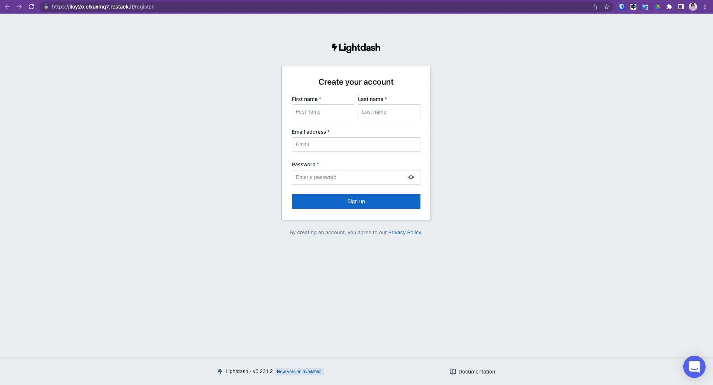

# Self-host Lightdash

_If you're [using Lightdash Cloud](#getting-setup-on-lightdash-cloud), you don't have to worry about self hosting. You can skip ahead to the next step of [Using Tables and the Explore view in Lightdash](/get-started/exploring-data/using-explores)._

Choose your preferred environment to self-host Lightdash:

1. [Run **Lightdash on your local machine**](#deploy-locally-with-our-installation-script) to try out Lightdash for yourself without any collaborators.
2. [Deploy **Lightdash to Heroku** with 1-click](#deploy-to-heroku) to get a cloud deployment for your whole team with minimum effort.
3. [Deploy **Lightdash to Restack on your own AWS infastructure**](#deploy-to-aws-with-restack) to setup Lightdash in production on kubernetes.
4. [Manually install **Lightdash in production**](#deploy-manually) to setup Lightdash in your preferred production environment.

---

## Getting set up on Lightdash Cloud

Want to have a production Lightdash instance, but not comfortable with self-hosting?

You can [**sign up for Lightdash Cloud Public Beta**](https://lightdash.typeform.com/public-beta#source=docs)!

With Lightdash Cloud, you get a Lightdash instance that you can share all your insights with your team
and you don't have to worry about any of the setup for hosting the instance yourself. So, if you're not too sure about all of
this container, Heroku and cloud-platforms business, or you're just not interested in the overhead of hosting your BI yourself,
then [Lightdash Cloud](https://lightdash.typeform.com/public-beta#source=docs) might be a good option for you :)

---

## Deploy locally with our installation script

Our installation script is the simplest way to install Lightdash if you only want to run Lightdash on your local
machine (that means, you won't be able to share the things you build in
Lightdash with anyone else):

:::caution Production deployments

For production deployments check the [Deploy manually](#deploy-manually) instructions.

:::

:::info

This script is going to install docker and docker compose. If you want to use a docker alternative, see [Deploy manually](#deploy-manually) instructions.

:::

#### 1. Clone the Lightdash repository

Clone the Lightdash code to your local machine. This will create a new directory called `./lightdash` (the Lightdash directory).

```bash
# Clone the Lightdash repo
git clone https://github.com/lightdash/lightdash
cd lightdash
# A new directory called "lightdash" should appear
```

#### 2. Install & Launch Lightdash

When running the install script you have two choices:

1. **Fast install (recommended)**: will automatically configure Lightdash with sensible defaults. You must host your
   dbt project on github/gitlab to use this method.
2. **Custom install**: gives more customisation including connecting Lightdash to a dbt project on your local machine.

```bash
./scripts/install.sh
# follow cli instructions
```

:::info
If you have a Windows machine and get the error **Error response from daemon: i/o timeout**.
Go to **Docker > Settings > General** and enable the option **Expose daemon on tcp://localhost:2375 without TLS**
:::

---

## Deploy to Heroku

Click to deploy the latest version of Lightdash to heroku. This provides a secure, production deployment.

#### 1. Once click deploy to Heroku

[](https://heroku.com/deploy?template=https://github.com/lightdash/lightdash-deploy-heroku)

Note if you don't have an account, you'll be prompted to signup. It's free to deploy Lightdash!

#### 2. Launch Lightdash

Heroku will show that it's setting up and deploying Lightdash. When it's complete you should see an option to view
your Lightdash app.


#### 3. Setup your admin account and Lightdash project

As the first user for Lightdash, you'll be prompted to create an admin account to secure your instance. Then, you'll get started with creating your Lightdash project.
You can follow along with the instructions for [creating your first project in Lightdash](./get-project-lightdash-ready)

---

## Deploy to AWS with Restack

To deploy Lightdash to your own AWS with Restack:

  1. [Sign up for a Restack account](#sign-up-for-a-restack-account).
  2. [Add AWS credentials with AdministratorAccess](#add-aws-credentials-with-administratoraccess).
  3. [One-click cluster creation with Restack](#one-click-cluster-creation-with-restack).
  4. [Deploy Lightdash on Restack](#deploy-lightdash-on-restack).
  5. [Start using Lightdash](#start-using-lightdash).
  6. [Deploy multiple instances of Lightdash](#deploy-multiple-instances-of-lightdash).

### Sign up for a Restack account

To Sign up for a Restack account, visit [www.restack.io/signup](https://www.restack.io/signup). You can sign up with your corporate email address or your GitHub profile. You do not need a credit card to sign up.

If you already have an account, go ahead and login to Restack at [www.restack.io/login](https://www.restack.io/login).

### Add AWS credentials with AdministratorAccess

To deploy Lightdash in your own AWS infrastructure with Restack, you will need to add your credentials as the next step. 

Make sure that this account has *AdministratorAccess*. This is how Restack can ensure an end-to-end cluster creation and cluster management process.

1. Navigate to *Clusters* in the left-hand navigation menu.
2. Select the *Credentials* tab.
3. Click *Add credential*.
    
4. Give a suitable title to your credentials for managing them later.
5. Enter your *AWS Access Key ID* and *AWS Secret Access key*.
6. Click *Add credential*.
    

>[How to get your AWS Access key ID and AWS Secret Access Key](https://docs.aws.amazon.com/accounts/latest/reference/root-user-access-key.html)

## One-click cluster creation with Restack

:::tip
Why do I need a cluster?<br/>
Running your application on a Kubernetes cluster lets you deploy, scale and monitor the application reliably. 
:::
Once you have added your credentials, 
1. Navigate to the *Clusters* tab on the same page and click on *Create cluster*.
    
2. Give a suitable name to your cluster.
3. Select the region you want to deploy the cluster in.
4. Select the AWS credentials you added in the previous step.
    

The cluster creation process will start automatically. Once the cluster is ready, you will get an email on the email id connected with your account. <br/>Creating a cluster is a one-time process. From here you can add other open source tools or multiple instances of Lightdash in the same cluster.


Any application you deploy in your cluster will be accessible via a free **restack domain**.<br/>Contact the Restack team via chat to set a custom domain for your Lightdash instances. 

## Deploy Lightdash on Restack
1. Click *Add application* from the Cluster description or go to the Applications tab in the left hand side navigation.
2. Click *Lightdash*.
    
3. Select the cluster you have already provisioned.
4. Click *Add application*.

## Start using Lightdash
Lightdash will be deployed on your cluster and you can access it using the link under the *URL* tab.

You can also check the workloads and volumes that are deployed within Lightdash.


## Deploy multiple instances of Lightdash
Restack makes it easier to deploy multiple instances of Lightdash on the same or multiple clusters. <br/>So you can test the latest version before upgrading or have a dedicated instance for development and for production.

-----
## Deploy manually

This is the recommended way to install and run Lightdash in production.

### Using docker compose

Lightdash docker compose main environment variables:

| Name                 | Type    | Default          | Required | Description                                                                                                               |
| -------------------- | ------- | ---------------- | -------- | ------------------------------------------------------------------------------------------------------------------------- |
| **PGHOST**           | string  | _auto generated_ | false    | postgres hostname                                                                                                         |
| **PGPORT**           | number  | 5432             | false    | Postgres port                                                                                                             |
| **PGUSER**           | string  | postgres         | false    | Postgres user                                                                                                             |
| **PGPASSWORD**       | string  |                  | true     | Postgres password                                                                                                         |
| **PGDATABASE**       | string  | postgres         | false    | Postgres database name                                                                                                    |
| **SECURE_COOKIES**   | boolean | false            | false    | Secure cookies                                                                                                            |
| **TRUST_PROXY**      | boolean | false            | false    | Trust the reverse proxy when setting secure cookies (via the "X-Forwarded-Proto" header)                                  |
| **LIGHTDASH_SECRET** | string  |                  | true     | This is the secret used to sign the session ID cookie and to encrypt sensitive information. **Do not share this secret!** |
| **PORT**             | number  | 8080             | false    | Port for Lightdash                                                                                                        |
| **DBT_PROJECT_DIR**  | string  | .                | false    | Path to your local dbt project. Only set this value if you want to use a dbt project from the same machine                |

Check all the possible environment variables [here](../../references/environmentVariables.md)

#### 1. Clone the Lightdash repository

Clone the Lightdash code to your local machine. This will create a new directory called `./lightdash` (the Lightdash directory).

```bash
# Clone the Lightdash repo
git clone https://github.com/lightdash/lightdash
cd lightdash
```

#### 2. Create containers

```bash
LIGHTDASH_SECRET="not very secret" PGPASSWORD="password" docker-compose -f docker-compose.yml up --detach --remove-orphans
```

:::info
If you have a Windows machine and get the error **Error response from daemon: i/o timeout**.
Go to **Docker > Settings > General** and enable the option **Expose daemon on tcp://localhost:2375 without TLS**
:::

### Using docker images

:::info

If you're using **podman** replace `docker` with `podman` in the commands mentioned.

:::

#### 1. Start a Postgres container

```bash
# Example data:
# Username: postgres
# Password: mysecretpassword
# Database name: postgres
# Port: 5432

docker run --name lightdash-db -p "5432:5432" \
    -e POSTGRES_PASSWORD=mysecretpassword -d postgres
```

#### 2. Start Lightdash container

Lightdash environment variables:

| Name                 | Type    | Default | Required | Description                                                                                                               |
| -------------------- | ------- | ------- | -------- | ------------------------------------------------------------------------------------------------------------------------- |
| **PGHOST**           | string  |         | true     | Postgres hostname                                                                                                         |
| **PGPORT**           | number  |         | true     | Postgres port                                                                                                             |
| **PGUSER**           | string  |         | true     | Postgres user                                                                                                             |
| **PGPASSWORD**       | string  |         | true     | Postgres password                                                                                                         |
| **PGDATABASE**       | string  |         | true     | Postgres database name                                                                                                    |
| **LIGHTDASH_SECRET** | string  |         | true     | This is the secret used to sign the session ID cookie and to encrypt sensitive information. **Do not share this secret!** |
| **SECURE_COOKIES**   | boolean | false   | false    | Secure cookies                                                                                                            |
| **TRUST_PROXY**      | boolean | false   | false    | Trust the reverse proxy when setting secure cookies (via the "X-Forwarded-Proto" header)                                  |

:::info

If you want to use a dbt project from the same machine, you will need to set a volume to **/usr/app/dbt**. Example:
`-v ~/my/dbt/path:/usr/app/dbt`

:::

```bash
# Example data:
# DB Host: host.docker.internal
# DB Port: 5432
# DB Username: postgres
# DB Password: mysecretpassword
# DB name: postgres
# Lightdash secret: not very secret
# Lightdash port: 8080

docker run --name lightdash-app \
    -e PGHOST=host.docker.internal -e PGPORT=5432 \
    -e PGUSER=postgres -e PGPASSWORD=mysecretpassword \
    -e PGDATABASE=postgres -e LIGHTDASH_SECRET="not very secret" \
    -e LIGHTDASH_LOG_LEVEL=debug \
    -p 8080:8080 \
    -d lightdash/lightdash:latest
```
