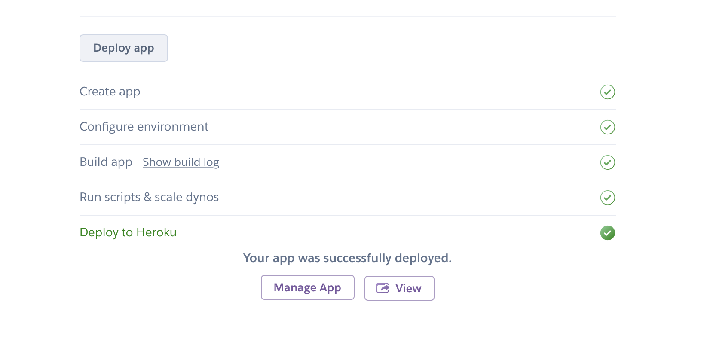

# Self-host Lightdash

_If you're [using Lightdash Cloud](#getting-setup-on-lightdash-cloud), you don't have to worry about self hosting. You can skip ahead to the next step of [Connecting your dbt project to Lightdash](/get-started/setup-lightdash/connect-project)._

Choose your preferred environment to self-host Lightdash:

1. [Run **Lightdash on your local machine**](#deploy-locally-with-our-installation-script) to try out Lightdash for yourself without any collaborators.
2. [Deploy **Lightdash to Heroku** with 1-click](#deploy-to-heroku) to get a cloud deployment for your whole team with minimum effort.
3. [Manually install **Lightdash in production**](#deploy-manually) to setup Lightdash in your preferred production environment.

----

## Getting set up on Lightdash Cloud

Want to have a production Lightdash instance, but not comfortable with self-hosting?

You can [**sign up to our waitlist for Lightdash Cloud**](https://hamzah905194.typeform.com/to/HFlicx4i)!

With Lightdash Cloud, you get a Lightdash instance that you can share all your insights with your team
and you don't have to worry about any of the setup for hosting the instance yourself. So, if you're not too sure about all of
this container, Heroku and cloud-platforms business, or you're just not interested in the overhead of hosting your BI yourself,
then [Lightdash Cloud](https://hamzah905194.typeform.com/to/HFlicx4i) might be a good option for you :)

----

## Deploy locally with our installation script

Our installation script is the simplest way to install Lightdash if you only want to run Lightdash on your local 
machine (that means, you won't be able to share the things you build in
 Lightdash with anyone else):

:::caution Production deployments

For production deployments check the [Deploy manually](#deploy-manually) instructions.

:::

:::info

This script is going to install docker and docker compose. If you want to use a docker alternative, see [Deploy manually](#deploy-manually) instructions.

:::

#### 1. Clone the Lightdash repository

Clone the Lightdash code to your local machine. This will create a new directory called `./lightdash` (the Lightdash directory).

```bash
# Clone the Lightdash repo
git clone https://github.com/lightdash/lightdash
cd lightdash
# A new directory called "lightdash" should appear
```

#### 2. Install & Launch Lightdash

When running the install script you have two choices:

1. **Fast install (recommended)**: will automatically configure Lightdash with sensible defaults. You must host your 
dbt project on github/gitlab to use this method.
3. **Custom install**: gives more customisation including connecting Lightdash to a dbt project on your local machine.


```bash
./install.sh
# follow cli instructions
```

:::info
If you have a Windows machine and get the error **Error response from daemon: i/o timeout**.
Go to **Docker > Settings > General** and enable the option **Expose daemon on tcp://localhost:2375 without TLS**
:::

----

## Deploy to Heroku

Click to deploy the latest version of Lightdash to heroku. This provides a secure, production deployment.

#### 1. Once click deploy to Heroku

[](https://heroku.com/deploy?template=https://github.com/lightdash/lightdash-deploy-heroku)

Note if you don't have an account, you'll be prompted to signup. It's free to deploy Lightdash!

#### 2. Launch Lightdash

Heroku will show that it's setting up and deploying Lightdash. When it's complete you should see an option to view
your Lightdash app.



#### 3. Setup your admin account and Lightdash project

As the first user for Lightdash, you'll be prompted to create an admin account to secure your instance. Then, you'll get started with creating your Lightdash project.
You can follow along with the instructions for setting up your Lightdash project here: #page to instructions for Lightdash project setup guide

----

## Deploy manually

This is the recommended way to install and run Lightdash in production.

### Using docker compose

Lightdash docker compose environment variables:

Name | Type | Default | Required | Description
---|---|---|---|---
**PGHOST** | string | *auto generated* | false | postgres hostname
**PGPORT** | number | 5432 | false | Postgres port
**PGUSER** | string | postgres | false | Postgres user
**PGPASSWORD** | string |  | true | Postgres password
**PGDATABASE** | string | postgres | false | Postgres database name
**SECURE_COOKIES** | boolean | false | false | Secure cookies
**TRUST_PROXY** | boolean | false | false | Trust the reverse proxy when setting secure cookies (via the "X-Forwarded-Proto" header)
**LIGHTDASH_SECRET** | string | | true | This is the secret used to sign the session ID cookie and to encrypt sensitive information. **Do not share this secret!**
**PORT** | number | 8080 | false | Port for Lightdash
**DBT_PROJECT_DIR** | string | . | false | Path to your local dbt project. Only set this value if you want to use a dbt project from the same machine


#### 1. Clone the Lightdash repository

Clone the Lightdash code to your local machine. This will create a new directory called `./lightdash` (the Lightdash directory).

```bash
# Clone the Lightdash repo
git clone https://github.com/lightdash/lightdash
cd lightdash
```

#### 2. Create containers

```bash
LIGHTDASH_SECRET="not very secret" PGPASSWORD="password" docker-compose -f docker-compose.yml up --detach --remove-orphans
```

:::info
If you have a Windows machine and get the error **Error response from daemon: i/o timeout**.
Go to **Docker > Settings > General** and enable the option **Expose daemon on tcp://localhost:2375 without TLS**
:::

### Using docker images

:::info

If you're using **podman** replace `docker` with `podman` in the commands mentioned.

:::

#### 1. Start a Postgres container

```bash
# Example data:
# Username: postgres
# Password: mysecretpassword
# Database name: postgres
# Port: 5432

docker run --name lightdash-db -p "5432:5432" \
    -e POSTGRES_PASSWORD=mysecretpassword -d postgres
```

#### 2. Start Lightdash container

Lightdash environment variables:

Name | Type | Default | Required | Description
---|---|---|---|---
**PGHOST** | string |  | true | Postgres hostname
**PGPORT** | number |  | true | Postgres port
**PGUSER** | string |  | true | Postgres user
**PGPASSWORD** | string |  | true | Postgres password
**PGDATABASE** | string |  | true | Postgres database name
**LIGHTDASH_SECRET** | string | | true | This is the secret used to sign the session ID cookie and to encrypt sensitive information. **Do not share this secret!**
**SECURE_COOKIES** | boolean | false | false | Secure cookies
**TRUST_PROXY** | boolean | false | false | Trust the reverse proxy when setting secure cookies (via the "X-Forwarded-Proto" header)
:::info

If you want to use a dbt project from the same machine, you will need to set a volume to **/usr/app/dbt**. Example:
`-v ~/my/dbt/path:/usr/app/dbt`

:::

```bash
# Example data:
# DB Host: host.docker.internal
# DB Port: 5432
# DB Username: postgres
# DB Password: mysecretpassword
# DB name: postgres
# Lightdash secret: not very secret
# Lightdash port: 8080

docker run --name lightdash-app \
    -e PGHOST=host.docker.internal -e PGPORT=5432 \
    -e PGUSER=postgres -e PGPASSWORD=mysecretpassword \
    -e PGDATABASE=postgres -e LIGHTDASH_SECRET="not very secret" \
    -e LIGHTDASH_LOG_LEVEL=debug \
    -p 8080:8080 \
    -d lightdash/lightdash:latest
```
