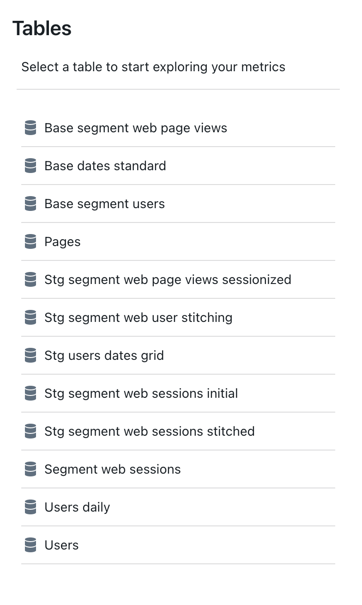
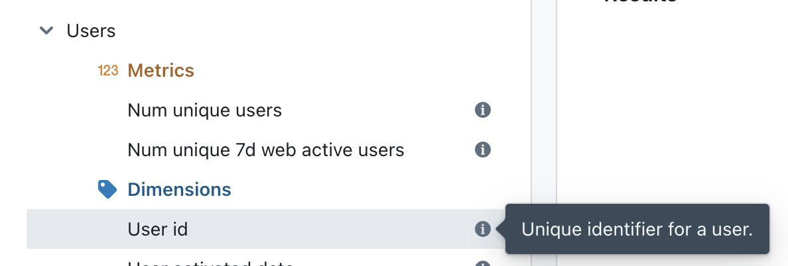
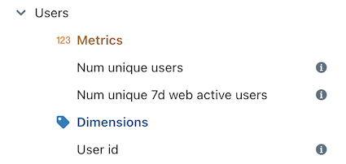
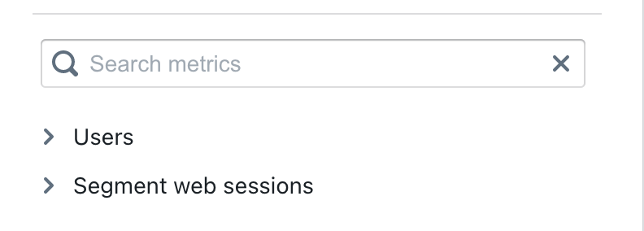

# Setup your project

Now that you've successfully installed lightdash (💪) here are a few tips on how you can get the most out of our favourite features!

---

lightdash's configuration is fully defined in your dbt project. For example, your project's metrics and joins sit in your models' YAML files.

Below, we'll walk you through some of the key features you can add to your project to get started. We also have an [example model YAML file](https://github.com/lightdash/lightdash/blob/main/examples/simple-dbt-model/example_model.yml) if you ever need something to reference and see lightdash in action!

## Dimensions in lightdash come from the columns defined in your dbt project

Once you've built and launched your lightdash project by running either `docker compose up` or `yarn start` from within your `lightdash` directory, you should be able to see a list of all of the models from your connected dbt project.



If you click on any of the models within your lightdash project, you'll see the dimensions and metrics for that model listed on the left side.

The dimensions you see in lightdash are the columns that you've defined in your model's dbt YAML file. If you include descriptions for your columns, these will be pulled into lightdash automatically!

:::info

For a dimension to appear in lightdash, you need to declare it as a column in your YAML file.

:::

```yaml
version: 2

models:
  - name: users
    description: "One row per user_id. This is a list of all users and aggregated information for these users."
    columns:
      - name: user_id
        description: 'Unique identifier for a user.'
```




## Metrics are defined in your model's YAML file, right beside your columns!

Now that you've gotten all of the dimensions in your project sorted, you can start to add metrics to your YAML files.

Metrics are quantitative measurements. You can think of them as "actions" that you take on dimensions. For example, num unique user ids is a metric that counts the unique number user_id values.

You add metrics to your YAML files under the `meta` tag at the column level.

```yaml
version: 2

models:
  - name: my_model
    columns:
      - name: user_id # dimension name of your metric
        meta:
          metrics:
            num_unique_user_ids: # name of your metric
              type: count_distinct # metric type
            num_user_ids:
              type: count
```

:::info

For more information on the types of metrics you can add, check out the metrics reference page.

:::

Once you've added a metric to your dbt project, you can sync the changes in lightdash by clicking on the refresh button in the app.


Your new metrics will appear in the list above dimensions in your table!



## Add joins to your YAML files to connect different models to each other

Joins let you to connect different models to each other so that you can explore more than one model at the same time in lightdash and see how different parts of your data relate to each other.

You add joins to your YAML files under the `meta` tag at the model level:

```yaml
version: 2

models:
  - name: users
    meta:
      joins:
        - join: segment_web_sessions
          sql_on: ${segment_web_sessions.user_id} = ${users.user_id}

    columns:
```

Once you've added a join, you can refresh lightdash to see your changes in action. The dimensions and metrics of the joined model are included in the list on the left, right below the original model:



## If you're ever stuck or in need of inspiration, check out our example model YAML file:

We have an example model YAML file if you ever need something to reference and see lightdash in action!

If you have specific questions about a feature or a problem, check out our reference pages and our FAQs.
