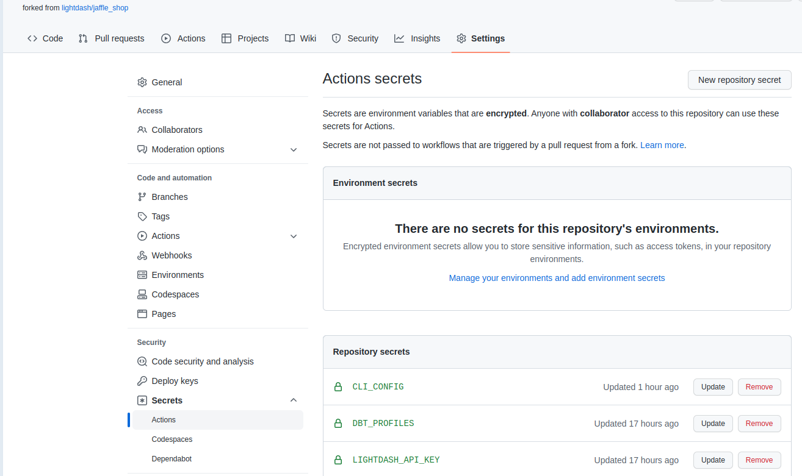
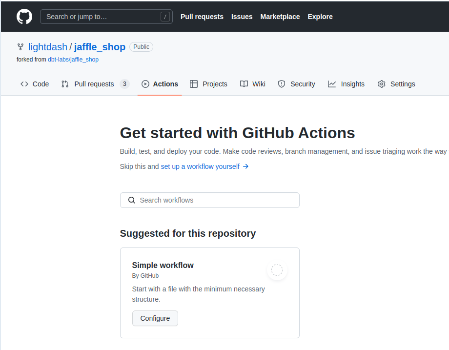
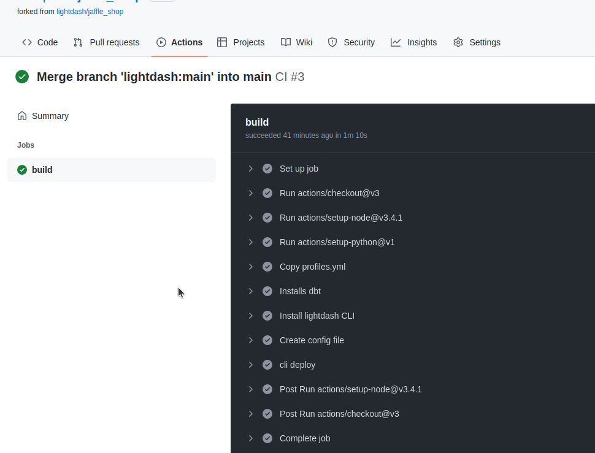

# How to automatically deploy 

If you use github to store your DBT config, now you can setup a `github action` to make it deploy automatically 
the new config into Lightdash.

## First add the credentials to Github secrets

We are going to add some secrets and config to github actions, 
but you don't want those to be public , so the best way to do this is to add them as secrets on Github

Go to your repo, click on `Settings` , on the left sidebar, click on `Secrets` under `Security`. 
Now click on the `New repository secret`



We need the following credentials, you can find them on the app, 
or in your `~/.config/lightdash/config.yaml` file on your machine if you have used the Lightdash CLI already.

- `LIGHTDASH_API_KEY`: Your personal access token on Lightdash. [See these instructions](https://docs.lightdash.com/guides/cli/cli-authentication#:~:text=First%2C%20you%27ll%20need%20to%20create%20a%20new%20personal%20access%20token%20in%20the%20UI%20by%20going%20to%20Settings%20%3E%20Personal%20Access%20Tokens.%20You%20can%27t%20use%20an%20existing%20personal%20access%20token!%20You%20have%20to%20create%20a%20new%20one%20just%20for%20yourself.) for creating a personal access token in the app.
- `LIGHTDASH_PROJECT`: The UUID for your project. For example, if your URL looks like `https://eu1.lightdash.cloud/projects/3538ab33-dc90-aabb-bc00-e50bba3a5f69/tables`, then `3538ab33-dc90-45f0-aabb-e50bba3a5f69` is your `LIGHTDASH_PROJECT`  
- `LIGHTDASH_URL`: (like https://eu1.lightdash.cloud or https://app.lightdash.cloud)
- `DBT_PROFILES`: Copy your full profiles.yml file into this secret, like:

```
jaffle_shop:
  target: dev
  outputs:
    dev:
      type: snowflake
      account: abcd
      user: test
      password: ****
      role: SYSADMIN
      database: database
      warehouse: warehouse
      schema: jaffle_shop
```

## Create action.yml workflow in Github

Go to your repo, click on `Actions` menu, and click on `Configure`



Now copy [this file](https://github.com/lightdash/cli-actions/blob/main/action.yml) from our [cli-actions](https://github.com/lightdash/cli-actions) repo 

And save by clicking on `Start commit`

## You're done 

Everytime you make a change to your repo, on the `main` branch, 
it will automatically deploy your new config into your Lightdash projects

You can see the log on `Github actions` page


