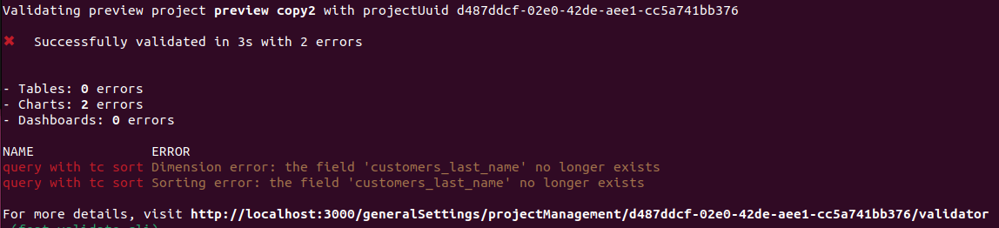

import AutomaticallyDeployChangesGithub from './../../snippets/github-secrets.mdx';
import ProjectId from './assets/project-id.png';

# Lightdash Validate

You can check to see if your changes break any of the content in your project using `lightdash validate`. This command will run the validator which will return a list of content in your project that is broken and details about the errors.

You can trigger a validation on a project using the Lightdash CLI so you can check locally if your changes will break anything. You can also add `lightdash validate` to your [GitHub Actions](#configure-github-actions) so changes can't be merged unless they pass the validation.

## Usage



### Validate your changes against your project by running lightdash validate

You can run `lightdash validate` to check if your changes break any of the content in production.
By default, `lightdash validate` will check your changes against the content in the project you've selected on the CLI.
You can change your project using `lightdash config set-project`.

```bash
lightdash validate
```

Optionally you can use the `--preview` argument to validate your last preview environment created from the CLI.

You will get a list of errors if your local files are going to break some content on your project.
These errors will not be reflected on the validation table on Lightdash settings.

### Validate any project using the project UUID

You can run a validation on any project by specifying the project UUID in the `lightdash validate` command.

```bash
lightdash validate --project <project uuid>
```

**Note:** you can get your project UUID from the Lightdash URL by selecting the ID after the `projects/`


### Validate only the tables

You can run a table only validation using the `--only-tables` argument.
When passing this argument, the `validate` command will not validate any `chart` or `dashboard` in your project.

```bash
lightdash validate --only-tables
```

## Configure Github actions

This command will create a preview environment, and then validate this preview by specifying `--preview` on the validate command.
`lightdash validate` will return an error (return code 1) if there is at least 1 validation error on your project.
You can use this output to block a deploy on Github actions like this

```bash
- name: Start preview
  run: lightdash start-preview
- name: Validate preview
  run: lightdash validate --preview
```

To learn more about setting up GitHub actions for Lightdash, check out the docs [here](/snippets/automatically-deploy-your-changes-using-github-action)
