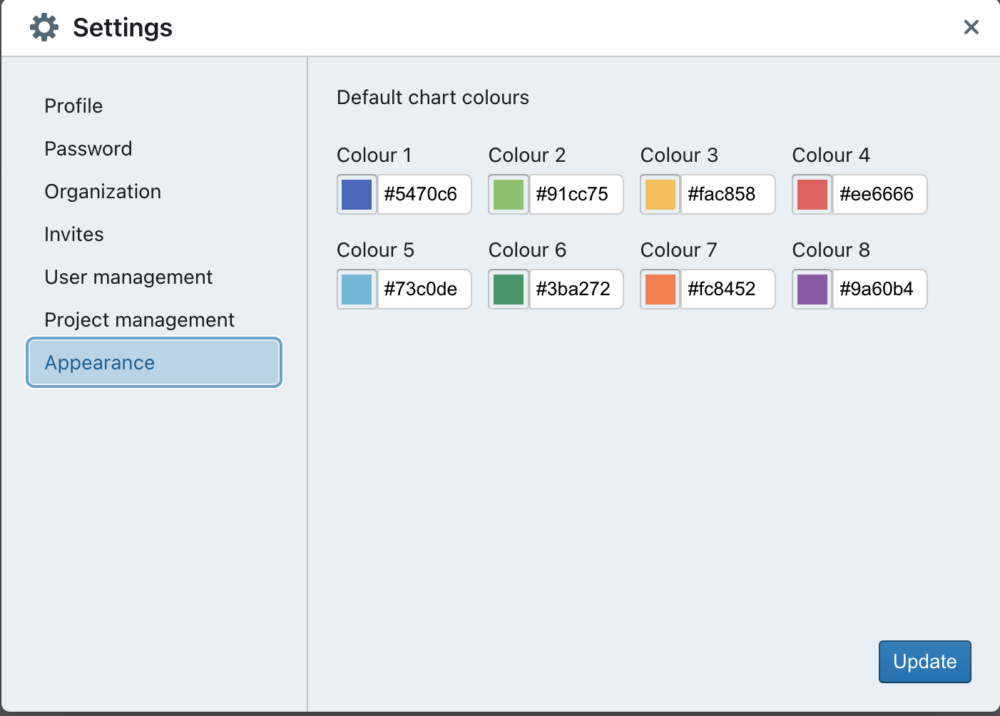
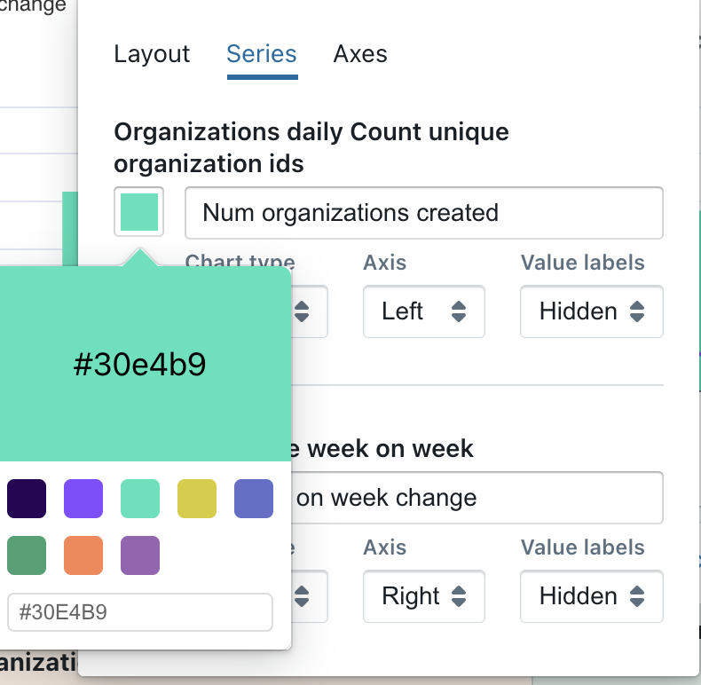

# Customizing the appearance of your project

## Update the default colours used in charts

You can update the default colours used in your organization's charts so that everything you build is on brand 👩‍🎨

You can do this by heading to the `settings` --> `appearances` and you can update any and all of your default colours used in your organization. Once you're done updating the colours you want, just click on `update` to save your changes.

The next time you build a chart, it will default to using these colours for the series.

