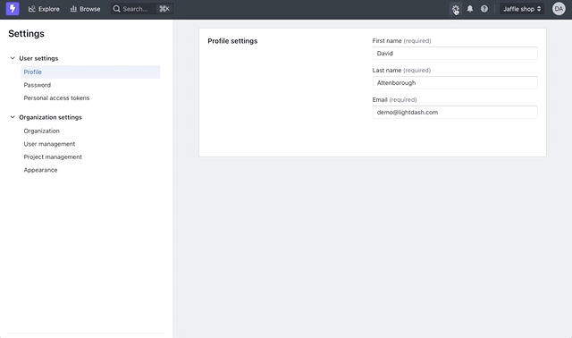
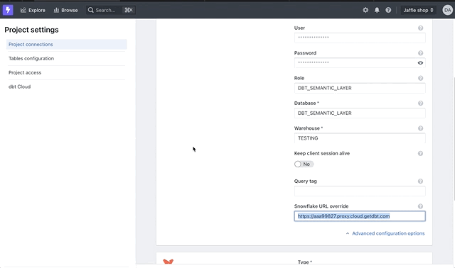
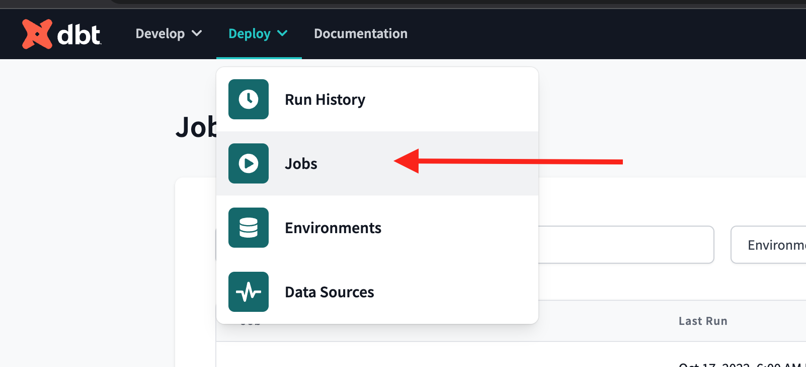
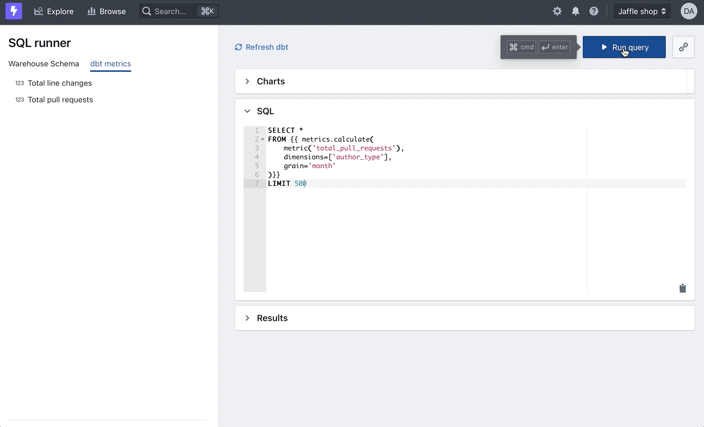

# dbt Semantic Layer

By integrating Lightdash with your dbt Semantic Layer, you can consume dbt metrics in real time and you 
can be sure
you're calculating the exact metrics you see in your other semantic layer-connected tools.

This is currently available for Snowflake only.

**Features:**

- Query your dbt metrics from a dbt Cloud job
- Run dbt macros and templated queries in the SQL runner
- (coming soon) show table freshness in the results
- (coming soon) schedule Lightdash to update after a dbt Cloud job

## Getting started

To get started, connect your dbt semantic layer to Lightdash.

### Connect to the semantic layer

Navigate to your _Project settings_ and then select _Project connections_ in the sidebar. Under your snowflake 
credentials you'll see an option to show advanced configuration options. 

Select the "Snowflake URL override" and enter `https://<your snowflake account>.proxy.cloud.getdbt.com`



Next you'll need to add your dbt Cloud credentials to Lightdash. Head to "dbt Cloud" under your project settings 
you'll need to enter your service account token and job ID:



**1. Service account token**

You can generate this at https://cloud.getdbt.com/next/settings and scroll down to 
   "Service Tokens". The token only needs the "metadata only" permission

**2. Job ID**

To fetch your metric definitions, Lightdash needs a job ID from dbt Cloud.  This job should be your production job 
that compiles your dbt metrics. In your dbt Cloud UI click on "Deploy" -> "Jobs" in the navigation bar:




Click the job that you'll connect to Lightdash. The job id is the last part of the URL after `/jobs` so in 
`/jobs/12345` your jobs id would be `12345`.


## Using jinja in the SQL Runner

Once you've connected to the semantic Layer you'll be able to run templated queries in the SQL Runner using dbt's 
jinja. Try running this whacky looking SQL:

```sql

    select {{ i }} as my_column

    
        union all 
    


```

The dbt Semantic Layer will now interpret your jinja in real time, compile the SQL and execute it in Snowflake.

### Querying dbt metrics

If you connected a dbt Cloud job in your project settings, you'll see a list of dbt metrics from the project in the 
SQL Runner. Click a metric to prefill your sql console and start executing queries.



