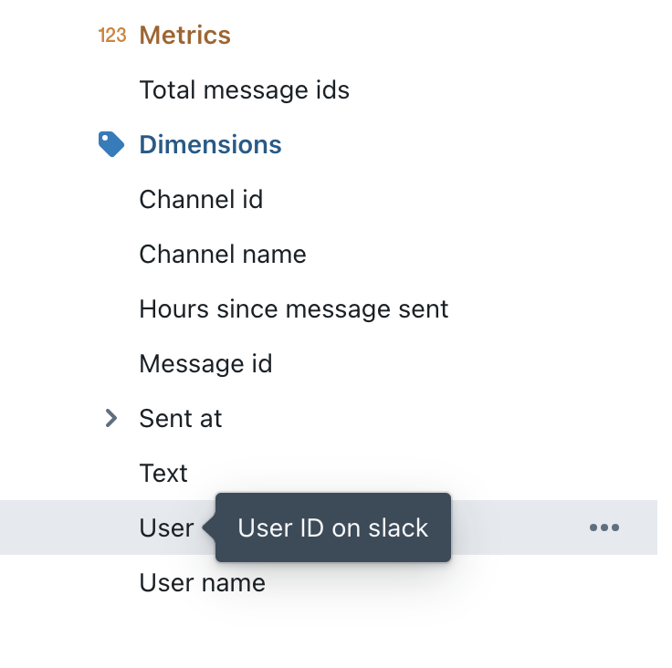

import GroupLabel from './assets/group-label.png';

# Formatting your fields

Sometimes the format of things in your dbt project is different to how you want it to look in Lightdash. That's okay! We've built a bunch of features to help you to format the fields in your dbt project so that the data in your Lightdash project looks exactly like you want it to 🥸

## Hiding fields from your dbt YAML files

Sometimes, we have a bunch of columns in our YAML files that we might not want to include in Lightdash. For example, columns with PII data, or the same date data, but at different levels of date granularity.

It's easy to hide columns from Lightdash. All you need to do is add two words to your column: `hidden: true`.

In your dbt YAML file, it'll look something like this:

```yaml
version: 2
models:
- name: users
  columns:
    - name: first_name
      meta:
        dimension:
          hidden: true
```

The same thing goes for metrics:

```yaml
version: 2
models:
- name: users
  columns:
    - name: first_name
      meta:
        metrics:
          count_unique_first_names:
            type: count_distinct
            hidden: true
```

By default, all of your dimensions and metrics have been set to `hidden: false`.

Check out [this doc](https://docs.lightdash.com/references/dimensions#dimension-configuration) to see all of the other properties you can customize for dimensions, and [this one](https://docs.lightdash.com/references/metrics#metric-configuration) for all of the other properties you can customize for your metrics.

## Grouping your metrics and dimensions in the sidebar

You can group related metrics and dimensions together using the `group_label` property in your .yml files.

For example, you might want to group together all of the fields related to your user's `product activity`. To do this, you'd add the same `group_label` to all of the fields you want grouped together, like so:

```yaml
version: 2
models:
- name: users
  columns:
    - name: user_id
    - name: logins_num_total
      meta:
        dimension: 
          group_label: 'Product activity'
    - name: query_executed_num_total
        dimension:
          group_label: 'Product activity'
```

This group would appear in the sidebar of my `Users` table like this:


You can use group labels across metrics and dimensions. In the sidebar, your metrics will get grouped together under the `metrics` section, and your dimensions will get grouped together under the `dimensions` section. Basically, adding group labels won't group your metrics and dimensions **_together_** in the sidebar.

## Adding custom descriptions to your fields

### Custom descriptions for dimensions

By default, Lightdash pulls in the descriptions you've included for your dimensions. But, you can override the description you see in Lightdash using the `description` property.

```yaml
version: 2
models:
- name: users
  columns:
    - name: user_id
      description: "Id generated by the Lightdash API on user's first login. On legacy systems, SHA64. On new systems since 2012, FARM_FINGERPRINT()"
      meta:
        dimension:
          description: 'Unique identifier for a user'
```

You can see the descriptions of your dimensions when you hover over the fields in Lightdash.



Check out [this doc](https://docs.lightdash.com/references/dimensions#dimension-configuration) to see all of the other properties you can customize for dimensions.

### Custom descriptions for metrics

If you don't add a custom description for your metric, Lightdash will show a description for you in the app, by default. To override this default description, you can use the `description` property.

```yaml
version: 2
models:
- name: users
  columns:
    - name: user_id
      description: "Id generated by the Lightdash API on user's first login. On legacy systems, SHA64. On new systems since 2012, FARM_FINGERPRINT()"
      meta:
        metrics:
          count_unique_users:
            type: count_distinct
            description: 'Count the unique number of user IDs'
```

Check out [this doc](https://docs.lightdash.com/references/metrics#metric-configuration) to see all of the other properties you can customize for metrics.

## Changing the name of your fields in Lightdash

Sometimes, the labels we use for the fields in our dbt project aren't very user friendly. We might want to change these in Lightdash, and we can! 

To change the name you'll see for your field in Lightdash, you just use the `label` property.

So, if I had a field `user_id_sha64`, I could relabel it to `User ID`. 

```yaml
version: 2
models:
- name: users
  columns:
    - name: user_id_sha64
      meta:
        dimension:
          label: 'User ID'
```

Same thing goes for metrics!

:::info

Relabelling a metric will not break any saved charts that use the old metric name. Instead, your saved charts will just use the new metric name in their results tables.

:::

```yaml
version: 2
models:
- name: users
  columns:
    - name: user_id_sha64
      meta:
        metrics:
          count_unique_user_ids:
            type: count_distinct
            label: 'Total users'
```

Check out [this doc](https://docs.lightdash.com/references/dimensions#dimension-configuration) to see all of the other properties you can customize for dimensions, and [this one](https://docs.lightdash.com/references/metrics#metric-configuration) for all of the other properties you can customize for your metrics.

## Rounding your metrics and dimensions

Rounding your metrics is easy to do using the `round` property in your YAML file.

Here's an example of how different rounding will affect your numbers:

| Original number | Round value | How it will appear in Lightdash |
| --------------- | ----------- | ------------------------------- |
| 121.854         | 2           | 121.85                          |
| 121.854         | 1           | 121.9                           |
| 121.854         | 0           | 123                             |
| 121.854         | -2          | 100                             |

### To add rounding to your dimensions, you just need to add `round` to their properties

Like this:

```yaml
version: 2
models:
- name: sales
  columns:
    - name: revenue
      meta:
        dimension:
          round: 2
```

Check out [this doc](https://docs.lightdash.com/references/dimensions#dimension-configuration) to see all of the other properties you can customize for dimensions.

### To add rounding to your metrics, you just need to add `round` to their properties

Like this:

```yaml
version: 2
models:
- name: sales
  columns:
    - name: revenue
      meta:
        metrics:
          total_revenue:
          type: sum
          round: 2
```

Check out [this doc](https://docs.lightdash.com/references/metrics#metric-configuration) to see all of the other properties you can customize for metrics.

## Using the `format` label to add units to your values

Some columns need a special format to convey what units they're in. For example, if you're a global company, and you have a `revenue` field. Is that in GBP? USD?

In Lightdash, you can use the `format` label to add units to your fields.

Here's an example of how different formats will affect your values:

| Original value | Format value | How it will appear in Lightdash |
| --------------- | ----------- | ------------------------------- |
| 121.854         | 'gbp'       | £121.854                        |
| 121.854         | 'usd'       | $121.9                           |

You can see which format types are currently available for [dimensions](https://docs.lightdash.com/references/dimensions#:~:text=number%20of%20digits-,format,-No), and for [metrics.](https://docs.lightdash.com/references/metrics#:~:text=number%20of%20digits-,format,-No)

### To add units to your dimensions, you just need to add `format` to their properties

You can add a `format` to your dimensions this:

```yaml
version: 2
models:
- name: sales
  columns:
    - name: revenue
      meta:
        dimension:
          format: 'gbp'
```

To see which format types are available for dimensions, [check the reference docs here.](https://docs.lightdash.com/references/dimensions#:~:text=number%20of%20digits-,format,-No). Check out [this doc](https://docs.lightdash.com/references/dimensions#dimension-configuration) to see all of the other properties you can customize for dimensions.

### To add units to your metrics, you just need to add `format` to their properties

You can add a `format` to your metrics this:

```yaml
version: 2
models:
- name: sales
  columns:
    - name: revenue
      meta:
        metrics:
          total_revenue:
            type: sum
            format: 'gbp'
```

To see which format types are available for metrics, [check the reference docs here.](https://docs.lightdash.com/references/metrics#:~:text=number%20of%20digits-,format,-No)
Check out [this doc](https://docs.lightdash.com/references/metrics#metric-configuration) to see all of the other properties you can customize for metrics.
