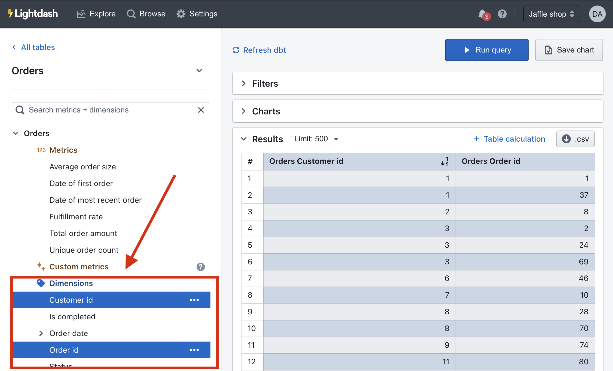

# Adding dimensions to Lightdash

**Dimensions** are fields that are used to **segment data** from your Tables.

If you're completely new to Lightdash, we'd recommend checking out our Tutorial on [creating your first dimensions and metrics in Lightdash](/get-started/setup-lightdash/add-metrics) to learn a bit more about dimensions, metrics, and how to use them in Lightdash.

## New to dbt?

If you haven't used dbt before, [follow dbt's getting started guide](https://docs.getdbt.com/guides/getting-started/learning-more) 
before proceeding with setting up Lightdash.

## What are dimensions?

Lightdash dimensions are columns that have been defined in your dbt project's .yml files

Basically, they're just the fields from your dbt models. Lightdash lets you explore these columns if you define them in your dbt model properties (i.e. their `.yml` files).

For example, the following dbt project file contains properties that create a single dimension, `status`, for the `orders` model in Lightdash:

```yaml
version: 2
models:
  - name: orders
    description: "A table of all orders."
    columns:
      - name: status
        description: "Status of an order: ordered/processed/complete"
        ...
```

The name of the dimension is `status` and the type will be inferred from the column in your database. You can see the [full list of dimension types supported in Lightdash here](/references/dimensions.md#dimension-types).

Once you've added your dimensions, you can use them in Lightdash to build charts and filter results. Dimensions appear in the Explore view, below metrics and, if selected, pop us as blue fields in your results table.



**In this tutorial, we'll walk you through the steps of installing + using the Lightdash CLI and adding your first dimension to your Lightdash project!**

## 1. Install the Lightdash CLI tool

The Lightdash CLI is the recommended way to develop your dbt + Lightdash project. It makes development faster and
easier, as well as giving you options for building more powerful automation to manage your Lightdash instance.

To install Lightdash, you'll need to have [npm](https://docs.npmjs.com/downloading-and-installing-node-js-and-npm) 
installed. Mac/Linux users usually already have `npm` available (you can check by running `npm` in your command line).

To install the Lightdash CLI, run the following on your command line.

```shell
npm install -g @lightdash/cli
```

Or install a specific version (eg: 0.162.0)

```shell
npm install -g @lightdash/cli@0.162.0
```

You _may_ need to install an additional package if you see any errors:

**Mac OS**

```shell
/bin/bash -c "$(curl -fsSL https://raw.githubusercontent.com/Homebrew/install/HEAD/install.sh)" # install homebrew if you don't have it
brew install unixodbc
npm install -g @lightdash/cli
```

**Ubuntu**

```shell
sudo apt install unixodbc
npm install -g @lightdash/cli
```

## 2. Login to the Lightdash CLI

Once you've downloaded the CLI, you'll need to authenticate yourself. There are two ways of doing this:

 _(Note that if you are using Google SSO login you should authenticate via environment variables.)_

<details>
  <summary>1. Run the Login command to use your email and password.</summary>
  To login to your Lightdash instance run the following command and provide your login email and password:

  ```shell
  lightdash login https://my-lightdash.domain.com
  ```

  where `https://my-lightdash.domain.com` is the address for your running Lightdash instance. For example Lightdash cloud users would type `lightdash login https://app.lightdash.cloud`.

</details>

<details>
  <summary>2. With environment variable to use a personal access token and help automate CI&CD pipelines.</summary>
  You can use the following environment variables to authenticate yourself on each command:

  - **LIGHTDASH_API_KEY** a personal access token you can generate in the app under the user settings
  - **LIGHTDASH_URL** address for your running Lightdash instance

  Example:

  ```shell
  LIGHTDASH_API_KEY=946fedb74003405646867dcacf1ad345 LIGHTDASH_URL="https://app.lightdash.cloud" lightdash preview
  ```

</details>

## 3. Choose which project you want to preview

When you login you'll be asked to set an active project. The active project is the dbt project you'll see a copy of in your developer preview.

You can change your active project by running:

```shell
lightdash config set-project
```

## 4. Create a dimension in Lightdash using `lightdash dbt run`

Now that you're all logged in, let's create our first dimension!

Dimensions are attributes of your data. They are directly linked to a column in a dbt model.

To explore data in Lightdash, you need to have dimensions defined in your dbt model properties. Dimensions are created automatically when you define columns in your dbt model properties. 

For example, if I had a dbt .yml file that looked like this:

```yaml
version: 2
models:
  - name: users
    columns:
      - name: user_id
        description: "unique ID for a user"
      - name: first_name
        description: "User's first name"
```

Then, I'd see a table in Lightdash called `Users` with two dimensions to explore: `User id` and `First name`. 

:::info

Before you get started with the next steps, you might want to check out onto a new branch if you're working with a version controlled project!

:::

Now, we're going to try adding a new column to our dbt project, then syncing it with Lightdash. We've made this really easy to do using our CLI tool.

### Add a column to one of your dbt models

Head to your dbt project and add a column to one of your dbt models. 

If you can't think of anything, just try adding:

```yaml
'test' AS test,
```

### Do `lightdash dbt run` to generate the column and its .yml

Now that you have your new column, you're going to do:

```shell
lightdash dbt run -s my_model # replace my_model with the name of your model
```

This command will run your dbt model (i.e. update the table in your data warehouse), then it will update the model's .yml file with any new dimensions.

The `lightdash dbt run` command supports dbt model selection syntax to generate .yml files for a group of models. This means you can use tags or other model selection syntax to specify which models you want to generate dimensions for in your dbt project.

```shell
lightdash dbt run -s tag:lightdash # all models with the lightdash tag
lightdash dbt run -s payments  # just payments
lightdash dbt run -s payments+ # payments and all children
lightdash dbt run -s +payments # payments and all parents
lightdash dbt run -s payments+ +customers tag:lightdash # mix and match
```

Now, you should have your model .yml file with its new dimension `test` added in!

## 5. Preview your changes using `lightdash preview`

Once you've added a dimension to your dbt model, you might want to check to make sure that it's working the way you'd expect. This is where `lightdash preview` comes in handy.

**Developer previews** are temporary Lightdash projects where you can safely experiment with your metrics, dimensions and charts 
without affecting your production project.

So, let's spin up a developer preview and check out our changes. In your terminal, run the commands:

```shell
lightdash preview
```

Then `cmd` + `click` to open the preview link from your terminal. Once you're in Lightdash go to `Explore` --> `Tables`, then click on the model you just updated to see your `test` column and play around with it.

## 6. Configuring your dimensions

You can jazz up your dimensions by configuring them in your .yml files. These dimension configurations live under the `meta` tag of your columns:

```yaml
version: 2
models:
  - name: orders
    description: "A table of all orders."
    columns:
      - name: status
        description: "Status from org256 settings codes. Referenced at 
        delivery from stat5 zone."
        meta:
          dimension:
            label: "Status latest"
            description: "Status of an order: ordered/processed/complete"
            ...etc
```

Things like the format, the label that people see in Lightdash, rounding, etc. - these are all configurations that you can apply to your dimensions.

You can [see all of the dimension configurations in our dimensions docs here](/references/dimensions.md#dimension-configuration).

## 7. Once you're happy with your changes, you can deploy them to production

If you're working with a version controlled project, you'll just want to make sure to merge your changes into the branch you've connected to your Lightdash project (e.g. `main` or `master`).

Once they've been merged or if you're just working off of `main` (_rebel_ 😏), you can deploy your changes.

To do this, just run this command in your terminal:

```shell
lightdash deploy
```

This will deploy the changes in your dbt project to the Lightdash project you set up on your CLI tool earlier.

:::info

**Note:** Lightdash's deploy commnd will deploy using your **default dbt target** unless you specify to use a different target. For example, if you've set up a developer profile where it targets a dev dataset (like `dbt_khindson.my_model_names`), then you'll need to pass the production target in your `lightdash deploy` command. Something like: `lightdash deploy --target prod`.

:::

And voilà! Your new dbt dimension is available to explore in Lightdash.
