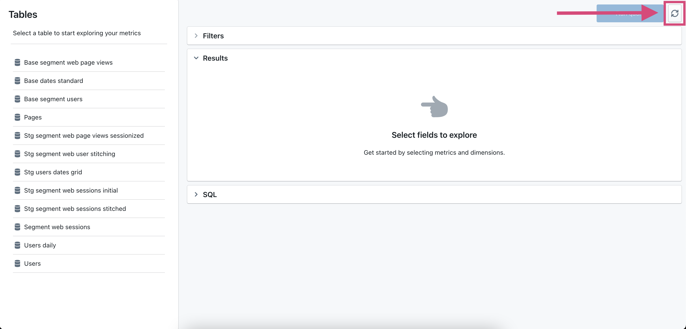

# How to create metrics

**Metrics are defined in your model's YAML file, right beside your columns!**

## Add metrics in your schema.yml files

Metrics are quantitative measurements. You can think of them as "actions" that you take on dimensions. For example, num unique user ids is a metric that counts the unique number user_id values.

You add metrics to your YAML files under the `meta` tag at the column level.

```yaml
version: 2

models:
  - name: my_model
    columns:
      - name: user_id # dimension name of your metric
        meta:
          metrics:
            num_unique_user_ids: # name of your metric
              type: count_distinct # metric type
            num_user_ids:
              type: count
```

For more information on the types of metrics you can add, check out the [metrics reference page](../references/metrics.md).

Once you've added a metric to your dbt project, you can sync the changes in Lightdash by clicking on the refresh button in the app.



Your new metrics will appear in the list above dimensions in your table!


## Next steps

* Customise your metrics further by reading [metrics reference](../references/metrics.md)
* Join additional tables together and start querying across tables: [How to join tables](how-to-join-tables.md)
