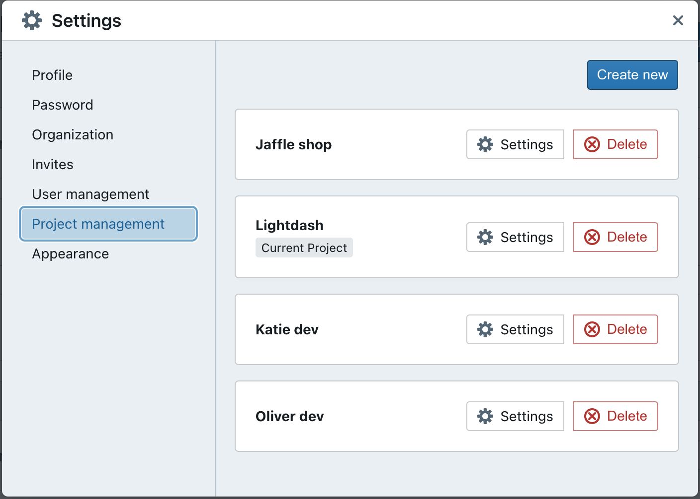
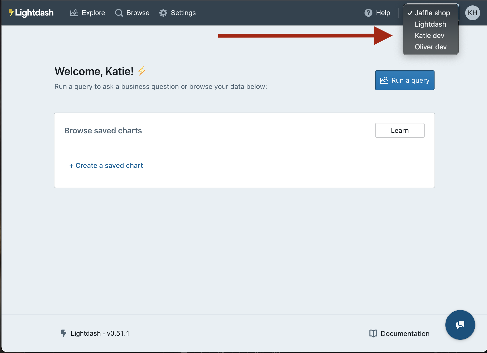
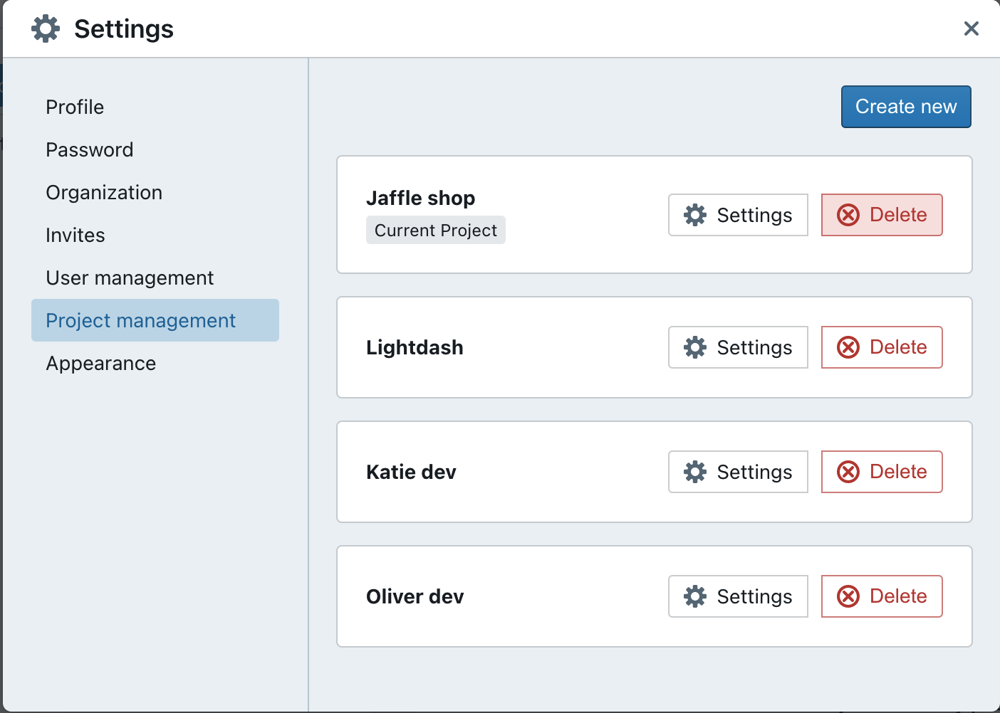

# How to create multiple Lightdash projects in your organization

With Lightdash, you can have a single organization (e.g. Lightdash), and multiple projects within that organization (e.g. Production, Jaffle Shop, etc.)

## To create a new project, head to the settings

To create a new project, click on `settings` --> `project management` --> `create new project`.

Give your project a nice, new name, then get started on setting up the dbt and warehouse connection.

:::info

Only users with admin permissions can create new projects.

:::

## Set up the dbt + warehouse connection

You'll need to define the dbt and warehouse connections for your new project.

Not sure what it all means? Don't worry, we've written [a step-by-step guide](https://docs.lightdash.com/get-started/setup-lightdash/connect-project) that will help you out.

## Easily switch between projects

Once you've got multiple projects set up, you can easily switch through the projects in your organization using the drop-down list in the top corner of your screen.

## Go to the project management settings to delete a project

Don't need a project anymore? That's okay - you can easily delete a project in the project settings space.

:::info

Only users with admin permissions can delete projects.

:::
