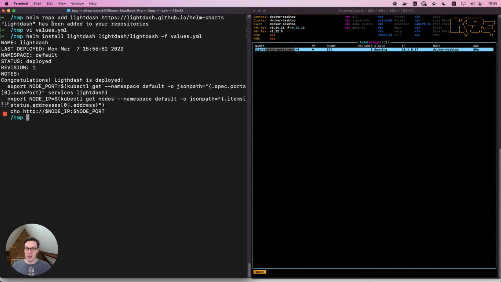

# Deploy to kubernetes

If you prefer to deploy Lightdash on Kubernetes you can make use of our [community helm charts](https://github.com/lightdash/helm-charts)

This guide shows the minimum configuration to get started as well as the many ways to configure your Lightdash 
deployment.

To use the helm chart you'll need the following **prerequisites**

* Access to a Kubernetes cluster and the [kubectl](https://kubernetes.io/docs/tasks/tools/) tool
* Have [helm](https://helm.sh/docs/intro/quickstart/) installed
* Have a postgres database available, make a note of the host, port, database, username, and password.


## Simple minimum configuration

This example shows the bare minimum configuration needed to install Lightdash on a single node Kubernetes cluster.
For production deployments in cloud environments, we recommend adjusting the helm chart to suit your needs.

You can watch this short tutorial of using helm or read on for recommended configuration and commands to run.

[](https://www.youtube.com/watch?v=94lQ2rDx4y0)


### Configure

Create a `values.yml` file with the following keys and adjust the values to suit your deployment environment:
```yaml
# values.yml
configMap:
  # Example connection details for Lightdash postgres database - Change me!
  PGHOST: lightdashdb-postgresql.default.svc.cluster.local
  PGPORT: 5432
  PGUSER: lightdash
  PGDATABASE: lightdash
  PGSSLMODE: disable
  
  # If you know the public url of the finished Lightdash installation add it here
  # you may have to return later and change this
  SITE_URL: ""

secrets:
  # Password for postgres user above - Change me!
  PGPASSWORD: easy
  
  # This secret controls encryption, never share it or store in plain text! 
  LIGHTDASH_SECRET: notverysecret

service:
  # This will allocate a random port on the node for Lightdash to be accessed outside the cluster
  type: NodePort
```

### Install

Add the lightdash repository and install the helm chart

```shell
helm repo add lightdash https://lightdash.github.io/helm-charts
helm install lightdash lightdash/lightdash -f values.yml
```

When using `NodePort` you can get the allocated port needed to build the `SITE_URL` by running:

```shell
export NODE_PORT=$(kubectl get -o jsonpath="{.spec.ports[0].nodePort}" services lightdash)
echo http://localhost:$NODE_PORT
```

You can now update the `SITE_URL` in the `values.yml` file and upgrade your Lightdash installation:

```shell
helm upgrade -f values.yml lightdash lightdash/lightdash
```


## Upgrade Lightdash

We're always releasing new features and fixes, to get the latest version simply run:

```shell
helm repo update lightdash
helm upgrade -f values.yml lightdash lightdash/lightdash
```

## (recommended) Secure with https

For production deployments we recommend against using `nodePort` and using your cloud provider's ingress controllers.
If you have an ingress controller available, you can use the following configuration to get a secure 
production-ready deployment:

```yaml
# values.yml
configMap:
  # Example connection details for Lightdash postgres database - Change me!
  PGHOST: lightdashdb-postgresql.default.svc.cluster.local
  PGPORT: 5432
  PGUSER: lightdash
  PGDATABASE: lightdash
  PGSSLMODE: disable

  # https url of your public Lightdash instance - Change me!
  SITE_URL: https://lightdash.myorg.com
  
  # Allow cookies only on https
  SECURE_COOKIES: "true"
  
  # (optional) allow http traffic behind a https enabled proxy
  TRUST_PROXY: "true"
  

secrets:
  # Password for postgres user above - Change me!
  PGPASSWORD: easy

  # This secret controls encryption, never share it or store in plain text
  LIGHTDASH_SECRET: notverysecret

# Example ingress configuration - Change me!
ingress:
  enable: true
  hosts:
    - host: lightdash.myorg.com
  tls:
    - ...
```

## (optional) Create a database in Kubernetes

For quickly testing Lightdash, you can create a postgres database in your Kubernetes cluster. For production use
cases we recommend using a fully managed service for your postgres database.

```shell
helm repo add bitnami https://charts.bitnami.com/bitnami
helm install \
  --namespace lightdash \
  lightdashdb \
  bitnami/postgresql \
  --set auth.username=lightdash,auth.password=easy,auth.database=lightdash
```
