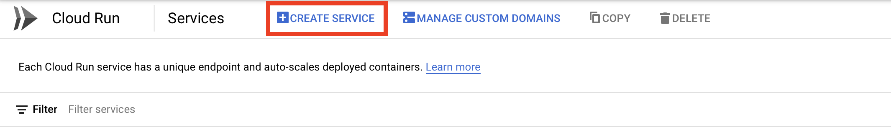
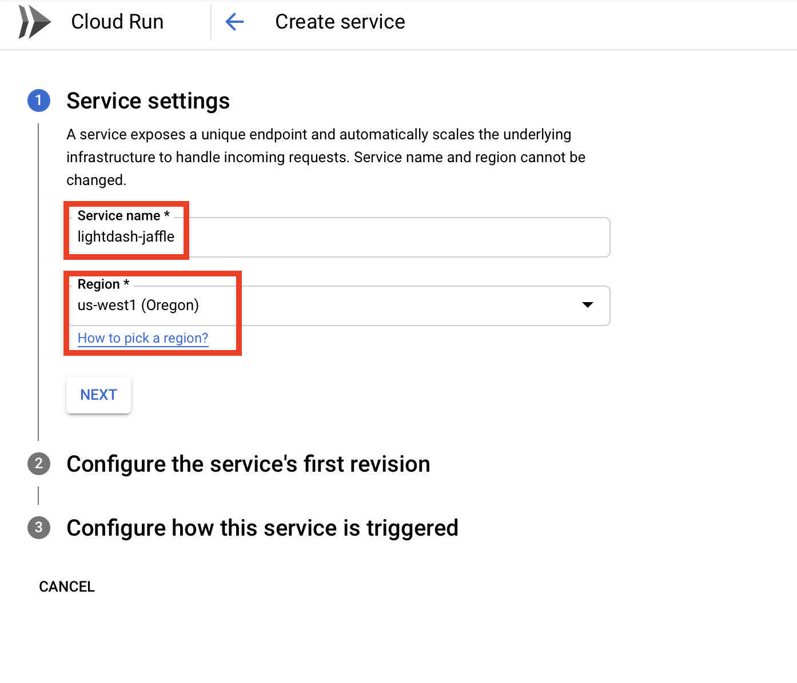
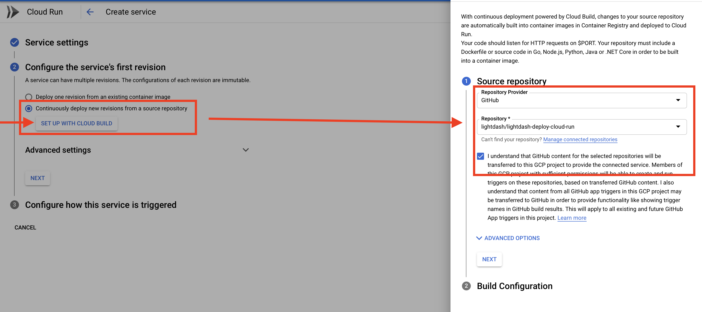
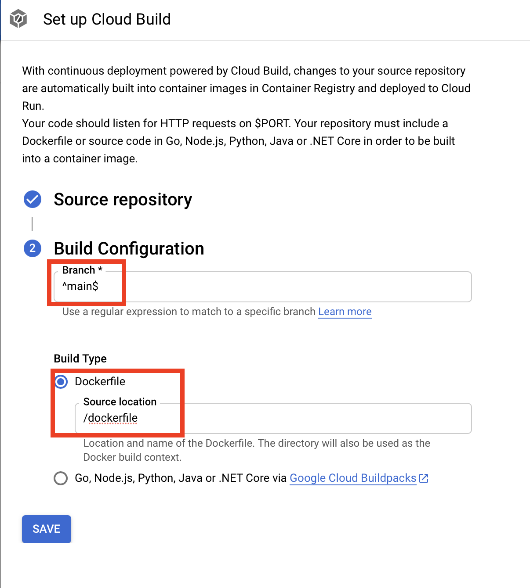
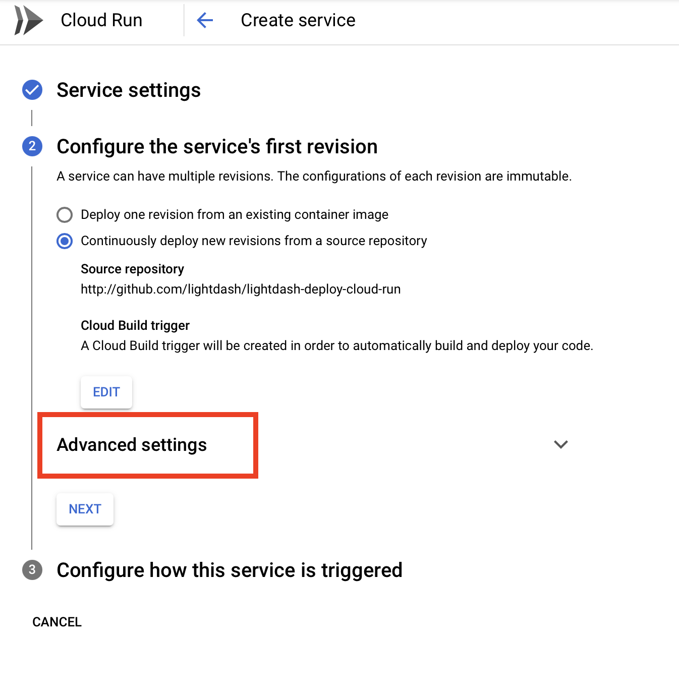
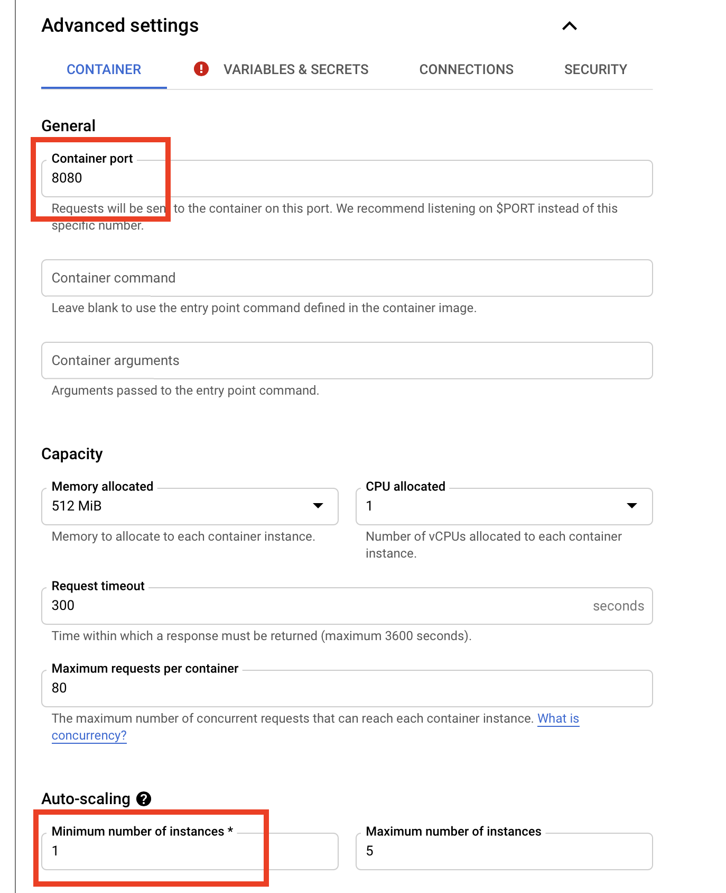
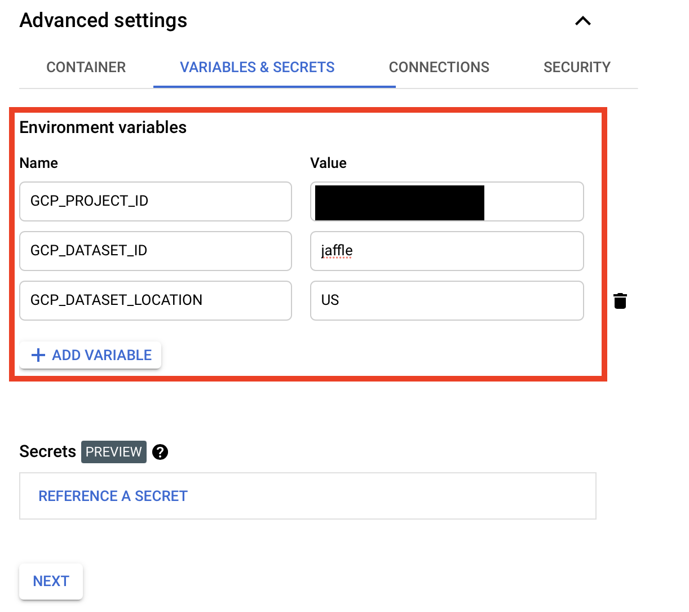
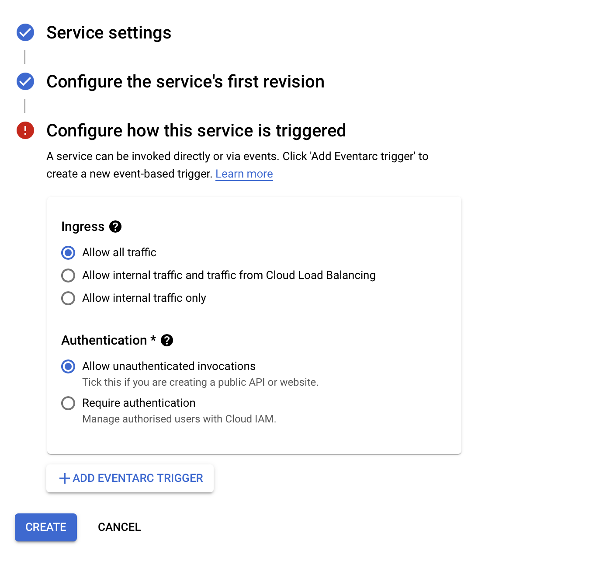

# How to deploy to production

:::caution

This guide is currently out of date.

:::

This guide will show you how to deploy your own Lightdash instance to production. By the end of this guide
you'll have Lightdash running on your own server so that your whole team can access it.

**Prerequisities**

- A dbt repo
- Ideally your dbt repo has some metrics defined [see how to create metrics](./how-to-create-metrics.md)

## 1. Setup your dbt repo for deployment

Your dbt project should follow our [example dbt project ready for deploying Lightdash](https://github.com/lightdash/lightdash-production-example).

This example project is a standard dbt project repo with 3 extra files:
- `lightdash-dockerfile`: you need to create your own simple dockerfile to deploy Lightdash with your dbt project
- `lightdash-entrypoint.sh`: (optional) - an optional script if you need to run any dbt commands before deploying lightdash
- `profiles/profiles.yml`: credentials template to access your data warehouse

 ```
 .
 ├── data/
 ├── dbt_project.yml
 ├── lightdash-dockerfile
 ├── lightdash-entrypoint.sh
 ├── models/
 └── profiles
     └── profiles.yml
 ```

Your `profiles.yml` should contain a profile matching the profile in your `dbt_project.yml`. Treat this file as a template
only! Do not put secrets in here. Instead use the `env_var` function. You can see this in action in [the example repo](https://github.com/lightdash/lightdash-production-example).

## 2. Deploy to your infrastructure of choice

### Cloud Run (Google cloud platform)

The steps below show you how to deploy the example repo to Cloud Run with the GCP UI using the github integration.

**Bigquery tip** - by default cloud run can access bigquery, so you don't need to pass any credentials (see the `./profiles.yml` in [the example repo](https://github.com/lightdash/lightdash-production-example)).

#### 1. Create a new service

[https://console.cloud.google.com/run](https://console.cloud.google.com/run)




#### 2. Link to github repo

Select "Deploy continuously... from a source repository" and point it to your github repo. Select your branch and the name of the     docker file (in our case it's `lightdash-dockerfile`




#### 3. Update container configuration

Hit advanced settings and check the port is set to `8080`. Also set minimum instances to 1: Lightdash is slow to startup so it's      better to keep it live.




#### 4. Update secrets

Set environment variables to populate all the values of your `profiles.yml` file that use the `env_var` function.

In our example we don't consider these secrets so we add them under "environment variables". However, if you need to pass database    passwords or other secrets to your `profiles.yml` file, then you can use the "secrets" functionality.



#### 5. Setup network access

In our example we just make it public. You may want to run it in a VPC, like your internal company network.


