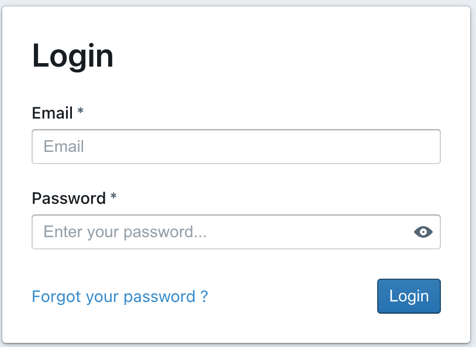

# How to reset your Password

Forgot your password? Don't worry, it happens to the best of us.

Luckily, in Lightdash it's a pretty quick fix 🧚

## If you're a Lightdash Cloud or Enterprise user

Just head to the login page and click on `Forgot your password?`



Once you fill out your email and click `send reset email`, you should get an email from us with instructions on how to reset your password in no time!

## If you've deployed Lightdash locally

We recommend [adding the SMTP environment variables](https://docs.lightdash.com/references/environmentVariables#smtp-environment-variables) so Lightdash can display a `Forgot your password?` button in the login page and send emails to reset password. Basically, the same flow as above.

You can override a user password in just a few steps:

1. Open the bash terminal for the docker Lightdash container

2. Override user password with this command:

```shell
cd ./packages/backend && node ./dist/overrideUserPassword.js <user email> <new password>
```
