# Limit the data in your query using Filters

Filters appear at the top of the Explore view or dashboard and allow users to change the data being pulled into your charts.

For example, if I built a chart showing the revenue over time, but I wanted it to only have the revenue I made in France, I could add a filter for `country is equal to France`.

You can [add filters to your charts individually in the Explore view](#adding-filters-in-the-explore-view), or [across all of your charts in your dashboard](#adding-filters-to-your-dashboard). Don't worry, we'll walk you through both and you'll be a filter pro in no time!

## General filters tips

Here are some general tips about filters that apply to using them in both the Explore view and in dashboards.

### If you want to have multiple filters, just click `+ Add filter`

In the Explore view:

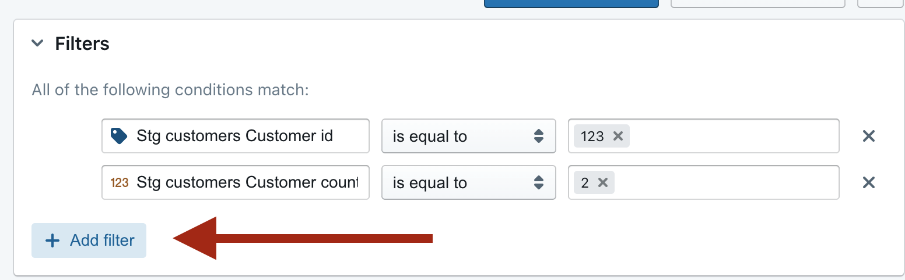

Or in a dashboard:
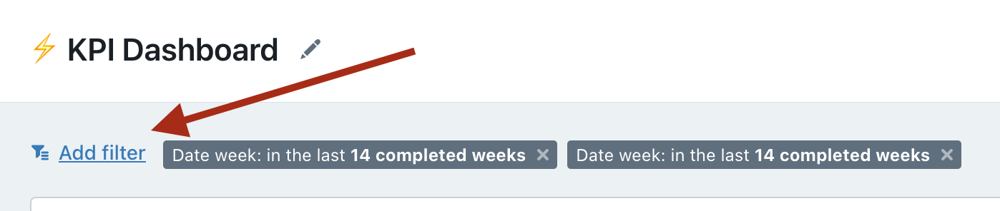

### If you add multiple filters, they are joined together using AND

So, the example in the Explore view above would give us compiled SQL that looks like:

```sql
WHERE (
  (users.days_since_activated) > 5
  AND (users.days_since_activated)...
```

### If you want to include multiple values in your filter, just hit `enter` between each value entry in your list

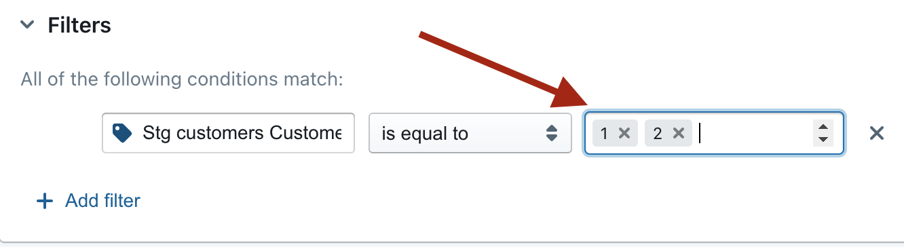

The listed values are separated by an OR statement in the compiled SQL. E.g. the above would give us:

```sql
WHERE (
  (users.days_since_activated) > 5
   AND (users.days_since_activated) IN (1,2,3)
)
```

### To learn about the types of filters we have available, check out the filters reference doc.

Check out our [filters reference doc here](https://docs.lightdash.com/references/filters/) to see a list of all available filters and their uses.

## Adding filters in the Explore view

There are a couple of ways that you can add filters in the Explore view.

### Adding a filter from within the `Filters` tab

In the Explores view, you can add filters from within the `Filters` tab. Just click to open the toggle, then click `add filter`.

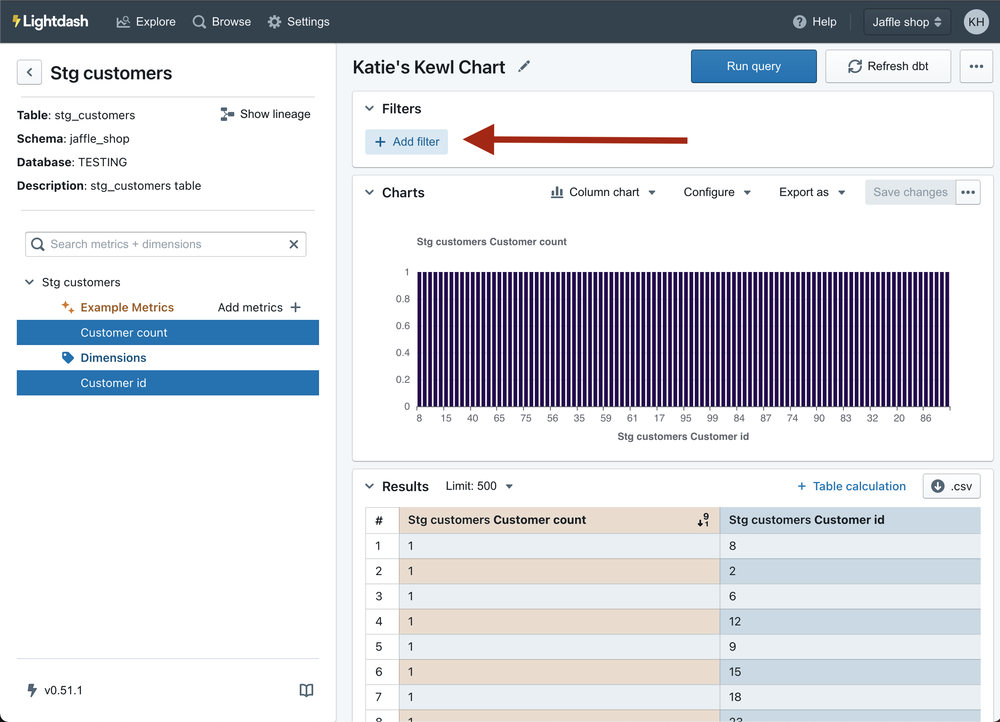

Select the field you would like to filter from the drop-down list, then select the filtering options.

### Adding a filter from the sidebar

It's easy to add filters directly from the list of fields in the sidebar. Just click on the `options` for a field, then click `add filter`.

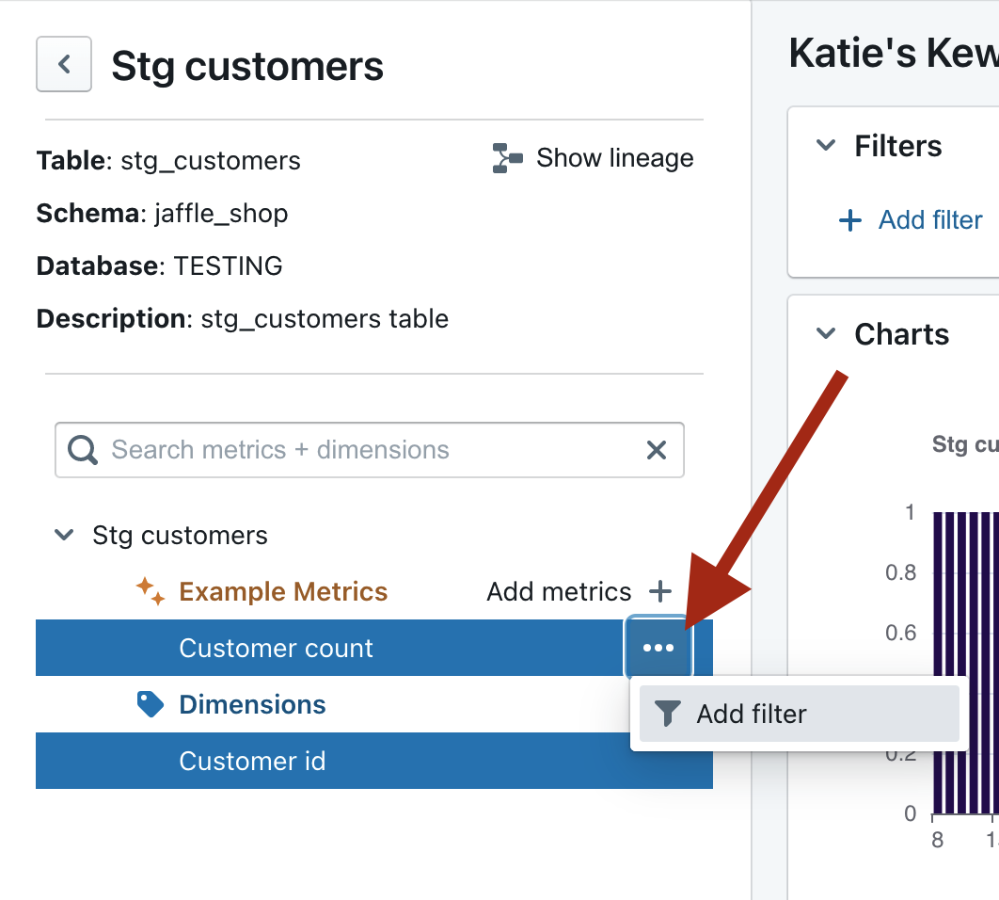

### Adding a filter from the results table

Once you have some results in your results table, you can add filters by clicking on the value you want to filter by.

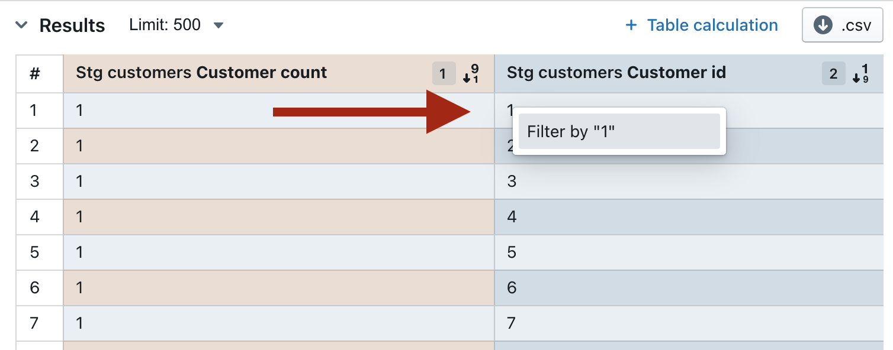

## Adding filters to your dashboard

There are a couple of ways that you can add filters to your Dashboards.

### Adding temporary filters to your dashboard

If you add a temporary filter to your dasboard, then only you will see the filters you've applied (you won't be changing the dashboard for everyone who comes to look at it). If you want to save the dashboard filters you're adding, then check out [adding saved filters to your dashboard](#adding-saved-filters-to-your-dashboard).

There are two ways to add temporary filters to your dashboard.

#### Adding temporary filters using the `add filters` button

1. Open up your dashboard.
2. Click `add filter`, then specify the dimension or metric that you want to filter on.
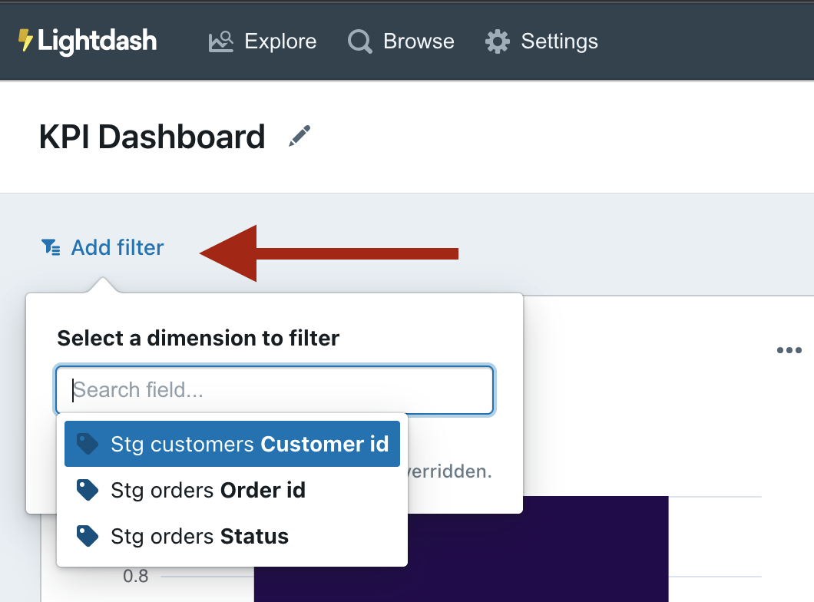
3. And voilà! Your filters will pop up on the top of your dashboard.


#### `Cross filtering` your dashboard using values in your tiles

Cross-filtering lets you interact with one chart and apply that interaction as a filter to other charts in the dashboard. You can filter the dashboard using cross filtering by:

1. Clicking on one of the values in the chart.
2. Selecting the value you want to filter on from the drop-down list.
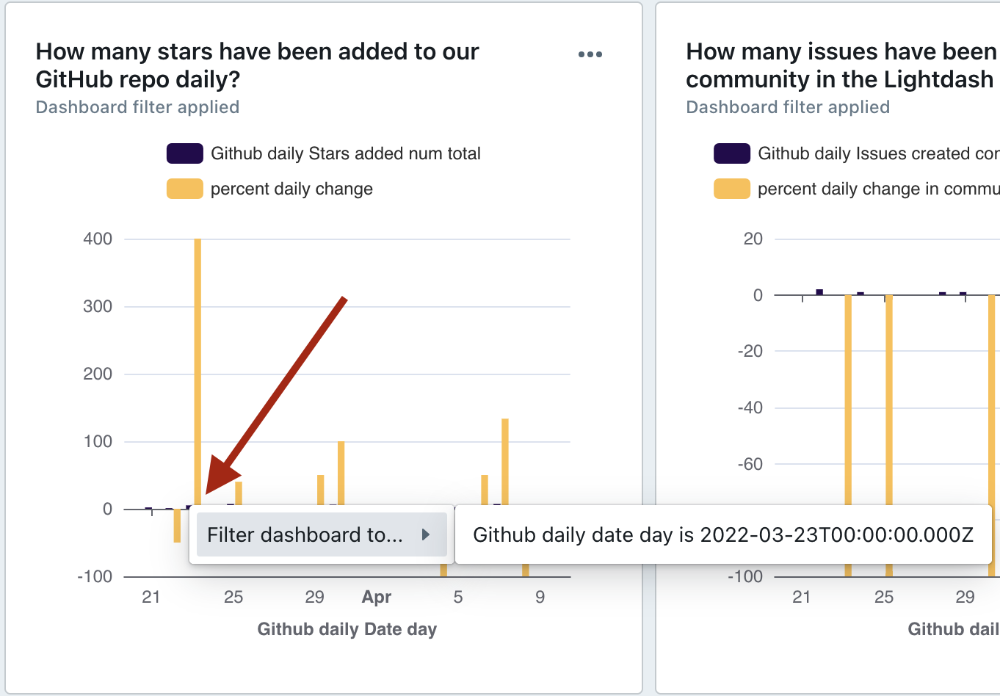
3. Now, your filter will pop up on the top of your dashboard.


### Adding saved filters to your dashboard

If you add a saved filter to your dashboard, then anyone that opens the dashboard will see the saved filters applied.

To add saved filters, you just:

1. Open up your dashboard.
2. Make sure you're in `edit` mode (if you're not, you should see the option to click `edit` on your dashboard)
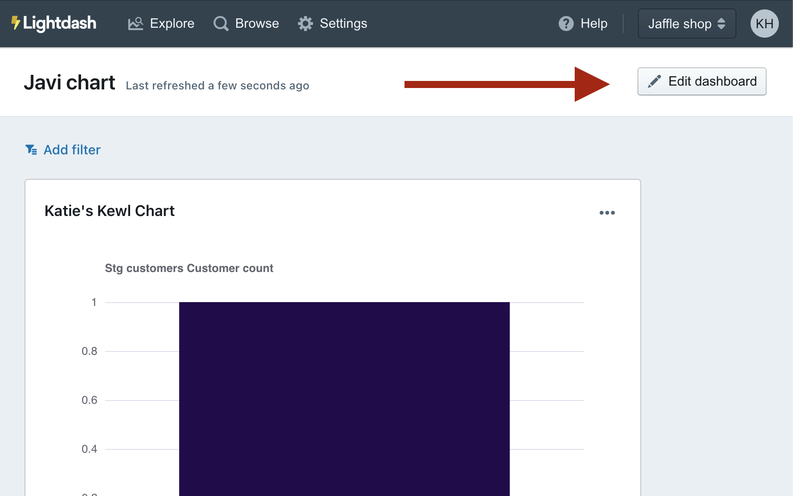
3. Click `add filter`, then specify the dimension or metric that you want to filter on.

4. Your filters will pop up on the top of your dashboard.

5. Once you have all of the filters you want, just hit `save` to save your filter settings.
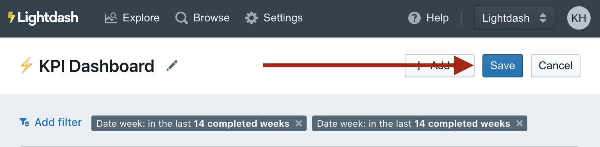
6. Now, whenever someone opens the dashboard, they'll see your saved filters applied!
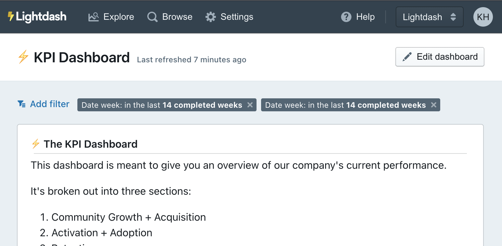

:::info

To add saved filters to your dashboard, you must be an `editor` or an `admin` for your project.

:::

### Some things worth mentioning about dashboard filters

#### Users can remove and override _saved filters_ on a dashboard while they're viewing it

Users have the option to delete or edit a dashboard's saved filters while they're looking at it. But, unless they're making these changes in `edit` mode and saving them, the original saved filters will be applied for the next user that comes to look at the dashboard.
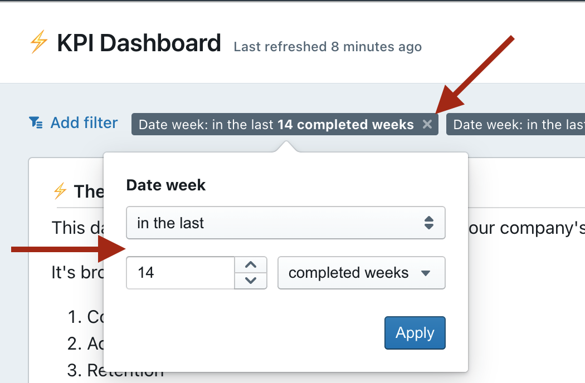

#### You can easily see which dashboard tiles have which filters applied to them

If a tile in a dashboard has a filter applied to it, you'll see the text `dashboard filter applied` on the tile.

You can also hover over this to see **_which_** filters have been applied to that tile.

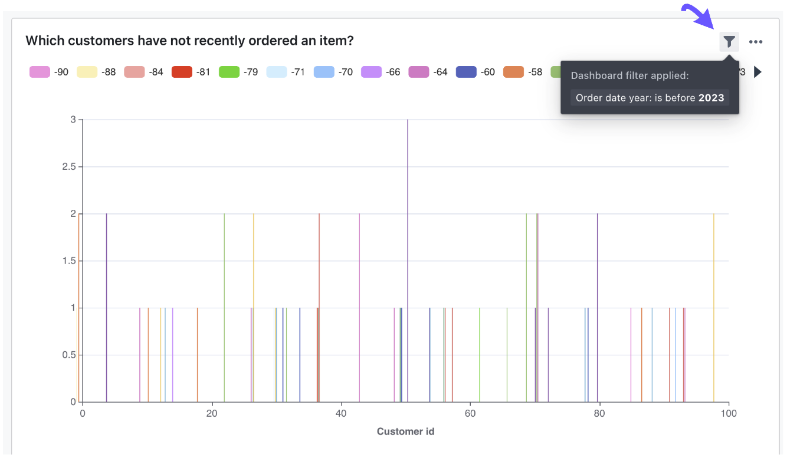

#### Dashboard filters _override_ the filters applied in the saved chart

For example, if I had a saved chart looking at the total number of orders by each status and my saved chart had the filter `status` **is equal to** `completed`. Then, on my dashboard, I added a dashboard filter for `status` **is equal to** `return_pending`. My saved chart's filter would be overridden, so the tile on the dashboard would be filtered to include orders that **_only_** had the `status` **is equal to** `return_pending`.

NOT `status` **is equal to** `return_pending` _and_ `completed`.

Here's another example using a date filter: If my original saved chart was filtered to only include orders completed on or after April 3rd, 2022. But, I add a date filter to my dashboard to include orders completed on or after January 1st, 2022, then my saved chart's filter will be overridden by the dashboard filter and I'll end up with the chart filtered by orders completed on or after January 1st, 2022.
