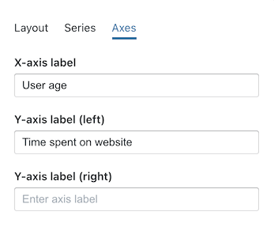

# Visualizing your results

Results tables can be useful for finding specific numbers or checking out your data, but it's usually easier to see trends and make sense of your data using charts.

In Lightdash, the data in your results tables can be visualized in a bunch of different ways:

- [Big Value](#big-value)
- [Table](#table)
- [Bar chart](#bar-chart)
- [Line chart](#line-chart)
- [Horizontal bar chart](#horizontal-bar-chart)
- [Scatter chart](#scatter-chart)
- [Mixed chart](#mixed-chart)

The visualization type that you pick determines how Lightdash shows the data series in your chart. To change how your data is displayed, go into the `charts` tab in the Explore view. You have the option to change the chart type shown by selecting a style from the drop-down:

you can also adjust all of the configuration settings for your chart type by clicking on the `configure` button:

Once you've finished creating your chart, you can share it using the URL,  save the chart, download it as an image, or save it to a dashboard.

## Chart types and options

Each chart type has its own configuration options. Click the `configure` button next to the chart type in the `chart` tab to see your options.

### Big value

The Big value option is for displaying a single number, well, big.

The Big value only works for numeric values. It will always pick the first value from the field in your results table as the number to display.

The options for Big value include:

- Updating the label below the big value value.

### Table

The Table option is good for looking at (surprise, surprise) tabular data, or for lists of things like user IDs or transactions. 

### Bar chart

Bar charts are helpful to compare things between different groups (e.g. the number of orders you have by product type) or to track how a number changes over time if you have a smaller number of x-axis values (e.g. number of new users per month over a year). 

You can also stack bar charts to compare proportions across different groups.

You can see more details about bar chart configurations [here](#configure-your-bar-line-and-scatter-charts).

### Line chart

Line charts are used to show changes in a number over a short or long period of time. When smaller changes exist, or you have lots of x-axis values, line charts are better to use than bar charts.

Line charts with multiple lines can also be used to compare changes over the same period of time for more than one group.

You can see more details about line chart configurations [here](#configure-your-bar-line-and-scatter-charts).

### Horizontal bar chart

Horizontal bar charts are just bar charts, except the columns are placed on the chart horizontally instead of vertically. Horizontal bar charts are useful when you're trying to group a number by something with a lot of possible values. They're also useful if your groups have really long label names.

You can see more details about horizontal bar chart configurations [here](#configure-your-bar-line-and-scatter-charts).

### Scatter chart

A scatter chart is useful if you want to to look at the relationship, a.k.a. correlation, between two variables. Something like the age of your users vs. the amount of time they've spent on your website.

You can group your scatter chart using a third variable. This will make the points on the scatter the same colour if they have the same group value.

You can see more details about scatter chart configurations [here](#configure-your-bar-line-and-scatter-charts).

### Mixed chart

You can combine bars, line, and scatter charts on the same chart using a Mixed chart.

To use a Mixed chart, you'll need to start with either a line, scatter or horizontal bar chart type and have two or more series on your chart. Either from having two or more fields selected for your y-axis or from having a group with two or more groups.

Once you have the series you want on your chart, you can pick and choose the different chart types you'd like for each series in the `series` tab of the `Configure` space.

You can easily revert all of the series on your chart to a single type using the `chart type` toggle list in the `series` tab.

You can see more details about mixed chart configurations [here](#configure-your-bar-line-and-scatter-charts).

### Configure your bar, line and scatter charts

These chart types have very similar configuration options, so we thought it would be easiest to talk about them all together:

#### Layout

This is where you can pick the columns from your results table that you want to plot on your x and y axes or that you want to group by.

For bar charts, this is also where you have the option to stack your bars, or leave them unstacked (grouped).

#### Series

The series tab is where you can adjust how your chart shows each data series. A **data series** is a set of related data points plotted on a chart. For example, the number of new users created each day over a set of dates is a series. In a bar chart, a series is represented by bars of the same color; in a line chart, a series is represented by a single line. You can see a list of the series for your chart in the `series` menu, and on the chart legend.

The options available in here will depend on the data in your chart. But, in here you can:

- Set the chart type of your series.
- Put your series on a left or right y-axis.
- Show the value labels on data points.
- Show or hide a series from your chart.

If you have multiple series in your chart, you can adjust these settings for **_all_** of the series in your chart at once using the configuration options at the top. Or, you can adjust these setting for each of the series individually.

#### Axes

Here’s where you can customize the text for your axes labels.

