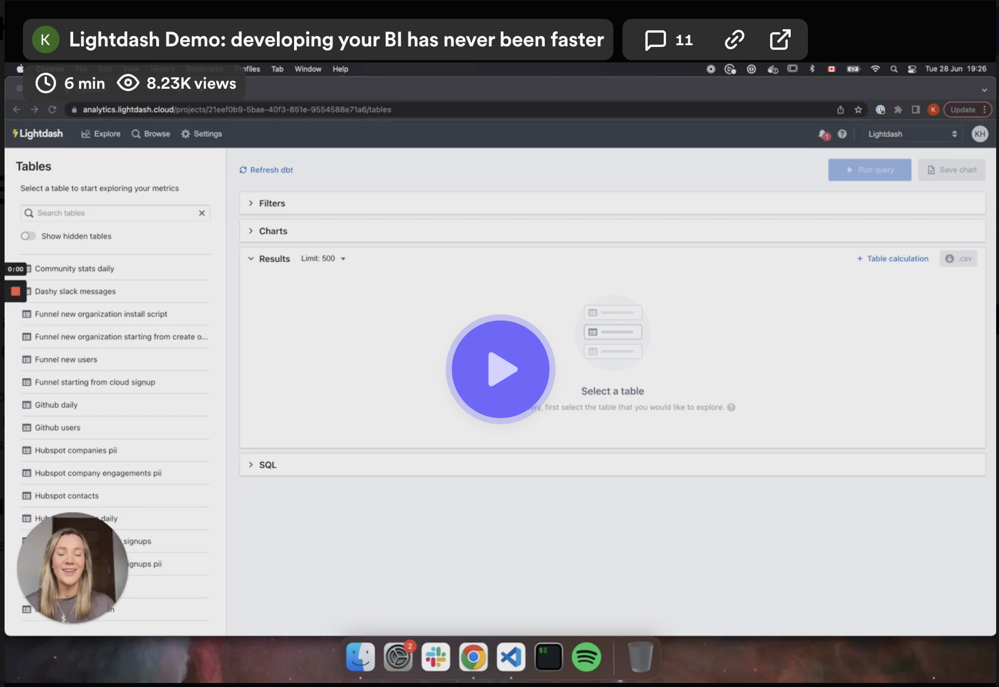

# Lightdash Docs

Lightdash instantly turns your dbt project into a full-stack BI platform. Analysts write metrics and Lightdash enables self-serve for the entire business. Here are some docs to walk you through it all 😄

We'd love you to [join our Slack Community](https://join.slack.com/t/lightdash-community/shared_invite/zt-2ehqnrvqt-LbCq7cUSFHAzEj_wMuxg4A) to get access to help directly from the team, see sneak previews of new features, and give us your feedback.

