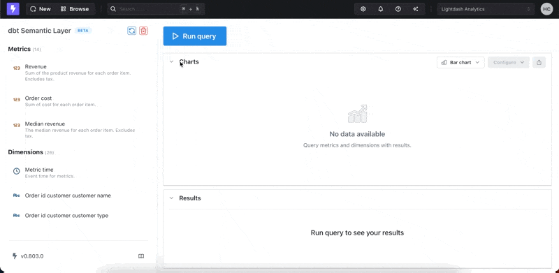

import FindDbtCloudJobs from './assets/find-dbt-cloud-jobs.png';
import DbtJobUrl from './assets/dbt-job-url-example.png';
import QueryUsingDbtSemanticLayer from './assets/query-using-dbt-semantic-layer.png';

# dbt Semantic Layer

Lightdash is dbt Semantic Layer ready and the integration is now available in public preview for Lightdash Cloud Pro and Lightdash Cloud Enterprise users. By integrating Lightdash with your dbt Semantic Layer, you can consume dbt metrics in real time and you can be sure you're calculating the exact metrics you see in your other semantic layer-connected tools.

:::info
Ensure you have access to the dbt Semantic Layer via your dbt Cloud account, follow their [getting started guide](https://docs.getdbt.com/docs/use-dbt-semantic-layer/quickstart-sl) for more information.
:::

**Features:**

- Query your Semantic Layer via the Lightdash UI
- Dynamically show matching metrics and dimensions based on current selected fields
- Dimensions are grouped by dbt Entities
- Modify time granularity for any timegrain dimensions
- (coming soon) Share & save Semantic Layer to Lightdash dashboards
- (coming soon) Search field for easier discover of metrics and dimensions

## Getting started with dbt Semantic Layer in Lightdash

Our dbt Semantic Layer integration is now available to all Lightdash Cloud Pro and Lightdash Cloud Enterprise customers. To have this activated on your account, please reach out to your Lightdash support team directly or ping us at support@lightdash.com.

### Query metrics

Once you're connected, you can head over to the explorer and you'll see a new sidebar showing all the available metrics and dimensions from the dbt Semantic Layer that you can query. To get started, simply select a metric from the list in the sidebar and Lightdash will automatically figure out the correct accompanying dimensions and only show those available for selection.

### Visualize results

Once you've selected your dimensions and metrics, Lightdash will automatically generate visualizations for you. You can use the full power of the Lightdash visualization library to change and customize these entirely.

The dbt Semantic Layer integration with Lightdash is actively being developed and we're always open to feedback on how it can be improved. Report any bugs [directly on our GitHub repository](https://github.com/lightdash/lightdash/issues/new?assignees=&labels=%F0%9F%90%9B+bug&projects=&template=bug_report.md&title=) or [join the community](https://join.slack.com/t/lightdash-community/shared_invite/zt-2ehqnrvqt-LbCq7cUSFHAzEj_wMuxg4A) to join the discussion with the team and have your say on the future feature roadmap for Lightdash.
