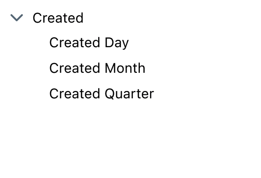

# Dimensions reference sheet

Dimensions are the columns in your table. They are the "attributes" of your data. For example, `user_id` in your users table is a dimension.

Dimensions match 1:1 with columns in your dbt models.

---

## Adding dimensions to your project

Read more about [adding dimensions to your project in our docs here](/guides/how-to-create-dimensions).

For a dimension to appear in Lightdash, you just need to declare it in your dbt model's YAML file.

```yaml
version: 2

models:
  - name: my_model
    columns:
      - name: user_id # will be "User id" in LightDash
        description: 'Unique identifier for a user."
```

Column descriptions in your YAML file are automatically pulled into Lightdash and you can spot them if you hover over the dimension name 👀


## Dimension types

Dimension types are automatically pulled from your tables schemas in Lightdash. We currently support these dimension types:

| Dimension Types |
| --------------- |
| string          |
| number          |
| timestamp       |
| date            |
| boolean         |

## Dimension configuration

To customize the dimension, you can do it in your dbt model's YAML file.

```yaml
version: 2

models:
  - name: my_model
    columns:
      - name: revenue_gbp_total_est
        description: "Total estimated revenue in GBP based on forecasting done by the finance team."
        meta:
          dimension:
            type: string
            label: 'Total revenue' # this is the label you'll see in Lightdash
            description: 'My custom description' # you can override the description you'll see in Lightdash here
            sql: "IF(${revenue_gbp_total_est} = NULL, 0, ${registered_user_email})" # custom SQL applied to the column from dbt used to define the dimension
            hidden: false
            round: 2
            format: 'gbp'
            group_label: "Revenue"
      - name: forecast_date
        description: "Date of the forecasting."
        meta:
          dimension:
            type: date
            time_intervals: ['DAY', 'WEEK', 'MONTH', 'QUARTER'] # not required: the default time intervals for dates are `['DAY', 'WEEK', 'MONTH', 'YEAR']`
```

All the properties you can customize:

| Property                          | Required | Value                            | Description                                                                                                                                                                                                                                                                                            |
|-----------------------------------|----------|----------------------------------|--------------------------------------------------------------------------------------------------------------------------------------------------------------------------------------------------------------------------------------------------------------------------------------------------------|
| label                             | No       | string                           | Custom label. If you set this property, this is what you'll see in Lightdash instead of the dimension name.                                                                                                                                                                                            |
| type                              | No       | Dimension type                   | The dimension type is automatically pulled from your table schemas in Lightdash but you can override the type using this property.                                                                                                                                                                     |
| description                       | No       | string                           | Description of the dimension in Lightdash. You can use this to override the description you have for the dimension in dbt.                                                                                                                                                                             |
| sql                               | No       | string                           | Custom SQL applied to the column used to define the dimension.                                                                                                                                                                                                                                         |
| [time_intervals](#time-intervals) | No       | `'default'` or `OFF` or string[] | `'default'` will be converted into `['DAY', 'WEEK', 'MONTH', 'YEAR']` for dates and `['RAW', 'DAY', 'WEEK', 'MONTH', 'YEAR']` for timestamps, as will not setting anything; if you want no time intervals set `'OFF'`. You can use any interval values supported by your warehouse (e.g. `DAYOFWEEK`). |
| hidden                            | No       | boolean                          | If set to `true`, the dimension is hidden from Lightdash. By default, this is set to `false` if you don't include this property.                                                                                                                                                                       |
| round                             | No       | number                           | Rounds a number to a specified number of digits                                                                                                                                                                                                                                                        |
| format                            | No       | string                           | This option will format the output value on the result table and CSV export. Currently supports one of the following: `['km', 'mi', 'usd', 'gbp', 'percent']`                                                                                                                                          |
| group_label                        | No       | string                           | If you set this property, the dimension will be grouped in the sidebar with other dimensions with the same group label.                                                                                                                                                                                |

## Time intervals

Lightdash automatically adds intervals for dimensions that are timestamps or dates, so you don't have to!

For example, here we have the timestamp dimension `created` defined in our dbt project:

```yaml
      - name: created
        description: 'Timestamp when the user was created.'
```

Lightdash breaks this out into the default intervals automatically. So, this is how `created` appears in our Lightdash project:


### By default, the time intervals we use are:

**Date**: ['DAY', 'WEEK', 'MONTH', 'YEAR']
**Timestamp**: ['RAW', 'DAY', 'WEEK', 'MONTH', 'YEAR']

### You can use any time interval value supported by your warehouse

Here are the supported time intervals in [BigQuery](https://cloud.google.com/bigquery/docs/reference/standard-sql/date_functions#extract:~:text=FROM%20date_expression)-,Description,-Returns%20the%20value) and [Snowflake](https://docs.snowflake.com/en/sql-reference/functions/year.html#usage-notes).

### To change the time intervals used for a dimension, specify your custom intervals using `time_intervals`

If you want to change the time intervals shown for a dimension, you can specify the custom time intervals you'd like you include using the `time_intervals` property for a dimension.

In this example, I've only included the day, month, and quarter time intervals for the `created` dimension in Lightdash.

```yaml
      - name: created
        description: 'Timestamp when the user was created.'
        meta:
          dimension:
            time_intervals:
              - DAY
              - MONTH
              - QUARTER
```



### To turn off time intervals for a dimension, set `time_intervals: OFF`

If you want to turn off time intervals for a dimension, you can simply set the `time_intervals` property to `OFF`.

In this example, `created` would now appear as a single, timestamp dimension without a drop-down list of time intervals in Lightdash:

```yaml
      - name: created
        description: 'Timestamp when the user was created.'
        meta:
          dimension:
            time_intervals: OFF
```


