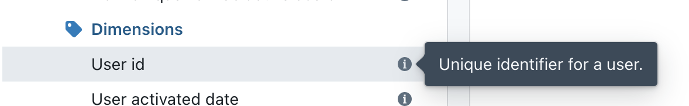
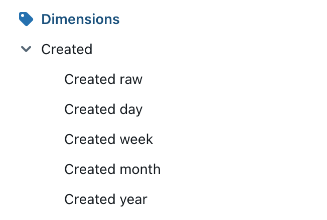
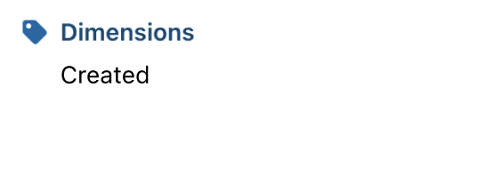

import ClickableDimension from './assets/clickable-dimension-link.jpg';

# Dimensions reference sheet

Dimensions are the columns in your table. They are the "attributes" of your data. For example, `user_id` in your users table is a dimension.

Dimensions match 1:1 with columns in your dbt models.

---

## Adding dimensions to your project

Read more about [adding dimensions to your project in our docs here](/guides/how-to-create-dimensions).

For a dimension to appear in Lightdash, you just need to declare it in your dbt model's YAML file.

```yaml
version: 2

models:
  - name: my_model
    columns:
      - name: user_id # will be "User id" in LightDash
        description: 'Unique identifier for a user."
```

Column descriptions in your YAML file are automatically pulled into Lightdash and you can spot them if you hover over the dimension name 👀



## Dimension types

Dimension types are automatically pulled from your tables schemas in Lightdash. We currently support these dimension types:

| Dimension Types |
| --------------- |
| string          |
| number          |
| timestamp       |
| date            |
| boolean         |

## Dimension configuration

To customize the dimension, you can do it in your dbt model's YAML file.

```yaml
version: 2

models:
  - name: sales_stats
    meta:
      joins:
        - join: web_sessions
          sql_on: ${web_sessions.date} = ${sales_stats.date}
    columns:
      - name: revenue_gbp_total_est
        description: "Total estimated revenue in GBP based on forecasting done by the finance team."
        meta:
          dimension:
            type: string
            label: 'Total revenue' # this is the label you'll see in Lightdash
            description: 'My custom description' # you can override the description you'll see in Lightdash here
            sql: "IF(${TABLE}.revenue_gbp_total_est = NULL, 0, ${registered_user_email})" # custom SQL applied to the column from dbt used to define the dimension
            hidden: false
            round: 2
            format: 'gbp'
            group_label: "Revenue"
      - name: forecast_date
        description: "Date of the forecasting."
        meta:
          dimension:
            type: date
            time_intervals: ['DAY', 'WEEK', 'MONTH', 'QUARTER'] # not required: the default time intervals for dates are `['DAY', 'WEEK', 'MONTH', 'YEAR']`
            urls:
              - label: "Open in forecasting tool"
                url: "https://finance.com/forceasts/weeks/${ value.raw }"
              - label: Open in Google Calendar
                url: 'https://calendar.google.com/calendar/u/0/r/day/${ value.formatted |split: "-" |join: "/"}'
```

All the properties you can customize:

| Property                                          | Required | Value                            | Description                                                                                                                                                                                                                                                                                                                                              |
|---------------------------------------------------|----------|----------------------------------|----------------------------------------------------------------------------------------------------------------------------------------------------------------------------------------------------------------------------------------------------------------------------------------------------------------------------------------------------------|
| label                                             | No       | string                           | Custom label. If you set this property, this is what you'll see in Lightdash instead of the dimension name.                                                                                                                                                                                                                                              |
| type                                              | No       | Dimension type                   | The dimension type is automatically pulled from your table schemas in Lightdash but you can override the type using this property.                                                                                                                                                                                                                       |
| description                                       | No       | string                           | Description of the dimension in Lightdash. You can use this to override the description you have for the dimension in dbt.                                                                                                                                                                                                                               |
| sql                                               | No       | string                           | Custom SQL applied to the column used to define the dimension.                                                                                                                                                                                                                                                                                           |
| [time_intervals](#time-intervals)                 | No       | `'default'` or `OFF` or an array[] containing elements of [date](#date-options), [numeric](#numeric-options) or [string](#string-options) options | `'default'` (or not setting the `time_intervals` property) will be converted into `['DAY', 'WEEK', 'MONTH', 'YEAR']` for dates and `['RAW', 'DAY', 'WEEK', 'MONTH', 'YEAR']` for timestamps; if you want no time intervals set `'OFF'`. |
| hidden                                            | No       | boolean                          | If set to `true`, the dimension is hidden from Lightdash. By default, this is set to `false` if you don't include this property.                                                                                                                                                                                                                         |
| round                                             | No       | number                           | Rounds a number to a specified number of digits                                                                                                                                                                                                                                                                                                          |
| format                                            | No       | string                           | This option will format the output value on the result table and CSV export. Currently supports one of the following: `['km', 'mi', 'usd', 'gbp', 'eur', 'percent']`                                                                                                                                                                                            |
| group_label                                       | No       | string                           | If you set this property, the dimension will be grouped in the sidebar with other dimensions with the same group label.                                                                                                                                                                                                                                  |
| [urls](#urls)                                     | No       | Array of { url, label }          | Adding urls to a dimension allows your users to click dimension values in the UI and take actions, like opening an external tool with a url, or open at a website. You can use liquid templates to customise the link based on the value of the dimension.                                                                                               |

## Time intervals

Lightdash automatically adds intervals for dimensions that are timestamps or dates, so you don't have to!

For example, here we have the timestamp dimension `created` defined in our dbt project:

```yaml
      - name: created
        description: 'Timestamp when the user was created.'
```

Lightdash breaks this out into the default intervals automatically. So, this is how `created` appears in our Lightdash project:



### By default, the time intervals we use are:

**Date**: ['DAY', 'WEEK', 'MONTH', 'YEAR']

**Timestamp**: ['RAW', 'DAY', 'WEEK', 'MONTH', 'YEAR']

### To turn off time intervals for a dimension, set `time_intervals: OFF`

If you want to turn off time intervals for a dimension, you can simply set the `time_intervals` property to `OFF`.

In this example, `created` would now appear as a single, timestamp dimension without a drop-down list of time intervals in Lightdash:

```yaml
      - name: created
        description: 'Timestamp when the user was created.'
        meta:
          dimension:
            time_intervals: OFF
```



### Date options

| Option      | Description                                   | Type            | Displayed value                           | Notes                                                         |
|-------------|-----------------------------------------------|-----------------|-------------------------------------------|---------------------------------------------------------------|
| RAW         | Original value                                | Date / DateTime | 2019-01-01 / 2019-01-01, 09:30:30:300 UTC |                                                               |
| YEAR        | Date truncated to the nearest year            | Date            | 2019                                      |                                                               |
| QUARTER     | Date truncated to the nearest quarter         | Date            | 2019-Q1                                   |                                                               |
| MONTH       | Date truncated to the nearest month           | Date            | 2019-01-01                                |                                                               |
| WEEK        | Date truncated to the nearest week            | Date            | 2019-01-01                                | The start of the week depends on your warehouse configuration |
| DAY         | Date truncated to the nearest day             | Date            | 2019-01-01                                |                                                               |
| HOUR        | Datetime truncated to the nearest hour        | DateTime        | 2019-01-01, 09 UTC                        |                                                               |
| MINUTE      | Datetime truncated to the nearest minute      | DateTime        | 2019-01-01, 09:30 UTC                     |                                                               |
| SECOND      | Datetime truncated to the nearest second      | DateTime        | 2019-01-01, 09:30:30 UTC                  |                                                               |
| MILLISECOND | Datetime truncated to the nearest millisecond | DateTime        | 2019-01-01, 09:30:30:300 UTC              |                                                               |

### Numeric options

| Option            | Description                  | Type   | Displayed value | Notes                                                                         |
|-------------------|------------------------------|--------|-----------------|-------------------------------------------------------------------------------|
| DAY_OF_WEEK_INDEX | Index of the day of the week | Number | 0               | The value range and start of the week depends on your warehouse configuration |
| DAY_OF_MONTH_NUM  | Day of the month             | Number | 21              |                                                                               |
| DAY_OF_YEAR_NUM   | Day of the year              | Number | 127             |                                                                               |
| MONTH_NUM         | Month number                 | Number | 7               |                                                                               |
| QUARTER_NUM       | Quarter number               | Number | 3               |                                                                               |
| YEAR_NUM          | Year number                  | Number | 2019            |                                                                               |

### String options

| Option           | Description     | Type   | Displayed value |
|------------------|-----------------|--------|-----------------|
| DAY_OF_WEEK_NAME | Day of the week | String | Monday          |
| MONTH_NAME       | Month name      | String | March           |
| QUARTER_NAME     | Quarter name    | String | Q3              |

## URLs

Lightdash users can interact with dimension values by clicking on them. By adding custom `urls` you can configure
the actions available to your users. Like linking to external tools, or taking actions in other tools.


In the example below, users can click on a company name and open a corresponding record in their CRM or search for
the company in google or open that company's Slack channel.

```yaml
columns:
  - name: company_name
    label: Registered trading name of the company
    meta:
      dimension:
        urls:
          - label: Search for company in Google
            url: "https://google.com/search?${ value.formatted | url_encode }"
          - label: Open in CRM
            url: "https://mycrm.com/companies/${ row.company.company_id.raw | url_encode }"
```

The `${ value.formatted }` will be replaced with the value of the company name in the Lightdash UI at query run time.
The `${ row.company.company_id.raw }` will be replaced with the value of the company id in the Lightdash UI at query run time.
The action will be disabled if the column "company_id" from table "company" is not part of the query.

### You can reference values from other columns in your URLs

You can reference another dimension from your table in your URL. For these URLs to work, the other column you've referenced needs to be included in your results table.
For example, say I’ve added a URL to `company_name` and it uses the field `customer_id`:

```
columns:
  - name: company_name
    label: Registered trading name of the company
    meta:
      dimension:
        urls:
          - label: "Open company"
            url: "https://example.com/company/${row.customers.customer_id.raw | url_encode }"
```

This URL will only work if I have `customer_id` included in my results table.

### Liquid Templating

Use templates to configure the url values depending on the query, this allows your urls to depend on the results of queries.

**Available liquid tags**

| Tag                                         | Description                                                                                  |
|---------------------------------------------|----------------------------------------------------------------------------------------------|
| `${ value.formatted }`                      | The exact value of the dimension as seen in the Lightdash UI. For example "$1,427.20"        |
| `${ value.raw }`                            | The raw value of the dimension returned from the underlying SQL query. For example "1427.2 " |
| `${ row.table_name.column_name.formatted }` | The exact value of the column as seen in the Lightdash UI. For example "$1,427.20"           |
| `${ row.table_name.column_name.raw }`       | The raw value of the dimension returned from the underlying SQL query. For example "1427.2 " |

**Available liquid filters**

Filters can be used to make small transformations of your values:

| Filter     | Description                                                            | Example usage        |
|------------|------------------------------------------------------------------------|----------------------|
| url_encode | Encode a string as url safe, for example it replaces spaces with `%20` | `${value.formatted \ | url_encode }`|
| downcase   | Convert string to all lowercase                                        | `${value.formatted \ | downcase }`|
| append     | Append a string to another                                             | `${value.formatted \ | append: ".html"}`|

There are [many more filters available in the Liquid documentation](https://liquidjs.com/filters/overview.html).


## Using special characters or capital letters in your column names

If you use special characters on your column names,  you might get errors when using those columns on explore. 
For example, having a column named `Status` with capital S on a table named `orders` in postgres throws the following error: 

```
column orders.status does not exist
```

To fix this, we can add the quoted column to our `sql` meta tag on dimensions 

```
- name: status
  meta: 
    dimension: 
      type: string
      sql: '"orders"."Status"' # you can also use '${TABLE}."Status"'

```

This will quote the `Status` columns on the SQL query 

```
SELECT
  "orders".order_id AS "orders_order_id",
  "orders"."Status" AS "orders_status"
FROM "postgres"."jaffle"."orders" AS "orders"
```
