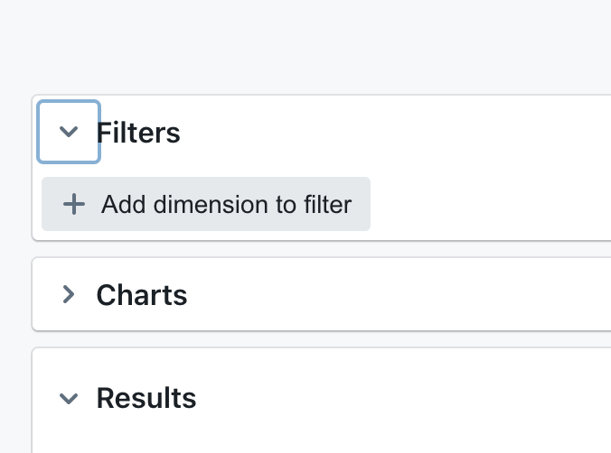
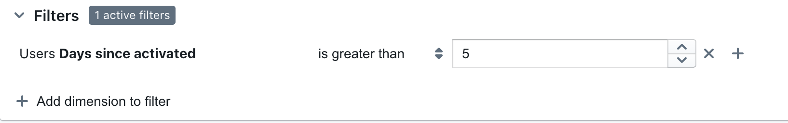

# Filters

Filters appear at the top of an explore and allow users to change the data being pulled into the explore.

---

# Adding filters to your explore

To filter the data that you're exploring, simply click on the `filters` toggle in lightdash and click `add dimension to filter`.




:::info

At the moment, we only support filters on dimensions (not on metrics)!

:::

Select the dimension you would like to filter from the drop-down list, then select the filtering options.



## You can add more conditions to your filter by selecting the '+' symbol on the right


:::info
These multiple filters are joined together using AND, so, the example above would give us compiled SQL that looks like:
```
WHERE (
  (users.days_since_activated) > 5
  AND (users.days_since_activated)...
```

## If you want to include multiple values in your filter, just hit `enter` between each value entry in your list


The listed values are separated by an OR statement in the compiled SQL. E.g. the above would give us:
```
WHERE (
  (users.days_since_activated) > 5
   AND (users.days_since_activated) IN (1,2,3)
)
```
