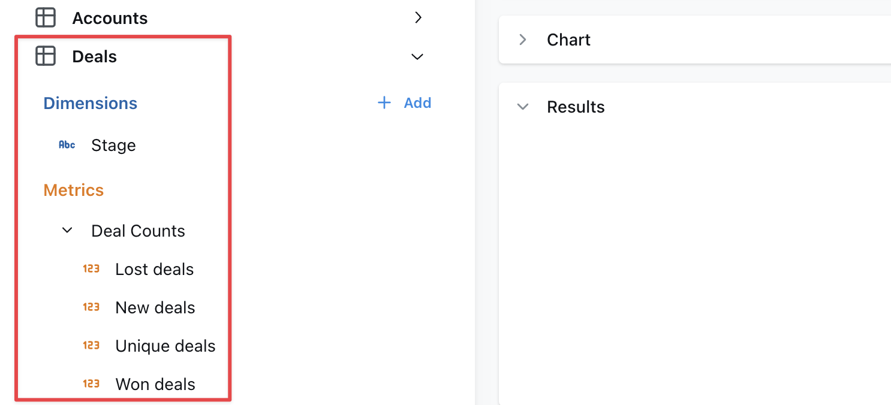

import HideJoinTableColumns from './assets/hide-join-table-columns.jpg';
import HideJoinedTableFromTablesList from './assets/hide-joined-table-from-tables-list.jpg';

# Joins reference doc

Joins let you connect different models to each other so that you can explore more than one model at the same time in Lightdash and see how different parts of your data relate to each other.

---

## Adding joins in your models

Joins are defined at the same level as the model parameters in your YAML file.

```yaml
version: 2
models:
  - name: accounts
    meta:
      joins:
        - join: deals
          type: left
          sql_on: ${accounts.id} = ${deals.account_id}
          fields: [unique_deals, new_deals, won_deals, lost_deals, stage]
```

When you open Lightdash, the dimensions and metrics from your joined model will appear below the ones in your selected model.



:::tip

- You can omit `fields` to include all metrics and dimensions defined in the joined table.
- When joined fields reference other fields, those other fields must also be included.
- The `sql_on` statement can include references to [user attributes](./user-attributes.mdx) for row-level filtering.

:::


## Rename a joined model

When joining a model B onto a model A, you may want to rename the model for readability. This can be done with the
`label` tag, for example on this `messages` model it's more suitable for our business to call the joined user a
"sender":

```yaml
models:
  - name: messages
    meta:
      joins:
        - join: users
          label: Sender
          sql_on: ${messages.sent_by} = ${users.user_id}
```

## Join the same table multiple times with an `alias`

If you need to join a table multiple times, you can use an `alias` to distinguish between the different tables. A
common use case is joining a user table multiple times to another table depending on the type of user. For example
this `messages` model has both a sender and a recipient:

```yaml
models:
  - name: messages
    meta:
      joins:
        - join: users
          alias: sender
          sql_on: ${messages.sent_by} = ${sender.user_id}
        - join: users
          alias: recipient
          sql_on: ${messages.sent_to} = ${recipient.user_id}
```

Note the following important differences when aliasing models in joins:

1. You must reference the fields in the model using the new alias. Notice that the joins above use `${sender.user_id} ` rather than `${users.user_id}`.
2. Because of the above, any fields in the base model or joined model that reference any field `${users.*}` will
   fail to compile. Be careful of aliasing tables that are used in the base model.
3. Joined models are automatically relabelled with the alias but you may also customise this using the `label:`
   field as above.

## Specify your join type using `type`

If you want to specify the type of join to be used in your SQL query, use the type field in your YAML configuration file. Set its value to one of the following: inner, left, right, or full. This will determine how the tables are joined in your query, aligning with SQL's INNER JOIN, LEFT OUTER JOIN, RIGHT OUTER JOIN, or FULL OUTER JOIN respectively.

here's an example of how to specify a join type:

```yaml
models:
  - name: messages
    meta:
      joins:
        - join: users
          type: inner
          sql_on: ${messages.sent_by} = ${users.user_id}
```

:::info

By default, if no `type` is specified, all joins are `LEFT OUTER` joins.

:::

Here's a table to help you understand what each join type means and how it translates to SQL:

| Join Type              | Generated SQL      | Description                                                                                                                                                       |
| ---------------------- | ------------------ | ----------------------------------------------------------------------------------------------------------------------------------------------------------------- |
| [`inner`](#type-inner) | `INNER JOIN`       | Returns rows that have matching values in both tables.                                                                                                            |
| [`left`](#type-left)   | `LEFT OUTER JOIN`  | Returns all rows from the left table, and the matching rows from the right table. Non-matching rows will have `NULL` for right table's columns.                   |
| [`right`](#type-right) | `RIGHT OUTER JOIN` | Returns all rows from the right table, and the matching rows from the left table. Non-matching rows will have `NULL` for left table's columns.                    |
| [`full`](#type-full)   | `FULL OUTER JOIN`  | Returns all rows when there is a match in either the left or right table records. Non-matching rows will have `NULL` for columns of the table that lacks a match. |

### inner

An inner join returns rows that have matching values in both tables. For example, if you have a `users` table and a `subscriptions` table, an inner join would return only the users who have a subscription.

Here's an example of how to specify an inner join:

```yaml
models:
  - name: users
    meta:
      joins:
        - join: subscriptions
          sql_on: ${users.user_id} = ${subscriptions.user_id}
          type: inner
```

### left

A left join returns all rows from the left table (i.e. the model where you're adding the `join` to), and the matching rows from the right table (i.e. the model you've specified in `- join:`). Non-matching rows will have `NULL` for right table's columns. For example, if you have a `users` table and a `subscriptions` table, a left join would return all users, and the subscription information for users who have a subscription.

Here's an example of how to specify a left join:

```yaml
models:
  - name: users
    meta:
      joins:
        - join: subscriptions
          sql_on: ${users.user_id} = ${subscriptions.user_id}
          type: left # you can omit this, as left is the default
```

### right

A right join returns all rows from the right table (i.e. the model you've specified in `- join: `), and the matching rows from the left table (i.e. the model where you're adding the `join` to). Non-matching rows will have `NULL` for left table's columns. For example, if you have a `users` table and a `subscriptions` table, a right join would return all subscriptions, and the user information for users who have a subscription.

Here's an example of how to specify a right join:

```yaml
models:
  - name: users
    meta:
      joins:
        - join: subscriptions
          sql_on: ${users.user_id} = ${subscriptions.user_id}
          type: right
```

### full

A full join returns all rows when there is a match in either the left or right table records. Non-matching rows will have `NULL` for columns of the table that lacks a match. For example, if you have a `users` table and a `subscriptions` table, a full join would return all users and all subscriptions, and the subscription information for users who have a subscription.

## Always join a table

If you need a table to always be joined, you can set the `always` field to `true`.

```yaml
models:
  - name: messages
    meta:
      joins:
        - join: users
          sql_on: ${messages.sent_by} = ${users.user_id}
          always: true
```

This will make sure that even when you don't select any of the fields from the joined table it will still be joined in the query.

## Only select a subset of fields from a join

Use the `fields` tag to select a subset of fields from a join. This is useful if you want to join a model but only a
few of its fields are useful in the joined context. For example this `messages` model only needs the `name` and
`email` fields from the `users` model. Note we must also include the `user_id` field since it's needed for the join.

```yaml
models:
  - name: messages
    meta:
      joins:
        - join: users
          sql_on: ${messages.sent_by} = ${users.user_id}
          fields: [user_id, email, name]
```

## Using joined dimensions or metrics in your YAML

Once you've joined a model, you can reference the metrics and dimensions from your joined model in your configurations.

For example, I can filter one of my metrics using a dimension from my joined model, like this:

```yaml
version: 2

models:
  - name: users
    meta:
      joins:
        - join: web_sessions
          sql_on: ${web_sessions.user_id} = ${users.user_id}
        - join: subscriptions
          sql_on: ${subscriptions.user_id} = ${users.user_id} AND ${subscriptions.is_active}

    columns:
      - name: user_id
        meta:
          metrics:
            num_unique_premium_user_ids:
              type: count_distinct
              filters:
                - subscriptions.plan: premium
```

You can also reference these joined metrics and dimensions in custom sql, like this:

```yaml
version: 2

models:
  - name: users
    meta:
      joins:
        - join: web_sessions
          sql_on: ${web_sessions.user_id} = ${users.user_id}
        - join: subscriptions
          sql_on: ${subscriptions.user_id} = ${users.user_id} AND ${subscriptions.is_active}

    columns:
      - name: user_id
        meta:
          dimension:
            sql: IF(${subscriptions.plan} IS NULL, NULL, ${user_id})
          metrics:
            num_unique_premium_user_ids:
              type: count_distinct
              sql: IF(${subscriptions.plan} = 'premium', ${user_id}, NULL)
```

:::warning

**Every joined field that you reference in a YAML file adds a dependency that you'll have to include in all future references to that model.**

For example, you might define `deals.unique_enterprise_deals` by using a joined field in a filter: `${accounts.segment} = 'Enterprise'`. 

Then later you need to join `deals` to a `marketing_attribution` model.

The `unique_enterprise_deals` metric must be excluded from the join unless you also join `accounts` to get the `accounts.segment` field. 

:::

Check out our [dimensions](/references/dimensions) and [metrics](/references/metrics) reference docs to see all of the other configurations you can use with your joined fields.

## Hide joined tables

Sometimes, you need to use an intermediate model to join two models together and don't want to show its columns in the list of available metrics/dimensions.
You can add a `hidden: true` tag to joins, like this to hide these intermediate models:

```yaml
models:
  - name: users
    meta:
    joins:
      - join: map_users_organizations
        sql_on: users.user_id = map_users_organizations.user_id
        hidden: true
      - join: organizations
        sql_on: organizations.organization_id = map_users_organizations.organization_id
```

Using just the `hidden` tag in the join and changing nothing else will remove the joined table from the sidebar of metrics/dimensions in `users`, but it will still appear in the "Tables" list as a table to explore on its own.


.

### Hiding joined tables/helper tables from the main "Tables" list

Sometimes, you might want to use a model as a join, but you don't want it to appear as a table to explore on its own in the list of Tables. You can use labels in your dbt project to help manage these tables and the `table configuration` settings in your Lightdash project.

#### Step 1: Add tags to your models

Models that are used in joins still need to be compiled in Lightdash. So, we suggest using some labels to tag the models that need to compiled in Lightdash with `lightdash`. Then, tag the models that you want users to explore with `lightdash-explore`.

For example, `map_users_organizations` in our example below is a table we want to use as a join, but we don't want it to appear as a table on its own that can be explored. So, in the `dbt_project.yml` file, we'll add the `tag: lightdash`, but we won't add the tag `lightdash-explore`

```yaml
models:
  - name: users
    meta:
    joins:
      - join: map_users_organizations
        sql_on: users.user_id = map_users_organizations.user_id
        hidden: true
      - join: organizations
        sql_on: organizations.organization_id = map_users_organizations.organization_id
```

Here we add our model tags in the `dbt_project.yml` file:

```yaml
models:
  users:
    +tags:
      - 'lightdash'
      - 'lightdash-explore'

  map_users_organizations:
    +tags:
      - 'lightdash'
```

When deploying lightdash via the CLI or using GitHub actions, you should use the dbt selector `-s lightdash` to make sure you don't compile unnecessary models.

#### Step 2: Update your Tables Configuration in the Lightdash app

In the Lightdash app, under the `project settings` --> `tables configuration`, you can filter by `lightdash-explore` so all the intermediary joins are hidden and users have a small and curated list of models then can explore from.

Doing this (combined with using the `hidden` label for the joined table above) would hide it both from the Tables list, and from the sidebar in the `Users` table.


.
