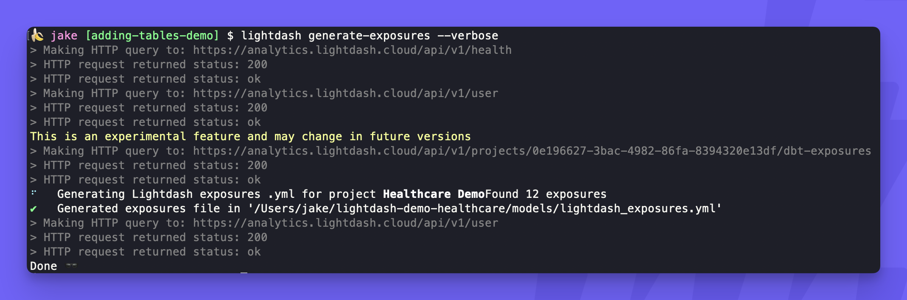
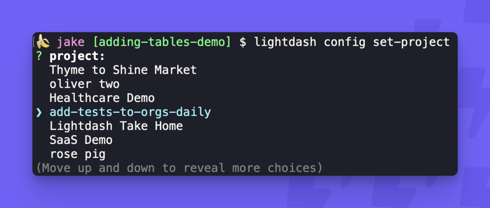

# Lightdash CLI reference

The Lightdash CLI is the recommended way to develop your Lightdash project. It makes development faster and easier, as well as giving you options for building more powerful automation to manage your Lightdash projects.

---


## Global options

There are three global options that can be used with any Lightdash CLI command: [version](#version), [help](#help), and [verbose](#verbose).


### Version

`--version` or `-V`

Ignores the preceding command and shows the installed CLI version. Usually it's used right after `lightdash`, like one of these:

```console
lightdash --version
lightdash -V
```


### Help

`--help` or `-h`

Tells you what the preceding command does and lists all command-specific options. You can view the general Lightdash CLI help like this:

```console
lightdash --help
lightdash -h
```

Both return:


When you use the `--help` or `-h` option with a command it'll look like this:

```console
lightdash validate --help
```

Returns:


### Verbose

`--verbose`

Defaults to OFF. When included, each step will print logs as it progresses through the command. For example, here's a `--verbose` version of `lightdash generate-exposures`:




## Commands

The table below includes a complete list of all commands available in the Lightdash CLI.

For examples and command-specific options, click through the command in the table for docs, or install the Lightdash CLI and use the [global help option](#help).

| Command                       | Description                                                                       |
| ----------------------------- | --------------------------------------------------------------------------------- |
| [`login`](#lightdash-login)              | Logs in to a Lightdash instance using email/password or a token                   |
| [`config set-project`]() | Choose the Lightdash project you are working on                                   |
| `compile`            | Compiles lightdash resources using your local project                             |
| `preview`            | Creates a temporary preview project - waits for a keypress to stop                |
| `start-preview`      | Creates a preview project that stays open until it is stopped                     |
| `stop-preview`       | Deletes an open preview project                                                   |
| `deploy`             | Compiles and deploys a Lightdash project using your local project and credentials |
| `refresh`            | Refreshes Lightdash project with remote repository                                |
| `validate`           | Validates content from your active project against your local project files       |
| `generate`           | Generates or updates schema.yml file(s) for the selected model(s)                 |
| `generate-exposures` | [Experimental command] Generates a .yml file for Lightdash exposures              |
| `dbt run`            | Executes dbt run, then `lightdash generate` to add/update `schema.yml` files      |


### `lightdash login`

Logs in to a Lightdash instance using email/password or a token. 

```console
lightdash login [URL]
```

| Option    | Required?   | Description                                                                                      |
| --------- | ----------- | ------------------------------------------------------------------------------------------------ |
| `[URL]`   | 🟢 Argument | The URL for your Lightdash instance                                                               |
| `--token` | 🔴 Option   | For logging in via access token - most common for SSO users - exclude to login with email/password|

**Examples:**

```bash
#Logs in to Lightdash Cloud US instance
lightdash login https://app.lightdash.cloud 

#Logs in to Lightdash Cloud EU instance while showing detailed logs of login process
lightdash login https://eu1.lightdash.cloud --verbose

#Logs in to a custom domain with a personal access token
lightdash login https://custom.lightdash.domain --token 12345
```


## `lightdash config set-project`

Allows you to choose the project you're developing in so the CLI knows which production project to look at for other commands like `lightdash validate`. If your organization only has one project you won't need to use this!

```shell
lightdash config set-project
```

This command will bring up an interactive list of projects in your organization to choose from, like this:



If you need to set the project non-interactively you can use one of the two optional arguments below.

| Option   | Required?   | Description                                                                                      |
| -------- | ----------- | ------------------------------------------------------------------------------------------------ |
| `--name` | 🟢 Argument |  Set the project non-interactively by passing a project name                                            |
| `--uuid` | 🟢 Argument | For logging in via access token - most common for SSO users - exclude to login with email/password|

**Examples:**

```bash
#Sets project to Healthcare Demo
lightdash config set-project --name "Healthcare Demo" 

#Sets project to the one with this UUID
lightdash config set-project --uuid "d75379bc-f6e9-4e52-86b2-d897cabacd0c"
```


## `lightdash compile`

Compiles Lightdash resources

No command-specific Lightdash options
Supports dbt options 


## `lightdash preview`

Uses dbt options

Lightdash options:
  --name [preview name]        Custom name for the preview. If a name is not provided, a unique, randomly generated name will be created.
  --start-of-week [number]     Specifies the first day of the week (used by week-related date functions). 0 (Monday) to 6 (Sunday)
  --skip-dbt-compile           Skip `dbt compile` and deploy from the existing ./target/manifest.json (default: false)
  --skip-warehouse-catalog     Skip fetch warehouse catalog and use types in yml (default: false)
  --use-dbt-list [true|false]  Use `dbt list` instead of `dbt compile` to generate dbt manifest.json (default: true)
  --ignore-errors              Allows deploy with errors on compile (default: false)


## lightdash start-preview 

Uses dbt options 

Lightdash options:
  --name [preview name]        [required] Name for the preview project. If a preview project with this name already exists, it will be updated, otherwise it will create a new preview project
  --start-of-week [number]     Specifies the first day of the week (used by week-related date functions). 0 (Monday) to 6 (Sunday)
  --skip-dbt-compile           Skip `dbt compile` and deploy from the existing ./target/manifest.json (default: false)
  --skip-warehouse-catalog     Skip fetch warehouse catalog and use types in yml (default: false)
  --use-dbt-list [true|false]  Use `dbt list` instead of `dbt compile` to generate dbt manifest.json (default: true)
  --ignore-errors              Allows deploy with errors on compile (default: false)


## lightdash stop-preview 

Does not use dbt options

Lightdash options:
  --name [preview name]  [required] Name for the preview project to be deleted


## lightdash deploy

Compiles and deploys a Lightdash project

Uses dbt options 

Lightdash options:
  --create [project_name]      Create a new project. If a project name is not provided, you'll be prompted for one on creation.
  --ignore-errors              Allows deploy with errors on compile (default: false)
  --start-of-week [number]     Specifies the first day of the week (used by week-related date functions). 0 (Monday) to 6 (Sunday)
  --skip-dbt-compile           Skip `dbt compile` and deploy from the existing ./target/manifest.json (default: false)
  --skip-warehouse-catalog     Skip fetch warehouse catalog and use types in yml (default: false)
  --use-dbt-list [true|false]  Use `dbt list` instead of `dbt compile` to generate dbt manifest.json (default: true)


## lightdash refresh 

Refreshes Lightdash project with remote repository

Does not use dbt options

Options:
  --verbose    (default: false)
  -h, --help  display help for command


## lightdash validate

Validates a project

Uses dbt options 

Lightdash options:
  --project [project uuid]     Project UUID to validate, if not provided, the last preview will be used
  --preview                    Validate the last preview if available (default: false)
  --skip-dbt-compile           Skip `dbt compile` and deploy from the existing ./target/manifest.json (default: false)
  --skip-warehouse-catalog     Skip fetch warehouse catalog and use types in yml (default: false)
  --use-dbt-list [true|false]  Use `dbt list` instead of `dbt compile` to generate dbt manifest.json (default: true)
  --only [elems...]            Specify project elements to validate (choices: "charts", "dashboards", "tables", default: ["charts","dashboards","tables"])


## lightdash generate

Generates a new `schema.yml` file or updates existing `schema.yml` for selected model(s)

Supports most (but not all) dbt options. These options are supported by `lightdash generate`:

- `--select`
- `--models`
- `--exclude`
- `--project-dir`
- `--profiles-dir`
- `--profile`
- `--target`
- `--vars`

Lightdash options:
  -y, --assume-yes           assume yes to prompts (default: false)
  --exclude-meta             exclude Lightdash metadata from the generated .yml (default: false)

Examples:
  ⚡️lightdash generate -- generates .yml file for all dbt models
  ⚡️lightdash generate -s mymodel -- generates .yml file for a single dbt model
  ⚡️lightdash generate -s model1 model2 -- generates .yml for multiple dbt models
  ⚡️lightdash generate -s tag:sales -- generates .yml for all dbt models tagged as sales
  ⚡️lightdash generate -s +mymodel -- generates .yml for mymodel and all it's parents

## lightdash generate-exposures

[Experimental command] Generates a .yml file for Lightdash exposures

Does not support dbt commands 

Options:
  --project-dir [path]  The directory of the dbt project (default: ".")
  --verbose              (default: false)
  --output [path]       The path where the output exposures YAML file will be written
  -h, --help            display help for command

Examples:
  ⚡️lightdash generate-exposures -- generates .yml file for all lightdash exposures


## lightdash dbt run

Runs dbt and then generates .yml for affected models

SEEMS OUT OF DATE? MISSING `--exclude`, does it just support everything that `dbt run` does?

Options:
  --project-dir [path]                 The directory of the dbt project (default: ".")
  --profiles-dir [path]                The directory of the dbt profiles (default: "/Users/jake/.dbt")
  --profile [name]
  -t, --target [target]
  -x, --fail-fast
  --threads [threads]
  --no-version-check
  -s, --select, [select] [selects...]
  --state [state]
  --defer
  --no-defer
  --full-refresh

Lightdash options:
  --exclude-meta                       exclude Lightdash metadata from the generated .yml (default: false)
  -y, --assume-yes                     assume yes to prompts (default: false)
  -h, --help                           display help for command

Examples:
  ⚡️lightdash dbt run -- run all models and generate .yml files
  ⚡️lightdash dbt run -s mymodel -- runs a single model and generates .yml
  ⚡️lightdash dbt run -s model1 model2 -- runs multiple models and generates .yml
  ⚡️lightdash dbt run -s tag:sales -- runs all models tagged as "sales" and generates .yml
  ⚡️lightdash dbt run -s +mymodel -- runs mymodel and it's parents and generates .yml


## dbt options

These are options from the dbt Core CLI that also work with some Lightdash CLI commands.


### dbt flags

https://docs.getdbt.com/reference/global-configs/about-global-configs#available-flags
`--project-dir [path]`
`--profiles-dir [path]`, 
`--profile [name]`,  
`--target [name]`,  
`--no-version-check`, 
`--state [state]`, 
`--full-refresh`, 


### dbt project variables

`--vars [vars]`, 
https://docs.getdbt.com/docs/build/project-variables


### dbt threads

`--threads [number]`, 
https://docs.getdbt.com/docs/running-a-dbt-project/using-threads


### dbt node selection 

  `-s, --select [models...]` 
  `-m, --models [models...]` (older way of using --select)
  https://docs.getdbt.com/reference/node-selection/syntax#shorthand

  `--exclude [models...]`, 
  https://docs.getdbt.com/reference/node-selection/exclude

  `--selector [selector_name]`, 
  https://docs.getdbt.com/reference/node-selection/yaml-selectors

