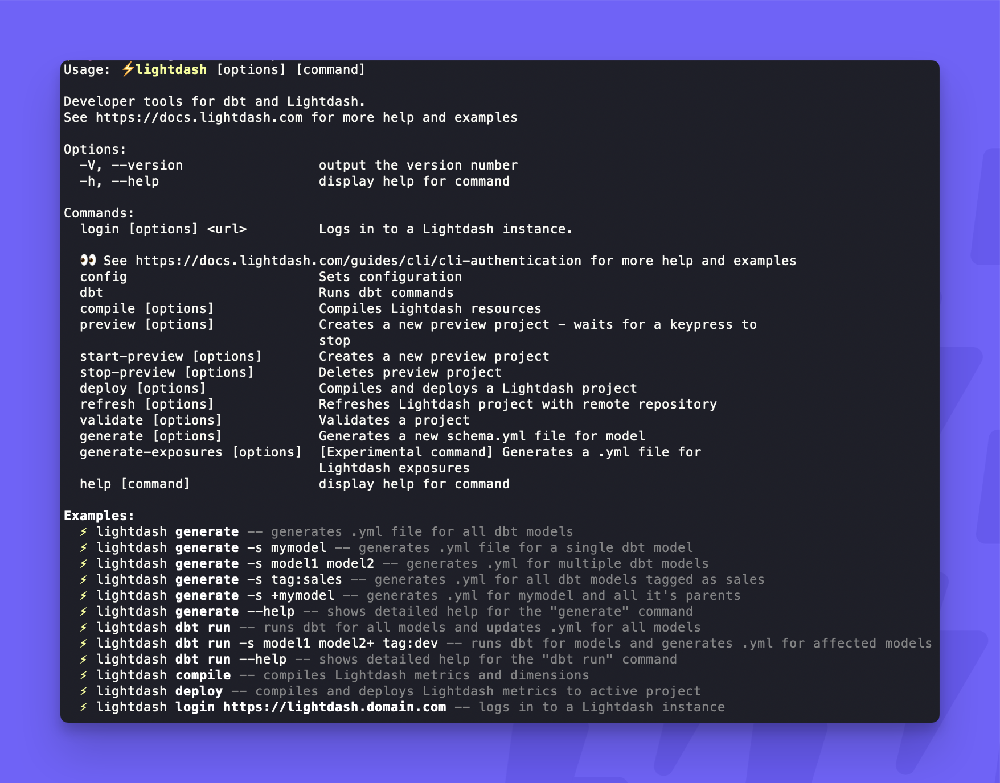

# Lightdash CLI reference

The Lightdash CLI is the recommended way to develop your Lightdash project. It makes development faster and easier, as well as giving you options for building more powerful automation to manage your Lightdash projects.

---


## Global Options

There are two global options that can be used with any command: [version](#version) and [help](#help).


### Version

`--version` or `-V`

Ignores the preceding command and shows the installed CLI version. Usually it's used right after `lightdash`, like one of these:

```console
lightdash --version
lightdash -V
```


### Help

`--help` or `-h`

Tells you what the preceding command does and lists all command-specific options. You can also view the general Lightdash CLI help like this:

```console
lightdash --help
lightdash -h
```

Both return:



When you use the `--help` or `-h` option with a specific command it'll look like this:

```console
lightdash validate --help
```

Returns:


## Commands

This is a complete list of all the commands available in the Lightdash CLI and the command-specific options that are supported.

### Login

```console
lightdash login [URL]
```

Command-specific options:

 - `--token [token]`  Login with a personal access token
 - `--verbose`         (default: false)

Examples:

```console
lightdash login https://app.lightdash.cloud -- Logs in to Lightdash Cloud US instance
lightdash login https://eu1.lightdash.cloud --verbose -- Logs in to Lightdash Cloud EU instance while showing detailed logs of login process
lightdash login https://custom.lightdash.domain -- Logs in to a self-hosted instance at a custom domain
lightdash login https://custom.lightdash.domain --token 12345 -- Logs in with a personal access token (useful for users that use SSO in the browser)
```

  

## CLI Commands

For more information about command-specific options, install the Lightdash CLI and use [the help option](#help).

| Command            | Description                                                        | Options                                                           |
| ------------------ | ------------------------------------------------------------------ | ----------------------------------------------------------------- |
| login              | Logs in to a Lightdash instance using email/password or a token    | `--token [token]`, `--verbose`                                    |
| config set-project | Choose the Lightdash project you are working on                    | `--name "[project_name]"`, `--uuid "[project_uuid]"`, `--verbose` | 
| compile            | Compiles lightdash resources using your local project              | `--project-dir [path]`, `--profiles-dir [path]`, `--profile [name]`,  `--target [name]`,  `--vars [vars]`, `--threads [number]`, `--no-version-check`, `-s, --select [models...]`, `-m, --models [models...]`, `--exclude [models...]`, `--selector [selector_name]`, `--state [state]`, `--full-refresh`, `--verbose` | 
| preview            | Creates a temporary preview project - waits for a keypress to stop |                          | 
| start-preview      | Creates a preview project that stays open until it is stopped      |                         |
| stop-preview       | Deletes an open preview project                                      |                          | 
| deploy             | Compiles and deploys a Lightdash project using your local project and credentials |                          | 
| refresh            | Refreshes Lightdash project with remote repository                                     | number                         | 
| validate           | Validates content from your active project against your local project files | number                         | 
| generate           | Generates or updates schema.yml file(s) for the selected model(s)           | number                         | 
| generate-exposures | [Experimental command] Generates a .yml file for Lightdash exposures                                     | number                         | 
| dbt                | Runs dbt commands                                | number                         | 


