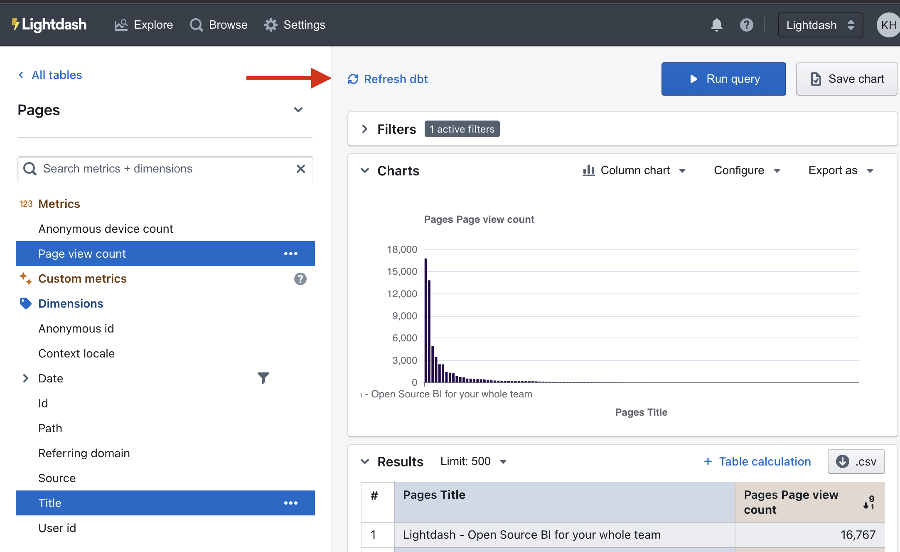

# Syncing your dbt changes

You can easily make changes in dbt and see them updated in your Lightdash project.

---

## 1. Syncing your dbt changes using `refresh dbt`

Whenever you make changes to your YAML files, you can sync Lightdash and see these changes by clicking the `refresh dbt` button in the Explore view of the app.

If you're using a git connection (like GitHub, Gitlab or Bitbucket), you'll need to push + merge your changes to the branch that your Lightdash project is connected to before you run `refresh dbt`.

## 2. Syncing your dbt changes using `lightdash deploy`

If you're using the [Lightdash CLI](/guides/cli/how-to-install-the-lightdash-cli), you can use the `lightdash deploy` command to deploy your changes to your Lightdash project.

To read more about how to use `lightdash deploy`, [check out our docs](/guides/cli/how-to-use-lightdash-deploy).

## Note: If you've made any changes to the underlying data, you need to run dbt first

If you've made any changes to the underlying data (for example, adding a new column in your `model.sql` file or changing the SQL logic of an existing dimension),  then you need to run: `dbt run -m yourmodel` before you click `refresh dbt` in Lightdash.
