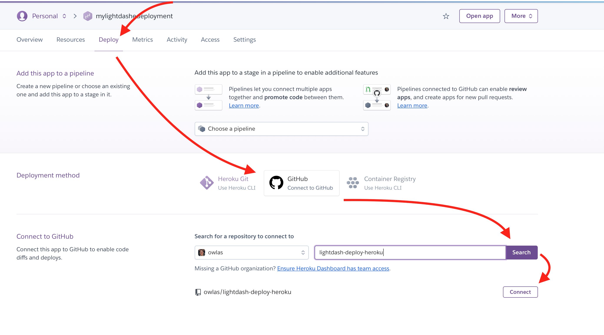
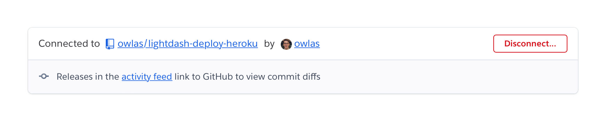
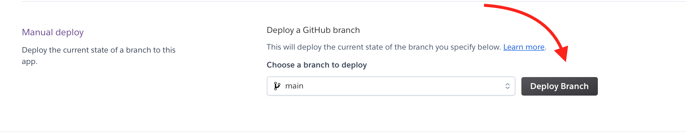

# Updating Lightdash to the latest version

## Local deployments

If you're running Lightdash on your own laptop using Docker, you just need to instruct Docker to pull
the latest version of Lightdash:

```shell
docker pull lightdash/lightdash
```

Now [restart Lightdash](../get-started/setup-lightdash/install-lightdash.mdx) and you'll be upgraded to the latest version.

## Kubernetes/helm deployments

If you install Lightdash into kubernetes using our [community helm charts](https://github.com/lightdash/helm-charts) 
you need to update your helm chart repository and upgrade your deployment.

```shell
helm repo update lightdash
helm upgrade -f values.yml lightdash lightdash/lightdash
```

## Heroku deployments

Follow these instructions if you used the "deploy to heroku" button to deploy Lightdash.

### 1. Fork the Lightdash repository on Github

Create a github account if needed, login, and hit "fork" on the [Lightdash GitHub repo for heroku](https://github.com/lightdash/lightdash-deploy-heroku)


### 2. Connect Heroku app to Github repo

Navigate to your [Heroku dashboard](https://dashboard.heroku.com) and select the Lightdash app you want to upgrade.

Under the "Deploy" tab for your app, follow these steps:
1. Scroll to "Deployment method" and select "GitHub"
2. You may be asked to sign-in to github to link your account with Heroku
3. Scroll to "Connect to Github"
4. Select your user and search for the "lightdash-deploy-heroku" repo
5. Click "Connect" for the repository `yourusername/lightdash`



If you've connected successfully you should see the following message:



### 3. Deploy latest Lightdash version

Still in the "Deploy" tab, scroll down to "Manual deploy" and deploy! 



The deploy may take a few minutes, make a coffee and when you see the "View" button you're ready to go! Click "View" 
and your browser will open the updated Lightdash app.


### 4. Next steps

Once you've completed steps 1-4 it's much easier to get future updates.

To update your heroku app, head over to your github fork and press "fetch upstream". This will update your fork and 
then either:
1. Repeat Step 3 and manually deploy
2. Configure your Heroku app to deploy automatically when you update your fork

