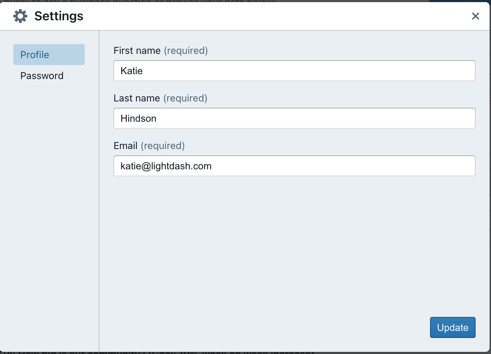
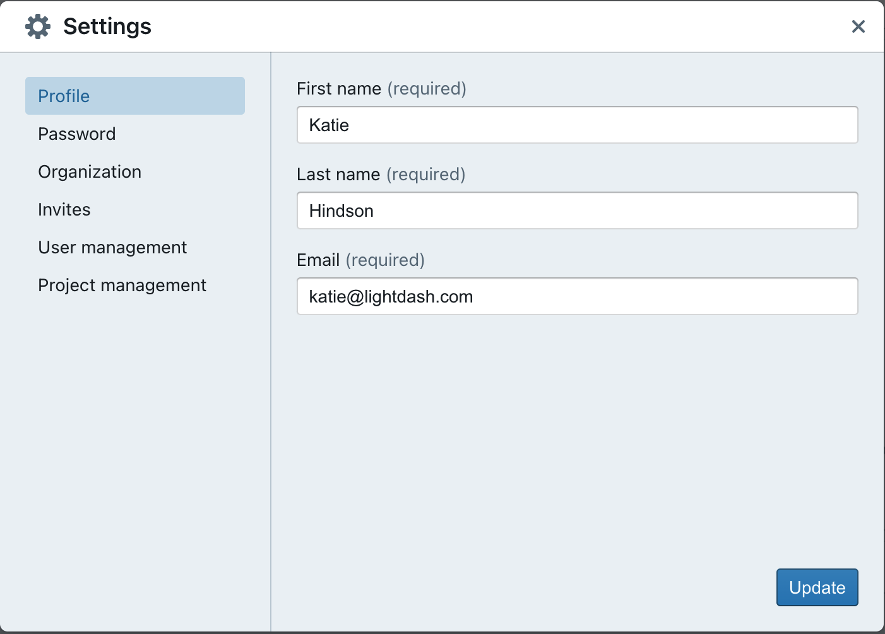
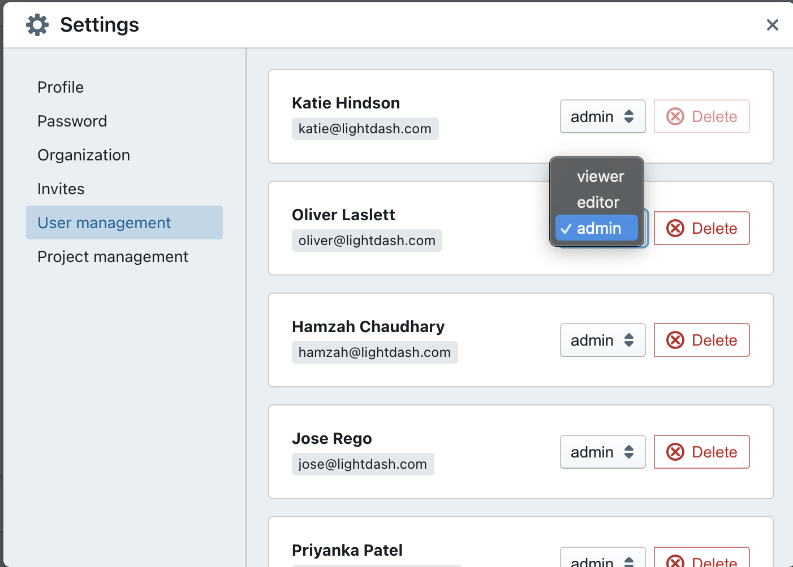

# User Roles and Permissions

Users in your Lightdash project can be given different roles and permissions that limit which actions they can take in your project.

---

## User roles

The user roles that we have at Lightdash are:

### Viewer
✅ Can explore tables  
✅ Can see saved charts  
✅ Can see dashboards  

❌ Can't create saved content  
❌ Can't edit saved content  
❌ Can't edit project settings  
❌ Can't edit user settings  

### Editor
✅ All Viewer permissions  
✅ Can create saved content  
✅ Can edit saved content  
✅ Can edit project settings  

❌ Can't edit user settings  
❌ Can't edit organization settings  

### Admin
✅ All Editor permissions  
✅ Can edit user settings  
✅ Can edit organization settings

## Updating a user's role and permissions

:::info
Only users with an `Admin` role can update users' roles and permissions in your Lightdash project.
:::

Head over to the `settings` for your project. Then click on `user management`.

Within `user management` you can update each user's roles and permissions.

