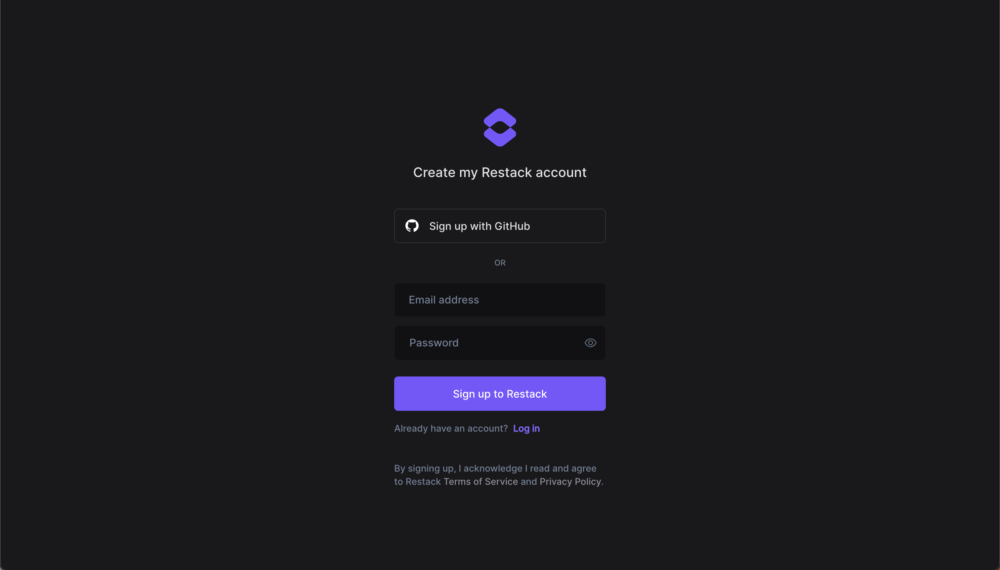
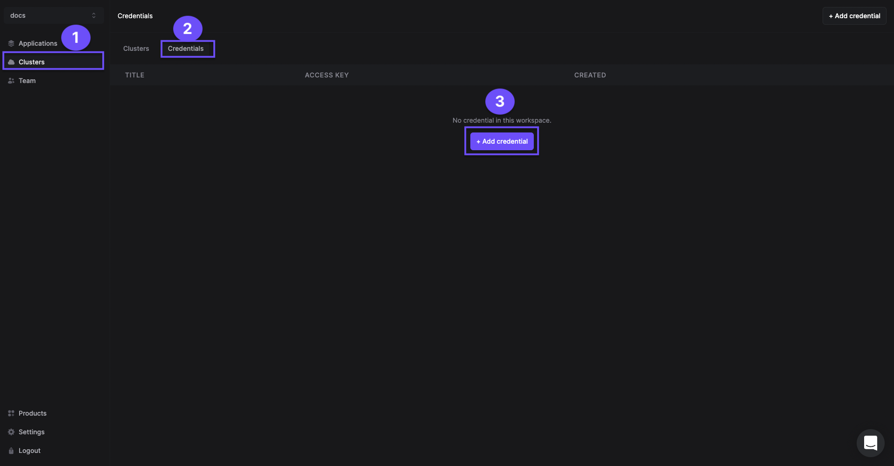
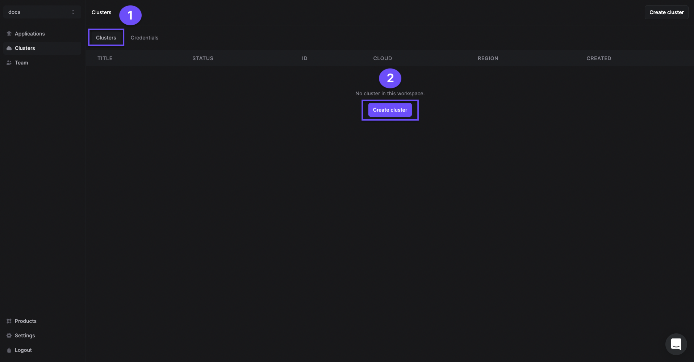
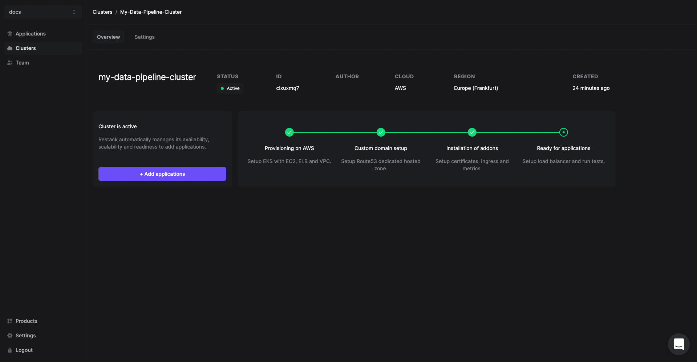
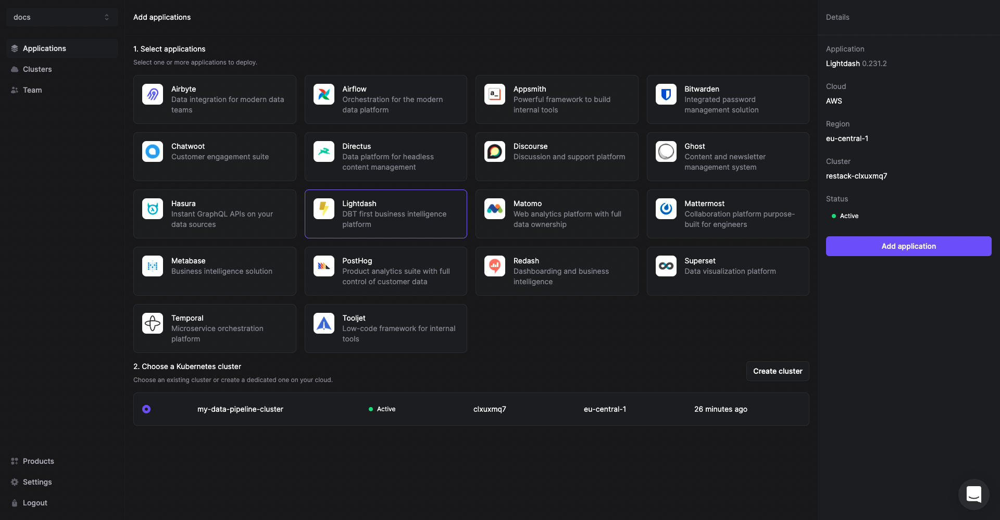
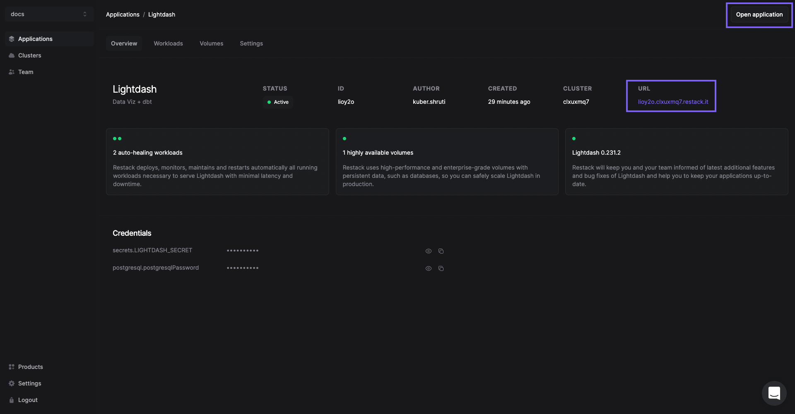
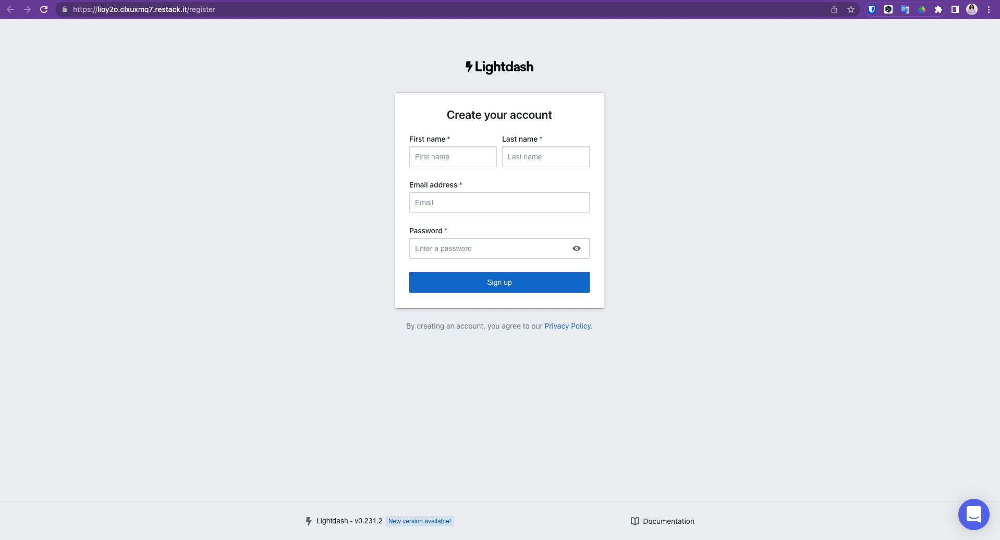

# Self-Host Lightdash with Restack

Restack is a managed service for deploying and managing open-source software.

## Deploy to AWS with Restack

To deploy Lightdash to your own AWS with Restack:

1. [Sign up for a Restack account](#sign-up-for-a-restack-account).
2. [Add AWS credentials with AdministratorAccess](#add-aws-credentials-with-administratoraccess).
3. [One-click cluster creation with Restack](#one-click-cluster-creation-with-restack).
4. [Deploy Lightdash on Restack](#deploy-lightdash-on-restack).
5. [Start using Lightdash](#start-using-lightdash).
6. [Deploy multiple instances of Lightdash](#deploy-multiple-instances-of-lightdash).

### Sign up for a Restack account

To Sign up for a Restack account, visit [www.restack.io/signup](https://www.restack.io/signup). You can sign up with your corporate email address or your GitHub profile. You do not need a credit card to sign up.

If you already have an account, go ahead and login to Restack at [www.restack.io/login](https://www.restack.io/login).

### Add AWS credentials with AdministratorAccess

To deploy Lightdash in your own AWS infrastructure with Restack, you will need to add your credentials as the next step.

Make sure that this account has _AdministratorAccess_. This is how Restack can ensure an end-to-end cluster creation and cluster management process.

1. Navigate to _Clusters_ in the left-hand navigation menu.
2. Select the _Credentials_ tab.
3. Click _Add credential_.
   
4. Give a suitable title to your credentials for managing them later.
5. Enter your _AWS Access Key ID_ and _AWS Secret Access key_.
6. Click _Add credential_.
   

> [How to get your AWS Access key ID and AWS Secret Access Key](https://docs.aws.amazon.com/accounts/latest/reference/root-user-access-key.html)

### One-click cluster creation with Restack

:::tip
Why do I need a cluster? 
Running your application on a Kubernetes cluster lets you deploy, scale and monitor the application reliably.
:::
Once you have added your credentials,

1. Navigate to the _Clusters_ tab on the same page and click on _Create cluster_.
   
2. Give a suitable name to your cluster.
3. Select the region you want to deploy the cluster in.
4. Select the AWS credentials you added in the previous step.
   

The cluster creation process will start automatically. Once the cluster is ready, you will get an email on the email id connected with your account.  Creating a cluster is a one-time process. From here you can add other open source tools or multiple instances of Lightdash in the same cluster.

Any application you deploy in your cluster will be accessible via a free **restack domain**. Contact the Restack team via chat to set a custom domain for your Lightdash instances.

### Deploy Lightdash on Restack

1. Click _Add application_ from the Cluster description or go to the Applications tab in the left hand side navigation.
2. Click _Lightdash_.
   
3. Select the cluster you have already provisioned.
4. Click _Add application_.

### Start using Lightdash

Lightdash will be deployed on your cluster and you can access it using the link under the _URL_ tab.

You can also check the workloads and volumes that are deployed within Lightdash.

### Deploy multiple instances of Lightdash

Restack makes it easier to deploy multiple instances of Lightdash on the same or multiple clusters.  So you can test the latest version before upgrading or have a dedicated instance for development and for production.
