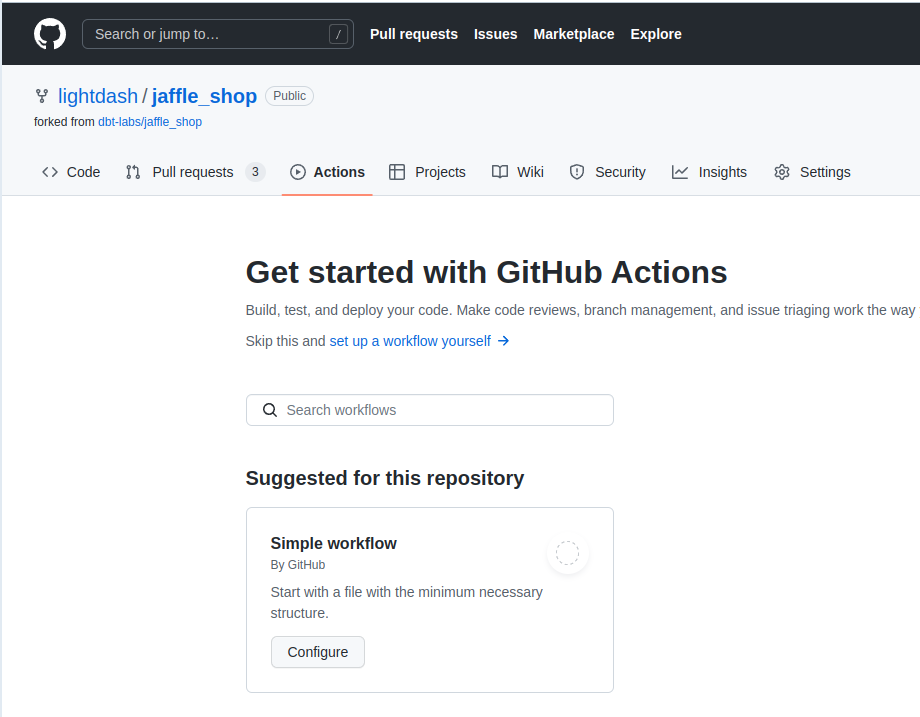

import NewWorkflowExistingActions from './assets/new-workflow-existing-actions.jpg';
import GithubRun from './assets/github-run.png';
import GithubSecretsSnippet from './github-secrets.mdx';

If you've connected Lightdash to GitHub, you can setup a `github action` and get Lightdash to deploy your project automatically. This is the easiest way to keep Lightdash in sync with your changes in dbt.

### Step 1: add the credentials to Github secrets

<GithubSecretsSnippet />

### Step 2: Create deploy.yml workflow in Github

Go to your repo, click on `Actions` menu.

If you don't have any GitHub actions, you'll just need to click on `Configure`

If you have some GitHub actions in your repo already, click on `New workflow`, then select `setup a workflow yourself`.

Now copy [this file](https://github.com/lightdash/cli-actions/blob/main/deploy.yml) from our [cli-actions](https://github.com/lightdash/cli-actions) repo.

Give it a nice name like `deploy-lightdash.yml`

And commit this to your repo by clicking on `Start commit`.

### You're done!

Everytime you make a change to your repo, on the `main` branch, it will automatically deploy your new config into your Lightdash projects

You can see the log on the `Github actions` page

