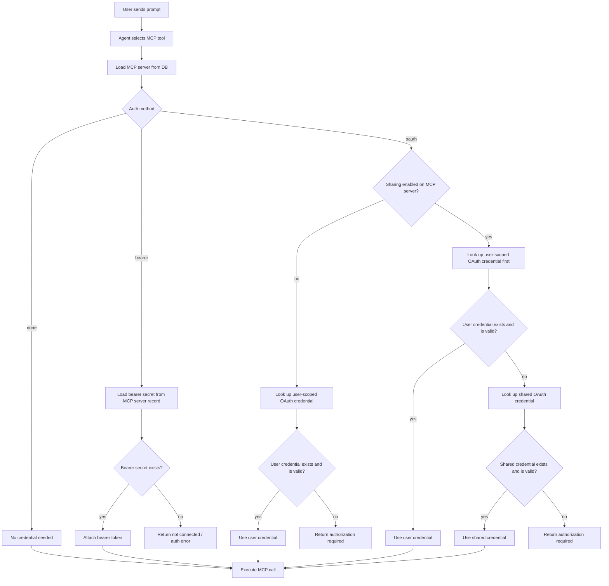
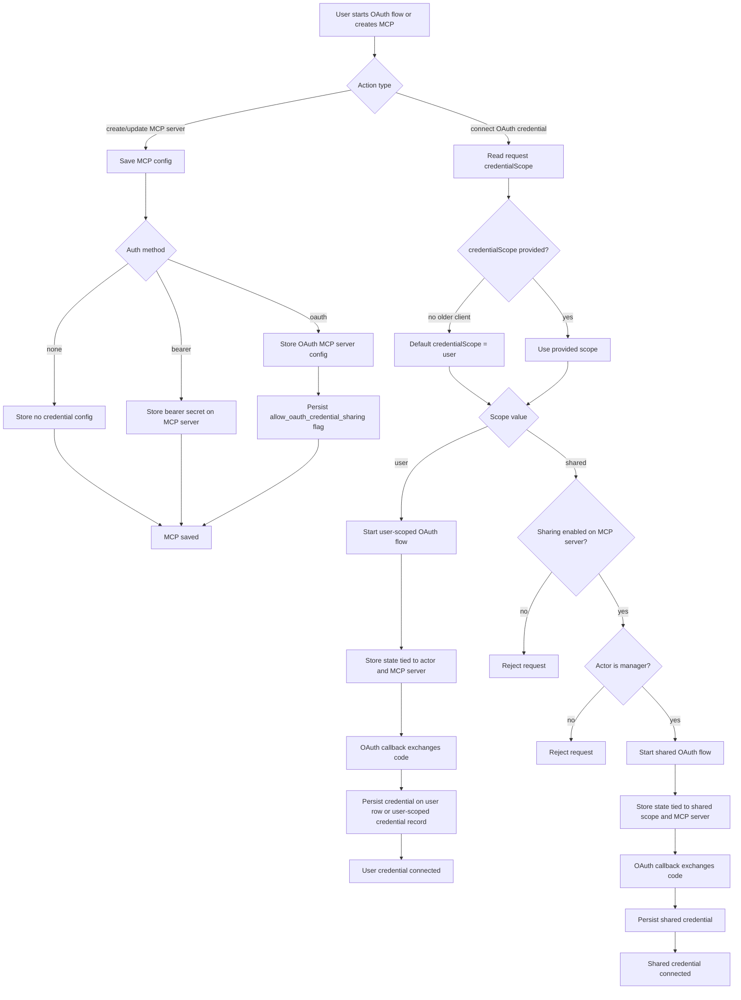

# MCP OAuth Credential Resolution

This document captures the backend credential resolution flow for MCP usage and the OAuth connection flow for user-scoped and shared credentials.

Compatibility rule for older clients:

- If `credentialScope` is omitted on OAuth connect flows, default it to `user`.

## Prompt execution flow

## OAuth creation and login flow

