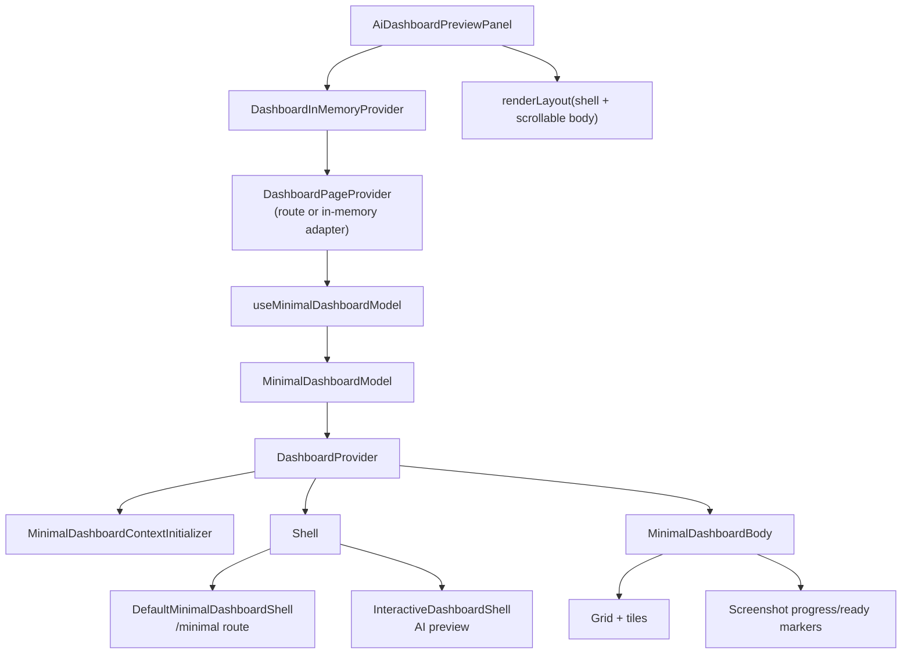

# Minimal Dashboard Architecture

This document describes the current `MinimalDashboard` frontend architecture after the split into model, body, and shell.

It exists to support multiple surfaces with the same dashboard content core:

- `/minimal` route for screenshots, exports, and unfurls
- AI preview panel for interactive dashboard previews inside agent threads

## Goals

- Keep screenshot and export behavior deterministic
- Allow preview-specific UI without forking dashboard rendering logic
- Keep route-backed and in-memory-backed dashboard state on the same abstraction
- Avoid regrowing `MinimalDashboard` into one large file

## High-level design

`MinimalDashboard` is split into three layers:

1. **Model**
   Loads dashboard data and derives view state.

2. **Body**
   Renders tiles, grid layouts, and screenshot-ready markers.

3. **Shell**
   Renders surrounding controls for a given surface, such as tabs, filters, date zoom, and parameters.

The body is the stable core. The shell is swappable.

## Mermaid overview

## Main files

### Entry points

- [packages/frontend/src/pages/MinimalDashboard.tsx](/Users/giorgi/develop/lightdash/packages/frontend/src/pages/MinimalDashboard.tsx)
  Thin re-export only
- [packages/frontend/src/pages/MinimalDashboard/index.tsx](/Users/giorgi/develop/lightdash/packages/frontend/src/pages/MinimalDashboard/index.tsx)
  Main composition point

### Model

- [packages/frontend/src/pages/MinimalDashboard/useMinimalDashboardModel.ts](/Users/giorgi/develop/lightdash/packages/frontend/src/pages/MinimalDashboard/useMinimalDashboardModel.ts)
  Responsible for:
  - dashboard fetch
  - scheduler/search parsing
  - active tab resolution
  - tile filtering
  - export tab groups
  - derived layouts

- [packages/frontend/src/pages/MinimalDashboard/minimalDashboardTypes.ts](/Users/giorgi/develop/lightdash/packages/frontend/src/pages/MinimalDashboard/minimalDashboardTypes.ts)
  Shared model and shell types

### Body

- [packages/frontend/src/pages/MinimalDashboard/MinimalDashboardBody.tsx](/Users/giorgi/develop/lightdash/packages/frontend/src/pages/MinimalDashboard/MinimalDashboardBody.tsx)
  Responsible for:
  - rendering dashboard tiles
  - rendering grid layouts
  - multi-tab export grouping
  - screenshot progress and ready markers

- [packages/frontend/src/pages/MinimalDashboard/MinimalDashboardContextInitializer.tsx](/Users/giorgi/develop/lightdash/packages/frontend/src/pages/MinimalDashboard/MinimalDashboardContextInitializer.tsx)
  Seeds `DashboardProvider` context from the loaded model

### Shells

- [packages/frontend/src/pages/MinimalDashboard/shells/DefaultMinimalDashboardShell.tsx](/Users/giorgi/develop/lightdash/packages/frontend/src/pages/MinimalDashboard/shells/DefaultMinimalDashboardShell.tsx)
  Minimal shell used by the `/minimal` route

- [packages/frontend/src/pages/MinimalDashboard/shells/InteractiveDashboardShell.tsx](/Users/giorgi/develop/lightdash/packages/frontend/src/pages/MinimalDashboard/shells/InteractiveDashboardShell.tsx)
  Interactive shell used by AI preview

- [packages/frontend/src/pages/MinimalDashboard/shells/InteractiveDashboardShell.module.css](/Users/giorgi/develop/lightdash/packages/frontend/src/pages/MinimalDashboard/shells/InteractiveDashboardShell.module.css)
  Preview-specific shell styling

### AI preview integration

- [packages/frontend/src/ee/features/aiCopilot/components/ChatElements/AiDashboardPreviewPanel.tsx](/Users/giorgi/develop/lightdash/packages/frontend/src/ee/features/aiCopilot/components/ChatElements/AiDashboardPreviewPanel.tsx)
  Uses:
  - `DashboardInMemoryProvider`
  - `MinimalDashboardView`
  - `InteractiveDashboardShell`
  - custom `renderLayout` to keep shell fixed and body scrollable

## State flow

There are two state adapters:

- `DashboardRouterProvider`
  Used by the real `/minimal` route
- `DashboardInMemoryProvider`
  Used by AI preview

Both feed `DashboardPageProvider`, which gives `MinimalDashboard` one unified source for:

- `projectUuid`
- `dashboardUuid`
- `tabUuid`
- `search`
- `replaceSearch`
- `switchToTab`

That means tabs and query-string-driven features can work the same way in both surfaces, while still allowing the preview to keep state local to the panel.

## Render flow

1. `MinimalDashboardView` reads page state from `DashboardPageProvider`
2. `useMinimalDashboardModel()` builds a `MinimalDashboardModel`
3. `DashboardProvider` is mounted with scheduler/date-zoom inputs from that model
4. `MinimalDashboardContextInitializer` seeds dashboard tiles, tabs, and parameters into provider state
5. The selected shell renders surrounding controls
6. `MinimalDashboardBody` renders the actual dashboard content core

## Why shells exist

The shell boundary is the main extension seam.

Put these in a shell:

- tabs
- filters bar
- date zoom
- parameters
- preview-only headers
- close buttons
- layout that decides what scrolls and what stays fixed

Keep these in the body:

- tiles
- grid layout
- multi-tab export rendering
- screenshot-ready markers

Rule:

- if a feature changes how dashboard content is rendered or exported, it probably belongs in the body
- if a feature changes surrounding controls or framing, it probably belongs in the shell

## Current layouts

### `/minimal`

Uses `DefaultMinimalDashboardShell`.

Characteristics:

- minimal tab UI
- route-backed tab navigation
- body scrolls as part of the page
- screenshot/export behavior preserved

### AI preview panel

Uses `InteractiveDashboardShell` plus a custom `renderLayout`.

Characteristics:

- dashboard header at panel level
- interactive tabs, filters, date zoom, parameters
- shell fixed in the panel
- body scrolls independently underneath
- local tab/search state via `DashboardInMemoryProvider`

## Extension guidelines

When adding new functionality:

1. Start from the shell/body rule above
2. Prefer adding a new shell or extending an existing shell over adding flags inside the body
3. Keep provider-facing state in `DashboardPageProvider` or `DashboardProvider`
4. Keep export and screenshot logic inside the body
5. If a new surface needs different scroll behavior, use `renderLayout` rather than modifying the body

## Anti-patterns

Avoid:

- adding many booleans to `MinimalDashboardBody` for surface-specific UI
- putting preview-only header logic into the body
- duplicating tile/grid logic in AI preview
- coupling screenshot/export markers to shell behavior
- making the `/minimal` route depend on preview-only styling or layout
