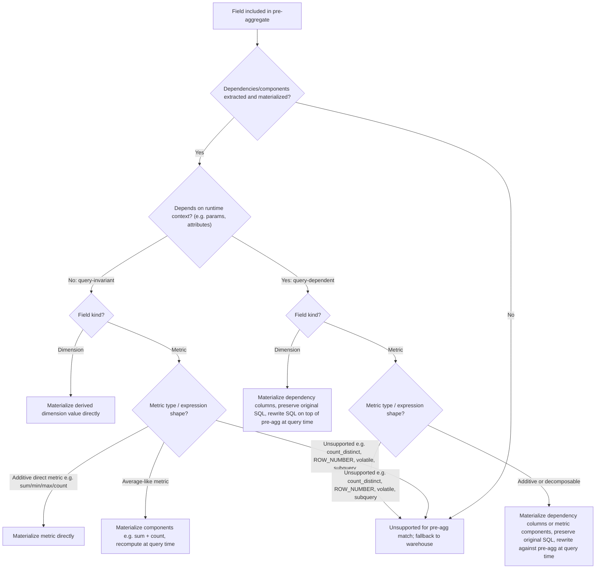

# Pre-Aggregates for Derived `sql:` Fields

This note describes how pre-aggregates could support derived dimensions and metrics defined with `sql:`.

## Definitions

Before anything else, split derived `sql:` fields into two categories.

### Query-invariant

A field is **query-invariant** when its value is fully determined by row data already in the warehouse and does not depend on runtime context.

Examples:

```yaml
order_value_bucket:
  type: string
  sql: CASE WHEN ${amount} > 100 THEN 'high' ELSE 'low' END
```

```yaml
full_name:
  type: string
  sql: CONCAT(${first_name}, ' ', ${last_name})
```

These expressions produce the same value every time for the same row.

### Query-dependent

A field is **query-dependent** when its value changes based on runtime context such as parameters, user attributes, timezone, or other request-scoped inputs.

Examples:

```yaml
dynamic_grouping:
  type: string
  sql: |
    CASE
      WHEN ${lightdash.parameters.grouping} = 'Status' THEN ${status}
      WHEN ${lightdash.parameters.grouping} = 'Source' THEN ${order_source}
      ELSE NULL
    END
```

```yaml
region_scoped_label:
  type: string
  sql: |
    CASE
      WHEN ${ld.attr.region} = 'US' THEN ${us_team_name}
      ELSE ${global_team_name}
    END
```

These expressions cannot be safely materialized once and reused blindly for all queries.

Metrics can also be query-dependent, not just dimensions.

Example:

```yaml
selected_revenue:
  type: sum
  sql: |
    CASE
      WHEN ${lightdash.parameters.revenue_mode} = 'Gross' THEN ${gross_amount}
      WHEN ${lightdash.parameters.revenue_mode} = 'Net' THEN ${net_amount}
      ELSE 0
    END
```

This metric changes with the request-scoped parameter value, so it cannot be treated as query-invariant.

## Unsupported Up Front

Some things should be considered unsupported or special-case only from the start.

- `count_distinct` metrics, unless you keep raw keys at the rollup grain or introduce sketches/approximate structures
- Window functions such as `ROW_NUMBER()`, `RANK()`, `LAG()`, `SUM(...) OVER (...)`
- Subqueries inside derived field SQL
- Volatile functions such as `CURRENT_TIMESTAMP`, `RANDOM()`, warehouse-specific non-deterministic functions
- Post-aggregate logic that assumes access to raw rows after aggregation
- Derived fields whose dependencies cannot be extracted reliably
- Derived fields whose dependencies are not materialized in a sufficient form

In all of these cases, the safe behavior is: **do not match the pre-aggregate and fall back to warehouse execution**.

## High-Level Rule

Supporting derived `sql:` fields requires two capabilities:

1. Detect field dependencies.
2. Choose the right representation strategy.

The main mistake to avoid is treating every derived field as if it can be materialized once as a stored value and later read back directly.

## Flowchart



## Step-by-Step Lifecycle

## 1. Parse the Field and Extract Dependencies

For every dimension or metric included in a pre-aggregate, extract:

- referenced dimensions
- referenced metrics
- runtime dependencies
  - parameters
  - user attributes
  - timezone / current date if applicable
- whether the SQL is row-level or aggregate-level
- whether it is deterministic

Example:

```yaml
sql: CASE WHEN ${status} = 'completed' THEN ${amount} ELSE 0 END
```

Dependencies:

- `status`
- `amount`

Example:

```yaml
sql: |
  CASE
    WHEN ${lightdash.parameters.grouping} = 'Status' THEN ${status}
    WHEN ${lightdash.parameters.grouping} = 'Source' THEN ${order_source}
    ELSE NULL
  END
```

Dependencies:

- `status`
- `order_source`
- parameter `grouping`

If dependencies cannot be extracted safely, the pre-aggregate should not be used for that field.

## 2. Decide the Representation

After dependency extraction, choose one of these strategies.

### Strategy A: Materialize the derived value directly

Use this for **query-invariant dimensions**.

Example:

```yaml
order_value_bucket:
  type: string
  sql: CASE WHEN ${amount} > 100 THEN 'high' ELSE 'low' END
```

This can be materialized directly because the expression does not depend on runtime context.

### Strategy B: Materialize dependencies, not the derived value

Use this for **query-dependent dimensions**.

Example:

```yaml
dynamic_grouping:
  type: string
  sql: |
    CASE
      WHEN ${lightdash.parameters.grouping} = 'Status' THEN ${status}
      WHEN ${lightdash.parameters.grouping} = 'Source' THEN ${order_source}
      ELSE NULL
    END
```

The rollup should store:

- `status`
- `order_source`
- any other dependencies

It should **not** rely on a precomputed `dynamic_grouping` value, because that value changes per request.

Important: preserving the original `sql:` is not enough on its own. If the source warehouse is not DuckDB, the stored expression will later need to be translated from source-warehouse SQL into DuckDB-compatible SQL before it can run against the materialized table.

Example:

- the source expression may use Snowflake, BigQuery, or Postgres-specific syntax
- the pre-aggregate query path later runs on DuckDB over the materialized file
- so the rewritten derived field SQL must be compiled or translated for DuckDB, not reused as raw source SQL

### Strategy C: Materialize the metric directly

Use this for **query-invariant additive metrics**.

Examples:

- `SUM(${amount})`
- `SUM(CASE WHEN ${status} = 'completed' THEN ${amount} ELSE 0 END)`

This works when the metric can be safely precomputed once at the chosen pre-aggregate grain and later rolled up again.

### Strategy D: Materialize metric components or dependencies

Use this for metrics that need recomputation or runtime rewrite.

This includes:

- average-like metrics such as `AVG(${amount})`
- query-dependent metrics whose `sql:` changes by parameter or user attribute
- other supported metrics that can be decomposed into reusable stored pieces

This can apply to both query-invariant and query-dependent metrics.

- Query-invariant example: `AVG(${amount})`
- Query-dependent example: a metric whose `sql:` switches between `${gross_amount}` and `${net_amount}` based on a parameter

## 3. Build the Materialization Query

### Example A: Query-invariant dimension

Field:

```yaml
order_value_bucket:
  type: string
  sql: CASE WHEN ${amount} > 100 THEN 'high' ELSE 'low' END
```

Pre-aggregate definition:

```yaml
dimensions:
  - order_value_bucket
metrics:
  - total_order_amount
time_dimension: order_date
granularity: day
```

Materialization query:

```sql
SELECT
  DATE_TRUNC('day', order_date) AS orders_order_date_day,
  CASE WHEN amount > 100 THEN 'high' ELSE 'low' END AS orders_order_value_bucket,
  SUM(amount) AS orders_total_order_amount
FROM orders
GROUP BY 1, 2
```

This is safe because the derived value is query-invariant.

### Example B: Query-dependent dimension

Field:

```yaml
dynamic_grouping:
  type: string
  sql: |
    CASE
      WHEN ${lightdash.parameters.grouping} = 'Status' THEN ${status}
      WHEN ${lightdash.parameters.grouping} = 'Source' THEN ${order_source}
      ELSE NULL
    END
```

Correct materialization strategy:

```sql
SELECT
  DATE_TRUNC('day', order_date) AS orders_order_date_day,
  status AS orders_status,
  order_source AS orders_order_source,
  SUM(amount) AS orders_total_order_amount
FROM orders
GROUP BY 1, 2, 3
```

Important: do **not** precompute `dynamic_grouping` and assume it is reusable for all parameter values.

Also important: when the query later runs against the pre-aggregate, the preserved CASE expression must be rewritten against pre-agg column names and translated into DuckDB-compatible SQL if the original expression came from a different warehouse dialect.

### Example C: Query-dependent metric

Field:

```yaml
selected_revenue:
  type: sum
  sql: |
    CASE
      WHEN ${lightdash.parameters.revenue_mode} = 'Gross' THEN ${gross_amount}
      WHEN ${lightdash.parameters.revenue_mode} = 'Net' THEN ${net_amount}
      ELSE 0
    END
```

Correct materialization strategy:

```sql
SELECT
  DATE_TRUNC('day', order_date) AS orders_order_date_day,
  SUM(gross_amount) AS orders_gross_amount__sum,
  SUM(net_amount) AS orders_net_amount__sum
FROM orders
GROUP BY 1
```

The metric value should be chosen later at query time by rewriting the expression against the stored components, not by precomputing one fixed `selected_revenue` column during materialization.

## 4. Store Metadata for Later Rewrite

For query-dependent fields, the pre-aggregate needs metadata beyond raw columns:

- original derived SQL or normalized AST
- dependency list
- runtime dependency list
- mapping from source field refs to pre-agg column refs

Without this, later query compilation can only read stored columns directly, which is exactly what breaks parameterized CASE dimensions.

## 5. Match a Query to a Pre-Aggregate

When a query asks for a derived field:

1. Expand its dependencies.
2. Check that every dependency is materialized in a sufficient form.
3. Check that the stored representation is sufficient to evaluate the field.
4. If anything is missing, do not use the pre-aggregate.

This is the core rule:

> A pre-aggregate can only answer a derived field if it materialized enough information to evaluate that field correctly.

### Sufficient Representation Example

Field:

```yaml
order_value_bucket:
  sql: CASE WHEN ${amount} > 100 THEN 'high' ELSE 'low' END
```

If the pre-aggregate only stores:

- `order_date_day`
- `SUM(amount)`

then it cannot reconstruct `order_value_bucket`, because raw `amount` is gone.

So for this field, either:

- materialize the bucket itself directly, or
- retain row-level `amount` in the pre-aggregate grain, which is usually too expensive

This example is still about grain, but the broader rule is about sufficient representation. Sometimes the right stored representation is not raw grain preservation, but precomputed components that still allow correct evaluation later.

## 6. Query the Pre-Aggregate

### Case A: Query-invariant derived dimension

If the derived value was materialized directly:

```sql
SELECT
  orders_order_value_bucket,
  SUM(orders_total_order_amount)
FROM preagg_orders
GROUP BY 1
```

### Case B: Query-dependent derived dimension

If the query parameter is:

```text
grouping = 'Status'
```

then rewrite the original SQL against pre-agg columns:

```sql
CASE
  WHEN 'Status' = 'Status' THEN orders_status
  WHEN 'Status' = 'Source' THEN orders_order_source
  ELSE NULL
END
```

Final query:

```sql
SELECT
  CASE
    WHEN 'Status' = 'Status' THEN orders_status
    WHEN 'Status' = 'Source' THEN orders_order_source
    ELSE NULL
  END AS orders_dynamic_grouping,
  SUM(orders_total_order_amount)
FROM preagg_orders
GROUP BY 1
```

This is the right model for parameters and user attributes.

## 7. Metric Examples

### Direct additive metric

```yaml
completed_revenue:
  type: sum
  sql: CASE WHEN ${status} = 'completed' THEN ${amount} ELSE 0 END
```

Materialization:

```sql
SELECT
  DATE_TRUNC('day', order_date) AS orders_order_date_day,
  SUM(CASE WHEN status = 'completed' THEN amount ELSE 0 END) AS orders_completed_revenue
FROM orders
GROUP BY 1
```

Query later:

```sql
SELECT SUM(orders_completed_revenue)
FROM preagg_orders
```

### Average-like metric

```yaml
avg_completed_amount:
  type: average
  sql: CASE WHEN ${status} = 'completed' THEN ${amount} END
```

Materialize components:

```sql
SELECT
  DATE_TRUNC('day', order_date) AS orders_order_date_day,
  SUM(CASE WHEN status = 'completed' THEN amount END) AS avg_completed_amount__sum,
  COUNT(CASE WHEN status = 'completed' THEN amount END) AS avg_completed_amount__count
FROM orders
GROUP BY 1
```

Query later:

```sql
SELECT
  SUM(avg_completed_amount__sum) / NULLIF(SUM(avg_completed_amount__count), 0)
FROM preagg_orders
```

### Query-dependent metric

```yaml
selected_revenue:
  type: sum
  sql: |
    CASE
      WHEN ${lightdash.parameters.revenue_mode} = 'Gross' THEN ${gross_amount}
      WHEN ${lightdash.parameters.revenue_mode} = 'Net' THEN ${net_amount}
      ELSE 0
    END
```

Materialize reusable components:

```sql
SELECT
  DATE_TRUNC('day', order_date) AS orders_order_date_day,
  SUM(gross_amount) AS orders_gross_amount__sum,
  SUM(net_amount) AS orders_net_amount__sum
FROM orders
GROUP BY 1
```

Query later with parameter-aware rewrite:

```sql
SELECT
  CASE
    WHEN 'Gross' = 'Gross' THEN SUM(orders_gross_amount__sum)
    WHEN 'Gross' = 'Net' THEN SUM(orders_net_amount__sum)
    ELSE 0
  END AS selected_revenue
FROM preagg_orders
```

### Unsupported metric: count distinct

```yaml
unique_customers:
  type: count_distinct
  sql: ${customer_id}
```

This cannot usually be rolled up exactly from an already-aggregated table unless:

- raw keys are materialized, or
- a special sketch / approximate representation is introduced

Safe default: unsupported for pre-aggregates.
