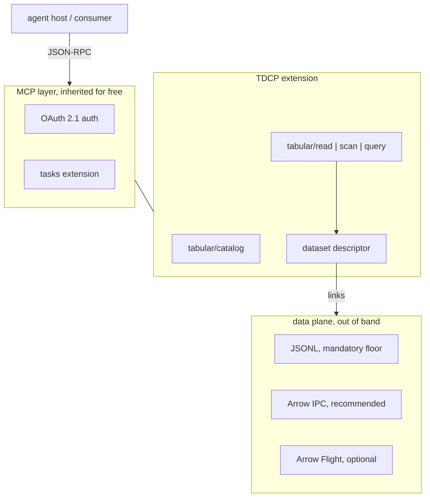
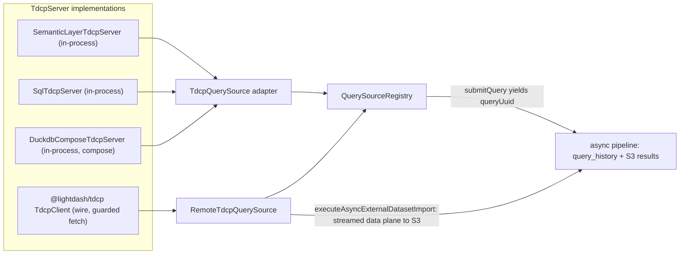

# TDCP: tabular data context protocol (draft)

The protocol track of the [multi-source query platform plan](multi-source-query-platform-plan.md): a draft MCP extension that standardizes *tabular data by reference*, so third-party sources plug into the multi-source pipeline (inbound) and Lightdash projects become governed tabular sources for external consumers (outbound). "TCP" is taken; TDCP is a working label.

## Thesis

MCP standardized tools and text; it has no first-class notion of a dataset — schema-described, potentially large, addressable by reference, with freshness and expiry. Every data-flavored MCP server reinvents previews, CSV-in-text, ad-hoc download links, and pagination. TDCP fills that gap, and it is built as an MCP extension (namespaced `tabular/*` methods), not a rival protocol: MCP's 2026-07-28 spec provides the extensions framework, OAuth 2.1 auth, tasks for async queries, and capability negotiation, all inherited rather than re-invented.

## Core design

Control plane over MCP JSON-RPC, data plane out of band:

- **The dataset descriptor** is the one object that matters: opaque `datasetId`, column schema, `rowCount`, `producedAt`/`expiresAt`, freshness, data-plane links (short-lived bearer tokens, never storage URLs), preview. See `TdcpDatasetDescriptor` in `packages/common/src/types/tdcp.ts`.
- **Capability tiers**, not one query language: tier 0 `tabular/read` (CSV, Sheets, simple REST — the consumer's compose engine does the rest), tier 1 `tabular/scan` with a deliberately tiny predicate AST and an `exact` mode so thin clients never re-filter, tier 2 `tabular/query` with dialect-tagged native queries (`sql:duckdb`, `metricquery:lightdash`).
- **Compose is a server capability, not a client obligation.** A server may declare `compose: true` and accept dataset references as named tables — so a client without a local engine sends handles to a compose-capable server. Supporting TDCP does not require the client to embed DuckDB.
- **Async by default**: query submission resolves to a descriptor; completion is the standard async query lifecycle in-process, the MCP tasks extension on the wire.

## How the draft lands in this codebase

Every query source is a TDCP server behind one adapter; the `QuerySourceClient` seam, registry, service, controller and tests are untouched:

| Piece | Location |
| --- | --- |
| Protocol home: spec, JSON Schemas, server + client SDK | `packages/tdcp/` (`@lightdash/tdcp`) — the single type vocabulary |
| `TdcpServer` contract (host-side, transport-agnostic) | `packages/backend/src/services/QuerySourceService/tdcp/TdcpServer.ts` |
| In-process servers (the former `sources/` built-ins) | `packages/backend/src/services/QuerySourceService/tdcp/servers/` |
| Built-in source inventory (also the outbound list) | `packages/backend/src/services/QuerySourceService/tdcp/index.ts` |
| Protocol ↔ host type bridge (the one meeting point) | `packages/backend/src/services/QuerySourceService/tdcp/typeMapping.ts` |
| SSRF-guarded egress fetch for both planes | `packages/backend/src/services/QuerySourceService/tdcp/guardedFetch.ts` |
| Adapters back onto `QuerySourceClient` | `packages/backend/src/services/QuerySourceService/sources/` |
| Protocol-agnostic import into the results pipeline | `AsyncQueryService.executeAsyncExternalDatasetImport` |
| Executable spec: SDK client ↔ SDK server round trip | `packages/tdcp/tests/roundtrip.test.ts` |

In-process servers return descriptors with `links: null` — the dataset already lives in the local results pipeline and `datasetId` is the `queryUuid`. Remote descriptors carry links; `RemoteTdcpQuerySource` imports the data plane into a local `query_history` row + S3 JSONL file, after which compose references, pagination and viz treat it like any local result.

## Draft status and what is deliberately not here

The `@oliver:` comments in the source mark every decision point. What the draft already holds: the data plane streams end to end (fetch → S3 upload, one line in memory at a time), both planes go through an SSRF-guarded fetch (`validatePublicHttpUrl` + timeout), every wire payload is structurally validated before it is typed, and the SDK's request handler enforces the tier guarantees (exact-mode refusal, declared dialects, links on wire descriptors) so integrators cannot get them wrong.

The headline gaps, all blocking ship but none blocking the walkable loop:

- **Server registration**: `TdcpSourceQuery.serverUrl` is a raw URL in the request body — it must become a registered-server reference on the sources entity, with credentials on a unified org/project/user credential model (the `ai_mcp_server_credential` shape generalized).
- **Transport**: the remote control plane is bare JSON-RPC over HTTPS; the real transport is the MCP SDK client with `PersistentMcpOAuthClientProvider`. The guarded fetch validates addresses but resolves DNS separately from the fetch — closing the rebinding window needs the pinned-agent treatment `secureFetch` uses, generalized to streaming bodies.
- **Outbound**: the in-process `TdcpServer` instances are the implementation the outbound MCP extension re-exposes; the endpoint itself is not in this draft.
- **Remote compose / handle delegation**: sending local handles to a remote compose server needs the token delegation decision before any handle leaves the deployment.
- **Tier 1 scan**: the SDK enforces the contract (see the round-trip test); no backend source implements it yet — the first API-backed source (GitHub, Attio) is the forcing function.
- **The host runtime** (`@tdcp/runtime`, not started): the client-side counterpart agents talk to — connects to N servers, aggregates catalogs, holds session dataset handles, and carries a compose engine (duckdb-wasm in browsers, native DuckDB for CLI agents, Lightdash's hardened DuckDB server-side). It presents to the agent as one compose-capable TDCP server, so the runtime is itself TDCP and no second agent-facing API exists. Lightdash's multi-source query pipeline is this runtime's reference deployment; a separate package because the engine is a real peer dependency, which must not touch the SDK's zero-dependency core.
