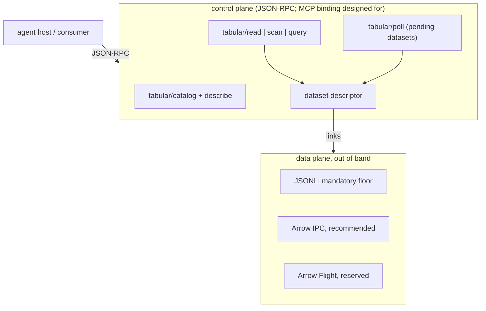
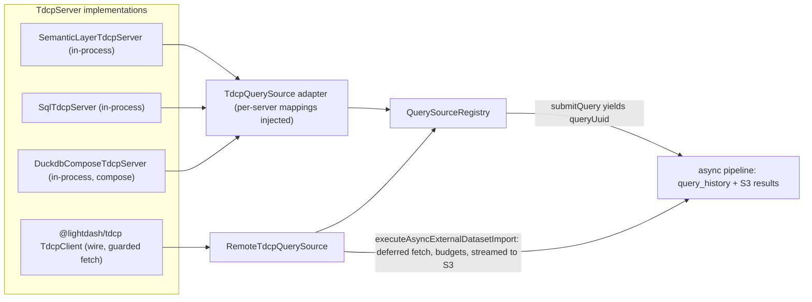

# TDCP: tabular data context protocol (draft)

The protocol track of the [multi-source query platform plan](multi-source-query-platform-plan.md): a draft protocol that standardizes *tabular data by reference*, so third-party sources plug into the multi-source pipeline (inbound) and Lightdash projects become governed tabular sources for external consumers (outbound). "TCP" is taken; TDCP is a working label.

## Thesis

MCP standardized tools and text; it has no first-class notion of a dataset — schema-described, potentially large, addressable by reference, with freshness and expiry. Every data-flavored MCP server reinvents previews, CSV-in-text, ad-hoc download links, and pagination. TDCP fills that gap. It is designed to bind to MCP as an extension (namespaced `tabular/*` methods) rather than as a rival protocol — MCP's 2026-07-28 spec provides the extensions framework, OAuth 2.1 auth, tasks for async queries, and capability negotiation. **That binding is designed for but not yet demonstrated**: nothing in this draft runs over an MCP session yet, and the draft ships a bare JSON-RPC 2.0 binding instead. The planned validation spike — the example server wired through the actual MCP SDK — either proves the inheritance story or TDCP stands alone on JSON-RPC honestly.

## Core design

Control plane over JSON-RPC, data plane out of band:

- **The dataset descriptor** is the one object that matters: opaque `datasetId`, column schema (five logical types plus a `sourceType` escape hatch for what they cannot name), `rowCount`, `producedAt`/`expiresAt`, freshness, and required data-plane links (short-lived bearer tokens, never storage URLs). See `TdcpDatasetDescriptor` in `packages/tdcp/src/types.ts`.
- **Async by design**: a data request resolves to a ready descriptor or a *pending* dataset polled via `tabular/poll` — a by-reference protocol must be able to say "not yet". On the MCP binding the tasks extension is expected to carry this lifecycle.
- **Capability tiers**, not one query language: tier 0 `tabular/read` (CSV, Sheets, simple REST — the consumer's compose engine does the rest), tier 1 `tabular/scan` with a deliberately tiny predicate AST and an `exact` mode so thin clients never re-filter (provisional until the first API-backed source; the guarantee is contractual, enforced pre-flight by the SDK's plan-then-execute scan contract), tier 2 `tabular/query` with declared dialects — each declaration carries its form (`query` text vs structured `params`), a payload JSON Schema so agents can learn to write queries from capabilities alone, and a docs link.
- **Compose is a server capability, not a client obligation.** A server may declare `compose: true` and accept dataset references as named tables — so a client without a local engine sends handles to a compose-capable server. Supporting TDCP does not require the client to embed DuckDB.

## How the draft lands in this codebase

Every built-in query source is a TDCP server behind one adapter; the `QuerySourceClient` seam, registry, service, controller and tests are untouched. **Honest accounting of the dogfood**: in-process, `catalog` is the load-bearing path — it serves the schema endpoint with real authorization and user-attribute filtering. The execute-side tier guards (dialect declarations, compose checks, exact-mode pre-flight) run in-process too, but the adapter and the registrations are the same author's two hands, so they act as a wiring checksum, not conformance pressure from input; they become real guards when the outbound endpoint makes dialect and capabilities wire input. In-process data requests resolve to a local handle (`{ queryUuid }` into the results pipeline) — descriptors exist only on the wire, minted from `query_history` where schema, row count, expiry and cache-hit are real rather than fabricated.

| Piece | Location |
| --- | --- |
| Protocol home: spec, JSON Schemas, server + client SDK | `packages/tdcp/` (`@lightdash/tdcp`) — the single type vocabulary |
| `TdcpServer` module (SDK-owned, transport-independent, dataset-generic) | `packages/tdcp/src/server.ts` |
| Lightdash host context and local dataset type | `packages/backend/src/services/QuerySourceService/tdcp/host.ts` |
| In-process servers, each owning its SourceQuery -> protocol mapping | `packages/backend/src/services/QuerySourceService/tdcp/servers/` |
| Built-in source inventory (also the outbound list) | `packages/backend/src/services/QuerySourceService/tdcp/index.ts` |
| Protocol ↔ host type bridge (the one meeting point) | `packages/backend/src/services/QuerySourceService/tdcp/typeMapping.ts` |
| SSRF-guarded egress fetch for both planes | `packages/backend/src/services/QuerySourceService/tdcp/guardedFetch.ts` |
| Adapters back onto `QuerySourceClient` | `packages/backend/src/services/QuerySourceService/sources/` |
| Protocol-agnostic import into the results pipeline | `AsyncQueryService.executeAsyncExternalDatasetImport` |
| Executable spec: SDK client ↔ SDK server round trip | `packages/tdcp/tests/roundtrip.test.ts` |

Remote submissions are non-blocking end to end: the `query_history` row is created immediately, and the whole remote exchange — control-plane request, polling while pending, then streaming the data plane into a local S3 JSONL file — runs in the background phase under explicit budgets (row cap, byte cap, idle timeout) with every row validated against the declared schema at the boundary. After import, compose references, pagination and viz treat the result like any local query.

## Draft status and what is deliberately not here

The `@oliver:` comments in the source mark every decision point. What the draft already holds: the async/pending lifecycle on the bare binding, the data plane streams end to end (fetch → S3 upload, one line in memory at a time, budgets enforced), both planes go through an SSRF-guarded fetch (`validatePublicHttpUrl`, headers timeout that never aborts a streaming body), every wire payload is structurally validated before it is typed, protocol error codes survive into `TdcpClientError`, and the SDK server module enforces the tier guarantees — exact-mode refusal before execution — for both in-process and wire execution.

The headline gaps, all blocking ship but none blocking the walkable loop:

- **Server registration**: `TdcpSourceQuery.serverUrl` is a raw URL in the request body — it must become a registered-server reference on the sources entity, with credentials on a unified org/project/user credential model (the `ai_mcp_server_credential` shape generalized). This is gate one before any flag widening.
- **Transport**: the remote control plane is bare JSON-RPC over HTTPS; the intended transport is the MCP SDK client with `PersistentMcpOAuthClientProvider`, unproven until the example-server-over-MCP spike answers how the extension is declared at initialize. The guarded fetch validates addresses but resolves DNS separately from the fetch — closing the rebinding window needs the pinned-agent treatment `secureFetch` uses, generalized to streaming bodies.
- **Outbound**: the in-process `TdcpServer` instances are the implementation the outbound endpoint re-exposes; the endpoint itself — including minting real descriptors from `query_history` — is not in this draft.
- **Remote compose / handle delegation**: sending local handles to a remote compose server needs the token delegation decision before any handle leaves the deployment.
- **Tier 1 scan hardening**: the product API, SDK contract and example server exercise scan end to end; the first API-backed source (GitHub, Attio) is the forcing function that stabilizes it out of provisional status.
- **`tabular/describe` on the SQL source**: the warehouse catalog ships `columns: null` (eager column resolution is infeasible at warehouse scale); the describe handler that resolves one table on demand lands with the sources entity work.
- **The host runtime** (`@tdcp/runtime`, not started): the client-side counterpart agents talk to — connects to N servers, aggregates catalogs, holds session dataset handles, and carries a compose engine (duckdb-wasm in browsers, native DuckDB for CLI agents, Lightdash's hardened DuckDB server-side). It presents to the agent as one compose-capable TDCP server, so the runtime is itself TDCP and no second agent-facing API exists. Lightdash's multi-source query pipeline is this runtime's reference deployment; a separate package because the engine is a real peer dependency, which must not touch the SDK's zero-dependency core.
