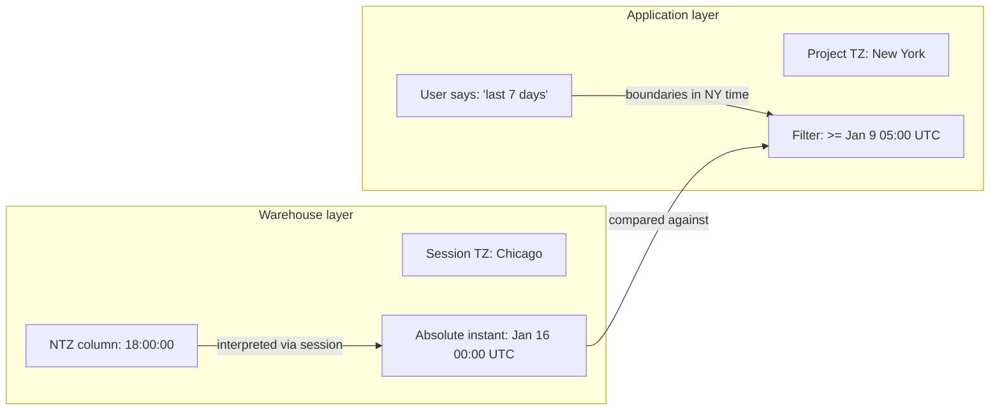
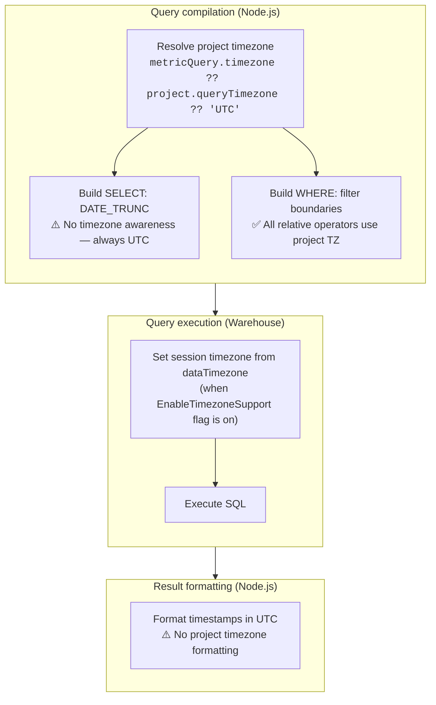
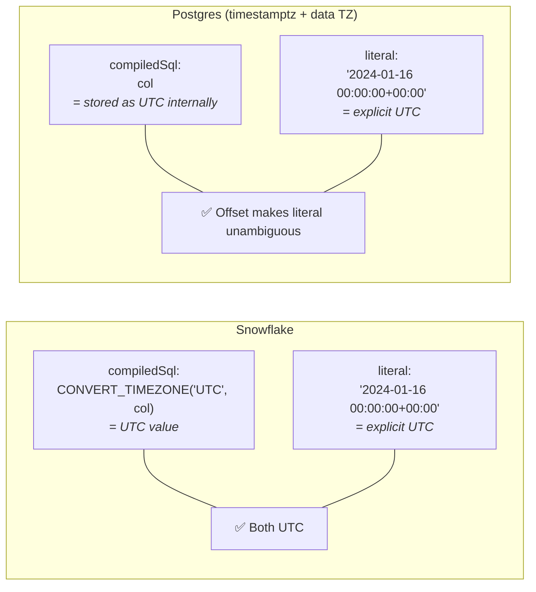
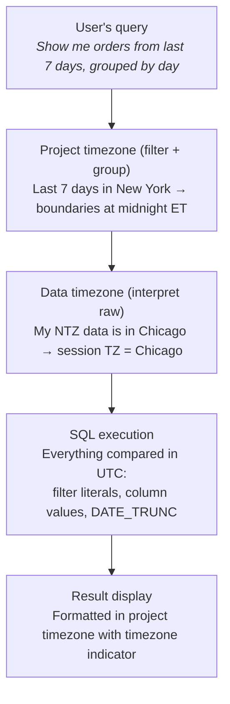

# Timezone Handling in Lightdash

This document describes how timezone handling works across the Lightdash stack: what the two timezone settings do, how they flow through SQL generation, where they're consistent, and where gaps remain.

---

## Why Two Timezone Settings?

Lightdash has two timezone settings that solve different problems at different layers:

| Setting              | Layer       | Question it answers                              | Where configured                         |
| -------------------- | ----------- | ------------------------------------------------ | ---------------------------------------- |
| **Data timezone**    | Warehouse   | "What timezone are my NTZ timestamps stored in?" | Warehouse connection → Advanced settings |
| **Project timezone** | Application | "What timezone should my users see data in?"     | Project settings → Timezone              |

The `EnableTimezoneSupport` feature flag (`LIGHTDASH_ENABLE_TIMEZONE_SUPPORT=true`) gates the data timezone feature: the warehouse form UI field and the warehouse session setup. The project timezone setting is always available.

### Data timezone (`dataTimezone`)

Answers the question: "what timezone are my NTZ (no-timezone) timestamps stored in?" Sets the warehouse session timezone (e.g., `SET timezone TO 'America/Chicago'` on Postgres) so the warehouse correctly interprets ambiguous NTZ values.

**Without it:** A stored value `2024-01-15 18:00:00` in an NTZ column is assumed to be UTC.
**With it set to `America/Chicago`:** The warehouse knows it's 6pm Chicago time (= midnight UTC next day).

For TZ columns (e.g., Postgres `timestamptz`, Snowflake `TIMESTAMP_TZ`), data timezone has no effect — these columns already store absolute instants. Gated behind `EnableTimezoneSupport` — when the flag is off, `dataTimezone` resolves to `undefined` and the warehouse session timezone is not explicitly set (preserving previous behavior).

### Project timezone (`queryTimezone`)

Controls where date boundaries fall for filters and grouping. When a user says "last 7 days," the project timezone determines what "today" means.

**Without it:** "Today" = midnight UTC.
**With it set to `America/New_York`:** "Today" = midnight Eastern time (= 4am or 5am UTC depending on DST).

### How they combine



Data timezone determines **what the data means**. Project timezone determines **what the user means**. Both convert to UTC for comparison.

---

## Current State

### SQL Pipeline

A query touches timezone in three places: the SELECT (grouping), the WHERE (filtering), and the warehouse session.



### SELECT — DATE_TRUNC grouping

DATE_TRUNC is **not timezone-aware**. All warehouses generate raw truncation with no timezone parameter:

```sql
-- Snowflake
DATE_TRUNC('DAY', col)
-- Postgres
DATE_TRUNC('day', col)
-- BigQuery
DATE_TRUNC(col, DAY)
```

Grouping boundaries are always in UTC. A row at March 1 02:00 UTC (= Feb 28 9pm New York) groups into March by UTC truncation, even if the project timezone is New York.

**File:** `packages/common/src/utils/timeFrames.ts`

### WHERE — Filter boundaries

Filter boundaries are computed in Node.js. All relative date filter operators use the project timezone via `.tz(timezone)`:

| Operator             | Uses project timezone?             |
| -------------------- | ---------------------------------- |
| `IN_THE_CURRENT`     | ✅ `.tz(timezone).startOf().utc()` |
| `NOT_IN_THE_CURRENT` | ✅                                 |
| `IN_THE_PAST`        | ✅                                 |
| `NOT_IN_THE_PAST`    | ✅                                 |
| `IN_THE_NEXT`        | ✅                                 |

Timestamp filter literals include the UTC offset so the warehouse interprets them unambiguously:

```typescript
const formatTimestampAsUTC = (date: Date): string =>
  moment(date).utc().format('YYYY-MM-DD HH:mm:ssZ');
// e.g. '2024-01-16 00:00:00+00:00'
```

BigQuery and ClickHouse are excluded from the offset format because BigQuery's `DATETIME` type rejects timezone offsets and ClickHouse's `date_time_input_format` may be set to `'basic'` which cannot parse them. These warehouses use a bare literal instead:

```typescript
const formatTimestampAsUTCNoOffset = (date: Date): string =>
  moment(date).utc().format('YYYY-MM-DD HH:mm:ss');
// e.g. '2024-01-16 00:00:00'
```

**File:** `packages/common/src/compiler/filtersCompiler.ts`

### Session — Warehouse timezone

Each warehouse client sets the session timezone from `dataTimezone` before executing the query, when the `EnableTimezoneSupport` flag is on.

**File:** `packages/warehouses/src/warehouseClients/` — per-client

| Warehouse  | Session command                               | Behavior when not set                   |
| ---------- | --------------------------------------------- | --------------------------------------- |
| Snowflake  | `ALTER SESSION SET TIMEZONE = 'tz'`           | Defaults to `'UTC'` (always set)        |
| Postgres   | `SET timezone TO 'tz'`                        | Not set (server default, typically UTC) |
| Redshift   | `SET timezone TO 'tz'` (inherits Postgres)    | Not set                                 |
| Databricks | `SET TIME ZONE 'tz'`                          | Not set                                 |
| Trino      | `SET TIME ZONE 'tz'`                          | Not set                                 |
| DuckDB     | `SET TimeZone = 'tz'`                         | Not set                                 |
| ClickHouse | `clickhouse_settings.session_timezone`        | Not set                                 |
| BigQuery   | N/A (accepts parameter but never applies it)  | No session timezone support             |
| Athena     | N/A (accepts parameter but never applies it)  | No session timezone support             |

The data timezone UI field is hidden for BigQuery and Athena since these warehouses have no session timezone plumbing.

### Result formatting

`formatTimestamp` has no arbitrary timezone parameter — only a `convertToUTC` boolean. Results are always formatted in the process timezone (UTC in production).

The API response includes a `resolvedTimezone` field (e.g., `"America/New_York"` or `null` for SQL queries) in query execution results, so the frontend knows what timezone the data was queried in. However, the formatted values themselves are still UTC.

**Files:** `packages/common/src/utils/formatting.ts`, `packages/common/src/types/api.ts` (`ApiExecuteAsyncQueryResultsCommon`)

---

## Snowflake `convertTimezone` Asymmetry

This is the most important implementation detail for understanding timezone behavior differences across warehouses.

**File:** `packages/common/src/compiler/translator.ts` — `convertTimezone()`

When explores are compiled, every TIMESTAMP dimension gets wrapped by `convertTimezone()`:

```typescript
if (type === DimensionType.TIMESTAMP && !disableTimestampConversion) {
  sql = convertTimezone(sql, 'UTC', 'UTC', targetWarehouse);
}
```

**Only Snowflake actually wraps the SQL.** All other warehouses return it unchanged:

| Warehouse  | `compiledSql` for a timestamp dimension                    |
| ---------- | ---------------------------------------------------------- |
| Snowflake  | `TO_TIMESTAMP_NTZ(CONVERT_TIMEZONE('UTC', "table"."col"))` |
| All others | `"table"."col"`                                            |

The Snowflake wrapper converts from the session timezone to UTC, normalizing all timestamp values to UTC at the dimension level. This means:

- **Snowflake filter LHS** is UTC-normalized → comparing against UTC filter literals works correctly
- **Other warehouses filter LHS** is the raw column → comparing against UTC filter literals works for TZ columns (absolute instants) but **not for NTZ columns with non-UTC data timezone**

### Impact on filters

Filter literals now include the UTC offset (`+00:00`) on most warehouses, which makes comparison unambiguous for TZ columns:



For Postgres **timestamptz** columns, the `+00:00` offset ensures the literal is interpreted as UTC regardless of session timezone. For **NTZ** columns, the comparison is still raw — the literal is compared as-is and the offset is ignored by the column type. BigQuery and ClickHouse use bare literals (no offset) due to parser limitations, so the same NTZ ambiguity applies there.

### Impact on DATE_TRUNC

DATE_TRUNC is currently not timezone-aware, so the asymmetry doesn't affect grouping today. It will matter when timezone-aware DATE_TRUNC is implemented — the function will need to use `baseDimension.compiledSql` as input, which is already UTC-normalized on Snowflake but raw on other warehouses.

---

## Current Gaps

| Gap                                                              | Description                                                                                       | Impact                                                                                                        |
| ---------------------------------------------------------------- | ------------------------------------------------------------------------------------------------- | ------------------------------------------------------------------------------------------------------------- |
| **DATE_TRUNC is not timezone-aware**                             | Grouping boundaries are always UTC                                                                | A row at March 1 02:00 UTC (= Feb 28 9pm NY) groups into March, not February                                  |
| **Result formatting is UTC-only**                                | `formatTimestamp` has no arbitrary timezone parameter                                              | Formatted values always show UTC regardless of project timezone                                                |
| **Filter boundary formatting for positive-offset timezones**     | Boundaries computed correctly but date formatting loses the timezone shift for DATE dimensions     | "In the past 1 day" with Asia/Tokyo can produce a filter date off by one day                                  |
| **NTZ filter comparison on non-Snowflake**                       | Filter WHERE clause compares raw NTZ column against UTC literal                                   | NTZ columns with non-UTC data timezone produce incorrect filter results on Postgres, Databricks, etc.         |
| **Scheduled deliveries use UTC**                                 | Query formatting in email/Slack uses process timezone                                             | Scheduled reports don't match Explorer display                                                                 |
| **BigQuery/Athena: no session timezone**                         | These warehouses accept the timezone parameter but never apply it                                 | Data timezone setting has no effect (UI field is hidden)                                                       |
| **`convertTimezone` only active for Snowflake**                  | Only Snowflake gets compile-time UTC normalization; `source_tz` and `target_tz` params are unused | Non-Snowflake warehouses have no compile-time timestamp normalization, which affects NTZ column filter accuracy |

### Recently resolved

| What                                                     | How                                                                                                                 |
| -------------------------------------------------------- | ------------------------------------------------------------------------------------------------------------------- |
| All 5 relative filter operators now use project timezone | `.tz(timezone)` added to `IN_THE_PAST`, `NOT_IN_THE_PAST`, `IN_THE_NEXT`                                           |
| `metricQuery.timezone` wired into resolution hierarchy   | Resolution order: `metricQuery.timezone` → `project.queryTimezone` → `'UTC'`                                        |
| Filter literals include UTC offset                       | Timestamp literals use `+00:00` suffix (except BigQuery/ClickHouse due to parser limitations)                       |
| API response includes `resolvedTimezone`                 | `ApiExecuteAsyncQueryResultsCommon` now carries the resolved timezone; `null` for SQL queries                        |
| ClickHouse session timezone key corrected                | Changed from `timezone` to `session_timezone` in `clickhouse_settings`                                              |
| Data timezone UI hidden for unsupported warehouses       | BigQuery and Athena no longer show the data timezone field since they can't apply it                                 |
| Timezone strings validated before SQL interpolation      | Prevents SQL injection via malicious timezone values                                                                 |

---

## Vision

The goal is for both timezone settings to work consistently across all warehouses and all SQL layers:



### What "fully working" means

1. **Filters:** ~~All relative operators compute boundaries in project TZ.~~ Done. ~~Literals are unambiguously UTC.~~ Done (except BigQuery/ClickHouse bare literals). Comparison works for both TZ and NTZ columns on all warehouses — **not yet done** for NTZ on non-Snowflake.
2. **DATE_TRUNC:** Groups at project TZ boundaries on all warehouses — **not yet done**.
3. **Display:** Formatted timestamps reflect the project timezone, with timezone indicator in the UI — **not yet done** (`resolvedTimezone` is in the API response but `formatTimestamp` doesn't use it yet).
4. **Scheduled deliveries:** Results match what the user sees in the Explorer — **not yet done**.
5. **NTZ normalization:** Filter WHERE clause normalizes NTZ columns to UTC so UTC literals compare correctly — **not yet done**.

### Open design questions

- **How should NTZ columns be normalized for filter comparison on non-Snowflake warehouses?** The original question of whether to expand `convertTimezone` in `translator.ts` to all warehouses was shelved due to large blast radius. An alternative is to normalize per-query in the filter path (e.g., `::timestamptz` on Postgres). No approach has been chosen yet.
- **Should `formatTimestamp` accept a timezone string directly, or should formatting happen at a higher level?** The current `convertToUTC` boolean is insufficient for project timezone formatting, but changing the signature affects all call sites.

---

## File Reference

| Component               | File                                                                   |
| ----------------------- | ---------------------------------------------------------------------- |
| `convertTimezone`       | `packages/common/src/compiler/translator.ts`                           |
| Filter compilation      | `packages/common/src/compiler/filtersCompiler.ts`                      |
| DATE_TRUNC              | `packages/common/src/utils/timeFrames.ts`                              |
| Timezone resolution     | `packages/common/src/utils/resolveQueryTimezone.ts`                    |
| MetricQueryBuilder      | `packages/backend/src/utils/QueryBuilder/MetricQueryBuilder.ts`        |
| AsyncQueryService       | `packages/backend/src/services/AsyncQueryService/AsyncQueryService.ts` |
| Project timezone config | `packages/backend/src/services/ProjectService/ProjectService.ts`       |
| Feature flags           | `packages/common/src/types/featureFlags.ts`                            |
| Warehouse credentials   | `packages/common/src/types/projects.ts`                                |
| Result formatting       | `packages/common/src/utils/formatting.ts`                              |
| Warehouse clients       | `packages/warehouses/src/warehouseClients/`                            |
